# Dokumentation Voronoi Projekt

- Modul: _Fachpraktikum Parallel Programming - 63782 - Prof. Dr. Lena Oden_
- Gruppe B:
  - _Pius Großmann_
  - _Anton Böhler_

---

# Vorgehen und Aufbau

Um ein strukturiertes Vorgehen zu gewährleisten wurde vorab ein Konzept entwickelt. Es beginnt mit dem ersten Abschnitt bei dem das Thema dieses Projekts klar beschrieben und abgesteckt wird.
Im darauf folgendem Abschnitt wird ein Performance Analyse Konzept entwickelt und implementiert und in allen anderen Abschnitten einheitliche Zeitmessungen und Analysen durchzuführen.
Der dritte Abschnitt befasst sich einer Naiven Implementation, wobei geklärt wird wie und warum diese funktioniert. Danach werden in Abschnitt vier und fünf die aus dem Kurs-Text erlernten Optimierungs-Verfahren angewandt. In Abschnitt sechs wird ein Algorithmus aus der Literatur erklärt, implementiert und mit dem bisherigem Algorithmus verglichen.
Zuletzt wird in Abschnitt sieben eine finale Analyse und Zusammenfassung der Ergebnisse dargelegt.

# Aufgabe 1 - Beschreibung des Problems

_Was ist das Problem?_

_2-3 wissenschaftliche Quellen_

_Was sind verwandte Probleme die nicht berücksichtigt werden?_

_Was wird berechnet?_

_Welche Einschränkungen beziehungsweise Annahmen werden gemacht?_

_Was ist die Eingabe und Ausgabe und welcher Daten-Typ wird genutzt?_

_Welche Parameter sind entscheidend für das Problem und welchen Einfluss haben diese?_

# Aufgabe 2 - Performance Analyse Konzept

```
TODO

- 512, 1024, ... 2^16
- log scale (x & y)
- single or multiple lines
- kernel only (no transfer or context switching)
```

_Wie werden im folgenden Performance Analysen durchgeführt?_

_Wie wird die Zeit für das kompilieren und den Daten-Transfer in der Analyse berücksichtigt?_

_Welche Eingabe- beziehungsweise Ausgabe-Größen werden verwendet?_

# Aufgabe 3 - Naive Implementation

_Wie viele Threads werden gestartet und welche Aufgabe hat ein jeder?_

Für jeden Pixel des Ergebnis wird ein Thread initialisiert. Jeder Thread iteriert durch alle Punkte und berechnet die Distanz zu jedem Punkt. Der Punkt mit der geringsten Distanz wird dabei gefunden und das Ergebnis in die Ausgabe geschrieben.

_Wie wird entschieden ob ein Punkt nächster Nachbar ist?_

Beim iterieren wird die Distanz zu jedem Punkt mit Hilfe von `cuda.libdevice.hypotf` berechnet und der Index des am nächsten liegenden Punkt gespeichert. Wenn nun ein Punkt mit geringerer Distanz gefunden wird, wird der Index überschrieben.

Folgende Animation gibt an, wie das Ergebnis nach jeder Iteration, also Hinzunahme eines weiteren Punkt, aussieht.

| Voronoi                                        | Distanzen                                            |
| ---------------------------------------------- | ---------------------------------------------------- |
|  |  |

Aus dieser Animation ist ersichtlich, dass jeder Pixel immer den bisherigen nächsten Nachbar verwaltet und inkrementell weitere Punkte hinzunimmt. In der beistehenden Animation sind die Distanzen zu sehen. Hierbei ist zu erkennen, dass die Distanzen sich mit jeder Iterationen verringern (oder gleich bleiben).

> [!note]
> Das berechneten Distanzen wurden aus dem Wertebereich $0$ bis $\sqrt{2}$ in den Wertebereich $0$ bis $255$ abgebildet. Zur besseren Visualisierung wurden die Distanzen mit dem Faktor $4$ hoch-skaliert und an der Oberen-Grenze abgeschnitten. Die Begründung hierfür ist, dass auch bei den letzten Iterationen der Animation noch Änderungen mit bloßem Auge zu erkennen sind. Für andere Animationen der Distanzen wird ebenfalls mit dem gleichen Faktor hoch-skaliert um Vergleiche zu ermöglichen.

_Wieso arbeitet der Algorithmus korrekt?_

Der Algorithmus arbeitet korrekt, weil für jeden Pixel jeder Punkt bei der Suche nach dem nächsten Nachbar berücksichtigt wird. Es kann also keinen Punkt geben der näher liegt als der berechnete Punkt.

_Müssen Race-Conditions beachtet werden?_

Da der Algorithmus für jeden Pixel einen Thread startet und Threads sich um nur deren zugewiesenen Pixel kümmern gibt es keine Race-Conditions. Es müssen also keine Atomic- oder Sync-Operationen durchgeführt werden.

_Gibt es warp divergence in dieser Implementation?_

Diese Implementation hat sehr wenig warp divergence. Bei dem Kernel Aufruf terminieren Threads die Pixel außerhalb des Ergebnis berechnen würden frühzeitig. Die Schleife wird in jedem Thread für jeden Punkt der Eingabe einmal ausgeführt. Das bedeutet jeder Thread führt die Schleife genau gleich-oft aus. An dieser Stelle gibt es also keine warp divergence. Hingegen bei der Verzweigung, ob die neu-berechnete Distanz näher liegt, kann es zu warp divergence kommen. Hierbei gibt es jedoch eine kleine Besonderheit. Die Pixel eines Warp liegen beieinander, weswegen Abstände zu den meisten Punkten ähnlich ausfallen und in vielen Fällen keine warp divergence auftritt.

_Welche Probleme beziehungsweise Grenzen hat der Kernel?_

Die Ausführungszeit eines Thread des Kernel wächst linear mit der Anzahl an Punkten. Gleiches gilt für die Anzahl an benötigten Threads in Bezug auf die Ausgabe-Größe. Diese Implementation kann keinen Punkt überspringen, da der Algorithmus dadurch nicht korrekt arbeiten würde.

_Welche Parameter haben den größten Einfluss auf die Performance und wieso?_

Die Anzahl an Punkten und die Ausgabe-Größe haben den größten Einfluss auf die Performance, da weitere Schleifen-Iterationen durchgeführt beziehungsweise weitere Threads gestartet werden müssen.

Folgendes Diagramm gibt die Laufzeit für verschiedene eine feste Ausgabe-Größe als Matrix. Das Diagram darunter ist für die feste Ausgabe-Größe von `128x128`.

| RTX 5070                                                                                                                           | GTX 1660 Ti                                                                                                                           |
| ---------------------------------------------------------------------------------------------------------------------------------- | ------------------------------------------------------------------------------------------------------------------------------------- |
|  |  |
|                      |                      |

Es ist leicht zu erkennen, dass größenordnungsmäßig ein verdoppeln der Anzahl an Punkten ein verdoppeln der Laufzeit mit sich bringt. Ein verdoppeln der Auflösung führt größenordnungsmäßig zu einem vervierfachen der Laufzeit. Das liegt daran, dass ein verdoppeln der Auflösung dazu führt, dass viermal so viele Pixel berechnet werden müssen.

Für den Fall `resolution=2048` und `points=512` wurde `ncu` ([Nsight Compute](https://developer.nvidia.com/nsight-compute)) für die `RTX 5070` ausgeführt. Folgender Ausschnitt der Ausgabe ist hierbei wichtig:

```
    Section: GPU Speed Of Light Throughput
    ----------------------- ----------- -------------
    Metric Name             Metric Unit  Metric Value
    ----------------------- ----------- -------------
    DRAM Frequency                  Ghz         13,79
    SM Frequency                    Ghz          2,54
    Elapsed Cycles                cycle    18.014.478
    Memory Throughput                 %         31,15
    DRAM Throughput                   %          0,35
    Duration                         ms          7,09
    L1/TEX Cache Throughput           %         31,21
    L2 Cache Throughput               %          0,55
    SM Active Cycles              cycle 17.971.334,48
    Compute (SM) Throughput           %         87,20
    ----------------------- ----------- -------------

    INF   This workload is utilizing greater than 80.0% of the available compute or memory performance of this device.
          To further improve performance, work will likely need to be shifted from the most utilized to another unit.
          Start by analyzing workloads in the Compute Workload Analysis section.
```

Laut `ncu` lastet der Algorithmus die GPU einigermaßen gut aus. Dem Vorschlag von `ncu` die `Compute Workload` näher zu betrachten wollen wir nachgehen. Um eine nahe-liegende Optimierung zu motivieren, wird als Exkurs die Manhattan-Distanz betrachtet.

_Exkurs Manhattan-Distanz: Welchen Einfluss hat die Manhattan-Distanz als alternative Metrik, und wie verändert sich das visuelle Ergebnis?_

Die Manhattan-Distanz ist eine alternative Distanz-Funktion zur Euklidischen Distanz-Funktion. Sie ist definiert als die Summe der absoluten Abstände für jede Dimension.

$$\sum_{i=0}^n \left|a_i - b_i\right|$$

Der zuvor beschriebene Algorithmus ist Distanz-Funktion agnostisch, weswegen nur eine kleine Änderung nötig ist, um das Voronoi-Diagram mit Manhattan-Distanz-Funktion zu berechnen.

Folgende Animation wurde für die Manhattan-Distanz erstellt.

| Voronoi                                        | Distanzen                                            |
| ---------------------------------------------- | ---------------------------------------------------- |
|  |  |

Der Algorithmus funktioniert auf die gleiche Weise, es gibt jedoch abgesehen von der Ausgabe einen deutlichen Unterschied in der Laufzeit.
Der gleiche Algorithmus mit Manhattan-Distanz ist deutlich schneller als mit Euklidischer-Distanz, wie folgendes Diagramm zeigt.

| RTX 5070                                                                                                                 | GTX 1660 Ti                                                                                                                 |
| ------------------------------------------------------------------------------------------------------------------------ | --------------------------------------------------------------------------------------------------------------------------- |
|  |  |

Dies ist natürlich nicht verwunderlich, da für die Berechnung der Manhattan-Distanz nur Addition und die Absolut-Funktion nötig sind, welche sehr leicht zu berechnen sind.
Hingegen für die Euklidische-Distanz wird die `cuda.libdevice.hypotf` Funktion aufgerufen, welche schwerer beziehungsweise langsamer zu berechnen ist.
Es ist also ersichtlich, dass durch eine effizientere Distanz-Prüfung eine schnellere Laufzeit möglich ist.

Das Ausführen von `ncu` für die Manhattan-Distanz hat folgende Ausgabe geliefert:

```
    Section: GPU Speed Of Light Throughput
    ----------------------- ----------- ------------
    Metric Name             Metric Unit Metric Value
    ----------------------- ----------- ------------
    DRAM Frequency                  Ghz        13,79
    SM Frequency                    Ghz         2,54
    Elapsed Cycles                cycle    8.809.962
    Memory Throughput                 %        63,71
    DRAM Throughput                   %         0,06
    Duration                         ms         3,47
    L1/TEX Cache Throughput           %        63,83
    L2 Cache Throughput               %         1,10
    SM Active Cycles              cycle 8.787.657,25
    Compute (SM) Throughput           %        73,60
    ----------------------- ----------- ------------

    INF   Compute and Memory are well-balanced: To reduce runtime, both computation and memory traffic must be reduced.
          Check both the Compute Workload Analysis and Memory Workload Analysis sections.
```

In diesem Fall ist der Algorithmus laut `ncu` besser ausgelastet. Es ist zu erkennen, dass die Anzahl an Rechenzyklen stark gesunken ist und damit die Rechenzeit. Um den Algorithmus für die Euklidische-Distanz zu optimieren wäre es also wünschenswert, wenn die Anzahl an Rechenzyklen ebenfalls niedriger wäre. Diese Thematik wollen wir in der nächsten Aufgabe betrachten.

# Aufgabe 4 - Optimierung durch billigere Distanz-Prüfung

_Welche Optimierungen können bei der Distanz-Prüfung problemlos gemacht werden und warum?_

Der bisherige Algorithmus arbeitet jeden Punkt ab und berechnet den Abstand um einen nächsten Nachbar zu bestimmen. Es gibt zwei Ansätze die an dieser Stelle untersucht werden könnten.

1. Schnellere Distanz Berechnung

Es kann versucht werden das berechnen von Distanz-Funktionen zu verbessern. Hierbei gibt es die Möglichkeit die `sqrt` Funktion aufzurufen.

Ansonsten können schnellere Mathe-Operationen ermöglicht werden mit der `fastmath=True` Annotation. Laut dem [nvidia-numba-cuda-user-guide](https://nvidia.github.io/numba-cuda/user/fastmath.html) werden einige Operationen wie `sqrt` durch schnellere Approximationen ersetzt und Multiplikations- und Additions-Operationen verschmolzen. Da unser Algorithmus nicht die exakten Distanzen benötigt sondern nur Distanzen vergleichen muss ist dies ein klarer Anwendungsfall.

Zuletzt kann darauf verzichtet werden die tatsächliche Euklidische Distanz zu berechnen. Da nur Distanzen verglichen werden, können wir auch die quadratische euklidische Distanz vergleichen. Auf den ersten Blick erscheint dies aufwendiger, jedoch kann auf diese Weise auf alle kompliziertere Mathe-Operationen verzichtet werden.

2. Distanz Berechnung überspringen

Es können schnelle Approximationen der Distanz-Funktion verwendet werden um sich die exakte Berechnung einzusparen. Beispielsweise kann der Abstand unter Berücksichtigung nur einer Dimension bestimmt werden. Auf diese Weise können Punkte die definitiv zu Weit entfernt sind übersprungen werden, indem eine Verzweigung eingesetzt wird.

Um den Rahmen dieses Projekt nicht zu sprengen beschränken wir uns in diesem Projekt nur mit dem ersten Ansatz. Es sei hier jedoch am Rande erwähnt, dass Abzweigungen wie sie im zweiten Ansatz beschrieben sind, vermutlich zu Warp-Divergence führen würden. Dadurch könnten ein solcher Ansatz die performance potentiell verschlechtern.

_Welchen Einfluss hat `sqrt` und wieso?_

Für die bisherigen Berechnungen wurde die `cuda.libdevice.hypotf` Funktion verwendet, da diese genau die Euklidische-Distanz berechnet. Es ist auch möglich das equivalent der `cuda.libdevice.hypotf` Funktion zu berechnen, indem der Ausdruck $\sqrt{(a_x - b_x)^2 + (a_y - b_y)^2}$ ausgeschrieben wird mit Hilfe der Funktion `cuda.libdevice.sqrtf`.

Die Annahme vorab ist, dass die beiden Funktionen die gleiche Laufzeit haben. Es wäre auch denkbar, dass die `cuda.libdevice.hypotf` Funktion bestimmte Optimierungen ermöglicht, die bei der generischen Funktion `cuda.libdevice.sqrtf` nicht möglich wären. Tatsächlich hat sich in der Praxis das gegenteil gezeigt, wie folgender Ausschnitt aus dem Assembly zeigt.

```diff
$L__BB0_6:
	mul.lo.s64 	%rd66, %rd76, %rd8;
	add.s64 	%rd67, %rd1, %rd66;
	add.s64 	%rd68, %rd5, %rd66;
	ld.global.b32 	%r132, [%rd67];
	add.s64 	%rd69, %rd9, %rd68;
-	ld.b32 	%r133, [%rd69];
+   ld.b32 	%r61, [%rd69];
-	sub.f32 	%r134, %r1, %r132;
-	sub.f32 	%r135, %r2, %r133;
+	sub.f32 	%r62, %r1, %r60;
+	sub.f32 	%r63, %r2, %r61;
-	abs.f32 	%r136, %r134;
-	abs.f32 	%r137, %r135;
-	min.s32 	%r138, %r137, %r136;
-	max.s32 	%r139, %r136, %r137;
-	and.b32 	%r140, %r139, -33554432;
-	xor.b32 	%r141, %r140, 2122317824;
-	mul.f32 	%r142, %r138, %r141;
-	mul.f32 	%r143, %r139, %r141;
-	mul.f32 	%r144, %r142, %r142;
-	fma.rn.f32 	%r145, %r143, %r143, %r144;
-	sqrt.rn.f32 	%r146, %r145;
+	mul.f32 	%r64, %r63, %r63;
+	fma.rn.f32 	%r65, %r62, %r62, %r64;
+	sqrt.rn.f32 	%r66, %r65;
-	or.b32 	%r147, %r140, 8388608;
-	mul.f32 	%r148, %r146, %r147;
-	setp.eq.f32 	%p36, %r138, 0f00000000;
-	selp.f32 	%r149, %r139, %r148, %p36;
-	setp.eq.f32 	%p37, %r138, 0f7F800000;
-	selp.f32 	%r150, 0f7F800000, %r149, %p37;
-	setp.lt.f32 	%p38, %r150, %r151;
-	selp.b64 	%rd75, %rd76, %rd75, %p38;
+	setp.lt.f32 	%p24, %r66, %r67;
+	selp.b64 	%rd75, %rd76, %rd75, %p24;
```

Es ist zu erkennen, dass die `cuda.libdevice.hypotf` zu einem größeren Ausdruck übersetzt wird und innerhalb dieses Ausdruck wird die intrinsic Funktion `sqrt.rn.f32` aufgerufen. Das explizite Ausschreiben des Ausdruck $\sqrt{(a_x - b_x)^2 + (a_y - b_y)^2}$ führt dazu, dass gewisse Anweisungen wegfallen.

Ein Abgleich mit der Dokumentation von CUDA für die [hypotf Funktion](https://docs.nvidia.com/cuda/cuda-math-api/cuda_math_api/group__CUDA__MATH__SINGLE.html#group__cuda__math__single_1ga2880a4ebf5500aeb74fb01340ea91215) gibt einen Einblick weswegen diese Anweisungen existieren.
Die `cuda.libdevice.hypotf` Funktion muss garantieren, dass:

- $\mathrm{hypot}(x,y)$, $\mathrm{hypot}(y,x)$ und $\mathrm{hypot}(x,-y)$ äquivalent sind
- $\mathrm{hypot}(x, \pm 0)$ äquivalent zu $\mathrm{fabsf}(x)$ ist
- $\mathrm{hypot}(\pm \infty,y)$ immer $+ \infty$ ergibt, selbst wenn $y=\mathrm{NaN}$
- $\mathrm{hypot}(\mathrm{NaN},y)$ immer $\mathrm{NaN}$ ergibt, selbst wenn $y \neq \pm \infty$

Diese Bedingungen erfordern zusätzliche Anweisungen.

Für den Algorithmus sind die meisten dieser Bedingungen tatsächlich irrelevant. Das Verhalten des Algorithmus ändert sich nicht, wenn die Funktion $\mathrm{NaN}$ statt $\infty$ oder andersherum zurückgibt, da Distanzen nur verglichen werden und der Algorithmus in beiden Fällen die gleiche Verzweigung wählt.

Durch die verringerte Anzahl an Anweisungen ist eine klare Verbesserung in der Laufzeit zu erkennen.

| RTX 5070                                                                                                                          | GTX 1660 Ti                                                                                                                          |
| --------------------------------------------------------------------------------------------------------------------------------- | ------------------------------------------------------------------------------------------------------------------------------------ |
|  |  |
|      |      |

Die verringerte Anzahl an Anweisungen ist auch in der Ausgabe von `ncu` zu sehen.

```
    ----------------------- ----------- -------------
    Metric Name             Metric Unit  Metric Value
    ----------------------- ----------- -------------
    DRAM Frequency                  Ghz         13,79
    SM Frequency                    Ghz          2,54
    Elapsed Cycles                cycle    13.419.397
    Memory Throughput                 %         41,82
    DRAM Throughput                   %          0,12
    Duration                         ms          5,28
    L1/TEX Cache Throughput           %         41,90
    L2 Cache Throughput               %          0,72
    SM Active Cycles              cycle 13.386.779,33
    Compute (SM) Throughput           %         83,84
    ----------------------- ----------- -------------

    INF   This workload is utilizing greater than 80.0% of the available compute or memory performance of this device.
          To further improve performance, work will likely need to be shifted from the most utilized to another unit.
          Start by analyzing workloads in the Compute Workload Analysis section.
```

Im Vergleich zur initialen Implementation hat diese implementation `4.595.081` (`~25.508 %`) weniger Rechenzyklen. Durch diese Einsparung ist der Algorithmus schneller geworden.

Es ist hierbei zu beachten, dass effektiv keine günstigere Distanz-Rechnung durchgeführt wurde, sondern es wurde auf gewisse Garantien bei der bisherigen Distanz-Berechnung verzichtet, da diese für den Algorithmus keinen Unterschied machen. Im folgenden wird auf exakte Ergebnisse verzichtet um den Algorithmus noch schneller zu machen.

_Welchen Einfluss hat `fastmath` und wieso?_

Wie bereits erwähnt ermöglicht die Annotation `fastmath=True`, auf Genauigkeit zu verzichten im Austausch für schnellere Laufzeiten. Als Beispiel ist folgender Ausschnitt aus dem Assembly der regulären `sqrtf`-Variante und der `sqrtf`-Variante mit `fastmath=True` gegeben.

```diff
$L__BB0_6:
	mul.lo.s64 	%rd66, %rd76, %rd8;
	add.s64 	%rd67, %rd1, %rd66;
	add.s64 	%rd68, %rd5, %rd66;
	ld.global.b32 	%r60, [%rd67];
	add.s64 	%rd69, %rd9, %rd68;
	ld.b32 	%r61, [%rd69];
	sub.f32 	%r62, %r1, %r60;
	sub.f32 	%r63, %r2, %r61;
	mul.f32 	%r64, %r63, %r63;
	fma.rn.f32 	%r65, %r62, %r62, %r64;
-	sqrt.rn.f32 	%r66, %r65;
+	sqrt.approx.ftz.f32 	%r66, %r65;
	setp.lt.f32 	%p24, %r66, %r67;
	selp.b64 	%rd75, %rd76, %rd75, %p24;
```

In diesem Fall hat der Compiler wegen `fastmath=True` die intrinsic Funktion `sqrt.approx.ftz.f32` statt `sqrt.rn.f32` ausgewählt. Gleichermaßen wurden Divisionen `div.rn.f32` durch `div.approx.ftz.f32` ersetzt. Abgesehen von diesen beiden Operationen bleibt das Assembly größtenteils gleich.

Für die Laufzeit ergeben sich folgende Unterschiede.

| RTX 5070                                                                                                                               | GTX 1660 Ti                                                                                                                               |
| -------------------------------------------------------------------------------------------------------------------------------------- | ----------------------------------------------------------------------------------------------------------------------------------------- |
|  |  |
|       |       |

Die Laufzeit hat sich deutlich verbessert durch den Einsatz von der `fastmath=True` Annotation. Für den Fall `Resolution=2048` und `Point-count=512` hat sich die Laufzeit ungefähr halbiert im Vergleich zur initialen Implementation aus _Aufgabe 3_.

_Welchen Einfluss hat schlicht $a^2 + b^2$ und wieso?_

Es gibt nun noch eine weitere wichtige Optimierung bei der Berechnung der Distanz-Funktion, nämlich das Verzichten auf die `sqrt` Operation. Im Algorithmus werden Distanzen nur verglichen und nicht anderweitig verwendet. Aus diesem Grund können wir folgende Folgerung ausnutzen: $\sqrt{a} \leq \sqrt{b} \implies a \leq b$, wenn $a \geq 0$ und $b \geq 0$. Da im Algorithmus die Eingaben für `sqrt` immer Quadrate (`^2`) sind, sind die Eingaben immer $0$ oder positiv.

Im Assembly ist die Änderung wie zu erwarten (An dieser Stelle wurden Register-Namen geändert, um die Übersichtlichkeit zu verbessern):

```diff
$L__BB0_6:
	mul.lo.s64 	%rd66, %rd76, %rd8;
	add.s64 	%rd67, %rd1, %rd66;
	add.s64 	%rd68, %rd5, %rd66;
	ld.global.b32 	%r60, [%rd67];
	add.s64 	%rd69, %rd9, %rd68;
	ld.b32 	%r61, [%rd69];
	sub.f32 	%r62, %r1, %r60;
	sub.f32 	%r63, %r2, %r61;
	mul.f32 	%r64, %r63, %r63;
	fma.rn.f32 	%r65, %r62, %r62, %r64;
-	sqrt.rn.f32 	%r66, %r65;
-	setp.lt.f32 	%p24, %r66, %r67;
+	setp.lt.f32 	%p24, %r65, %r67;
	selp.b64 	%rd75, %rd76, %rd75, %p24;
```

Diese Änderung erscheint auf den ersten Blick ernüchternd, jedoch ist die `sqrt.rn.f32` eine Aufwendige Operation, diese Operation einzusparen macht einen großen Unterschied.

In dem bisherigen Assembly hat der Compiler Loop-Unrolling durchgeführt mit bis zu vier Iterationen der Schleife. Durch das verzichten auf `sqrt.rn.f32` scheint der Compiler bis zu acht Iterationen der Schleife aufzurollen.

Folgende Diagramme zeigen die Laufzeit des Algorithmus mit der neuen Distanz-Funktion.

| RTX 5070                                                                                                                            | GTX 1660 Ti                                                                                                                            |
| ----------------------------------------------------------------------------------------------------------------------------------- | -------------------------------------------------------------------------------------------------------------------------------------- |
|  |  |
|  |  |

Es ist zu sehen, dass ein verzichten auf die `sqrt` Funktion die Performance steigert, jedoch ist auch zu erkennen, dass die Laufzeit zwischen der `sqrt` Funktion mit `fastmath=True` und keiner `sqrt` Funktion relativ nahe beieinander liegen.

An dieser Stelle ist es erneut interessant die Ausgabe von `ncu` zu betrachten:

```
    Section: GPU Speed Of Light Throughput
    ----------------------- ----------- ------------
    Metric Name             Metric Unit Metric Value
    ----------------------- ----------- ------------
    DRAM Frequency                  Ghz        13,79
    SM Frequency                    Ghz         2,54
    Elapsed Cycles                cycle    9.264.207
    Memory Throughput                 %        60,58
    DRAM Throughput                   %         0,12
    Duration                         ms         3,65
    L1/TEX Cache Throughput           %        60,70
    L2 Cache Throughput               %         1,03
    SM Active Cycles              cycle 9.240.057,88
    Compute (SM) Throughput           %        73,55
    ----------------------- ----------- ------------

    OPT   Compute is more heavily utilized than Memory: Look at the Compute Workload Analysis section to see what the
          compute pipelines are spending their time doing. Also, consider whether any computation is redundant and
          could be reduced or moved to look-up tables.
```

Hierbei weist `ncu` darauf hin, dass der Algorithmus viele Berechnungen durchführt und vergleichsweise wenig auf Speicherauslastung hat. Den Vorschlag die Anzahl an Berechnungen zu verringern oder Ergebnisse zwischenzuspeichern funktioniert für diesen Algorithmus leider jedoch nicht. Die Ausgabe von `ncu` wollen wir an dieser Stelle nicht ignorieren, jedoch wird erst im nächsten Abschnitt die Speicherauslastung optimiert. Vorab betrachten wir noch die Kombination aus Quadratischer-Euklidischer-Distanz und `fastmath=True`.

Das Verwenden von `fastmath=True` für die neue Distanz-Funktion hat nur minimale Auswirkungen, da im Algorithmus nur noch Divisionen, die nur selten durchgeführt werden beschleunigt werden, wie folgende Diagramme zeigen.

| RTX 5070                                                                                                                                 | GTX 1660 Ti                                                                                                                                 |
| ---------------------------------------------------------------------------------------------------------------------------------------- | ------------------------------------------------------------------------------------------------------------------------------------------- |
|  |  |
|  |  |

# Aufgabe 5 - Effizienteres Laden von Daten

_Wie wurden Daten in der Naiven Implementation geladen?_

Die Naive Implementation iteriert in jedem Thread mit einer Schleife über die Punkte. Das bedeutet jeder Thread greift in den globalen Speicher für jeden Punkt.

_Was kann beim Laden der Daten verbessert werden?_

Da in der Naiven Implementation zu jedem Zeitpunkt bekannt ist, welcher Punkt als nächstes benötigt wird, wäre es möglich die Daten in mehreren Bündeln (Batch-Processing) zu verarbeiten. Das bedeutet, dass ein Teil der Daten gleichzeitig geladen wird und danach gleichzeitig verarbeitet wird.

_Wie können die Daten ins Shared Memory geladen und mit einem Grid-Stride-Loop verarbeitet werden?_

Der gewählte Ansatz besteht darin eine feste Konstante `GRID_STRIDE_SIZE` zu definieren. Auf diese weise kann ein `cuda.shared.array` definiert und im Kernel zugegriffen werden. Dieser hat wie die Punkte Eingabe auch zwei Dimensionen, nämlich `GRID_STRIDE_SIZE` und `2`. Nun werden die ersten `GRID_STRIDE_SIZE` Punkte in das Shared Memory geschrieben. Hierbei werden `2 * GRID_STRIDE_SIZE` Threads benötigt, da für jeden Punkt ein `x` und ein `y` geladen werden muss. Je zwei aufeinander folgende Threads laden also die Daten für einen Punkt. Threads die keinen Punkt berechnen sollen warten beziehungsweise falls keine Punkte mehr vorhanden sind wird `np.inf` ins Shared Memory geschrieben um Fehler bei Rechnungen zu vermeiden. Bevor lesend auf das Shared Memory zugegriffen werden kann, muss `cuda.syncthreads()` aufgerufen werden, um Race-Conditions zu vermeiden. Nun können alle Threads aus dem Block durch das Array iterieren und Distanzen berechnen. Falls ein neuer Nächster Nachbar entdeckt wurde, muss der korrekte index des Punkt berechnet werden (Der Index in das Shared Memory Array wäre nicht korrekt). Zuletzt muss erneut `cuda.syncthreads()` aufgerufen werden, bevor die Schleife sich wiederholt, erneut um Race-Conditions zu vermeiden.

Ein weiteres Detail ist, dass ein early-exit nicht mehr möglich ist für Threads die Pixel außerhalb des Diagram berechnen. Das liegt daran, dass Threads neben dem Pixel ausrechnen auch Punkte laden müssen. Es kann also sein, dass ein Thread zwar außerhalb des Diagram liegt, aber trotzdem Punkte für andere Threads laden muss. Erst nachdem keine Punkte mehr geladen werden müssen ist ein exit für diese Threads möglich beziehungsweise nötig.

_Welchen Einfluss hat das Laden der Daten ins Shared Memory und Verarbeiten mit einem Grid-Stride-Loop und wieso?_

Um den Einfluss der Shared Memory Verarbeitung mit Grid-Stride-Loop besser darzustellen wird im folgenden mit der naiven Implementation aus _Aufgabe 3_ verglichen. Die Distanz-Berechnung wird für beide Varianten mit `cuda.libdevice.hypotf` durchgeführt um vergleichbare Resultate zu erhalten.

Die Größe `GRID_STRIDE_SIZE` ist natürlich maßgeblich für die Laufzeit, beispielsweise führt ein `GRID_STRIDE_SIZE=128` zu schlechterer performance. Mit `GRID_STRIDE_SIZE=8` haben wir die besten Ergebnisse erzielt. In den folgenden Analysen gilt deswegen stets `GRID_STRIDE_SIZE=8`.

Ein Blick auf das Assembly zeigt, dass der Compiler wegen der Konstante `GRID_STRIDE_SIZE=8` ein Loop-Unrolling der inneren Schleife, welche Distanz-Berechnungen übernimmt, durchgeführt hat. Im Vergleich zur Naiven Variante konnte der Compiler darauf verzichten mehrere Loop-Unrolling Schritte für verschiedene Längen durchzuführen, da bereits beim Kompilieren des Programm die Anzahl an Iterationen feststeht.

| RTX 5070                                                                                                                                       | GTX 1660 Ti                                                                                                                                       |
| ---------------------------------------------------------------------------------------------------------------------------------------------- | ------------------------------------------------------------------------------------------------------------------------------------------------- |
|  |  |
|      |      |

Es ist zusehen, dass im Vergleich zur Naiven Variante bei höherer Auflösung und Punkt-Anzahl deutlich Laufzeit eingespart wurde. Interessanterweise ist zu sehen, dass der Algorithmus für kleine Eingaben langsamer geworden ist. Der Grund hierfür ist vermutlich darauf zurückzuführen, dass mehr Overhead durch das Shared-Memory beziehungsweise das Loop-Unrolling entstanden ist. Erst bei größeren Eingaben fällt dieser Overhead weg.

Ein Blick auf die `ncu` Ausgabe zeigt, dass trotz der langsameren Distanz-Berechnung die `Compute (SM) Throughput` so hoch wie noch bei keiner anderen Implementation liegt.

```
    Section: GPU Speed Of Light Throughput
    ----------------------- ----------- -------------
    Metric Name             Metric Unit  Metric Value
    ----------------------- ----------- -------------
    DRAM Frequency                  Ghz         13,79
    SM Frequency                    Ghz          2,54
    Elapsed Cycles                cycle    14.116.124
    Memory Throughput                 %         40,37
    DRAM Throughput                   %          0,11
    Duration                         ms          5,56
    L1/TEX Cache Throughput           %         40,45
    L2 Cache Throughput               %          0,20
    SM Active Cycles              cycle 14.081.178,23
    Compute (SM) Throughput           %         92,81
    ----------------------- ----------- -------------

    INF   This workload is utilizing greater than 80.0% of the available compute or memory performance of this device.
          To further improve performance, work will likely need to be shifted from the most utilized to another unit.
          Start by analyzing workloads in the Compute Workload Analysis section.
```

Es ist zu beachten das wie bei den anderen `ncu` Ausgaben stets der Fall `resolution=2048` und `points=512` betrachtet wird. Die Laufzeit hat sich deutlich verringert, obwohl die Anzahl an Rechenzyklen nur leicht gesunken ist. Der Grund hierfür der größere Durchsatz.

_Wie können die Daten innerhalb eines Warp geladen und mit `shfl_sync` verarbeitet werden werden?_

Das Verfahren hat starke Ähnlichkeit mit dem vorherigen Ansatz. In diesem Fall werden Daten nicht mehr auf auf Block-Ebene geladen, sondern auf Warp-Ebene. Da Threads in einem Warp synchron ablaufen ist kein Aufruf von `cuda.syncthreads()` mehr nötig. Ein Nachteil hierbei ist, dass nun jeder Warp die Daten laden muss. Da nun kein `cuda.shared.array` vorhanden ist, muss eine lokale Variable definiert werden, welches auf ähnliche Weise verwendet wird. Die Variable wurde `point_component_warp_value` benannt und wird für jeden zweiten Thread eines Warp die `x`-Komponente und für jeden anderen Thread des Warp die `x`-Komponente laden. Falls ein Punkt nicht vorhanden ist, werden die Komponenten jeweils auf `np.inf` gesetzt um Fehler bei Rechnungen zu vermeiden. Wenn ein Warp nun die Variable `point_component_warp_value` eines jeden Thread befüllt wurden 16 `x`- und 16 `y`-Komponenten geladen, da es insgesamt 32 Threads pro Warp sind. Nun kann mit `cuda.shfl_sync` auf einen beliebigen Wert eines anderen Thread des gleichen Warp zugegriffen werden. Mit `cuda.shfl_sync(0xFFFFFFFF, point_component_warp_value, index)` und `cuda.shfl_sync(0xFFFFFFFF, point_component_warp_value, index + 1)` werden die Komponenten eines Punkt geladen und es kann die Distanz-Rechnung durchgeführt werden. Die beiden `cuda.shfl_sync` Aufrufe werden 16-mal wiederholt, bis vom Warp geladenen alle Punkte verarbeitet sind. Danach können die nächsten Punkte geladen werden, erneut ohne ein Aufruf von `cuda.syncthreads()`, da die Threads eines Warp synchron ablaufen.

Wie auch beim vorherigen Ansatz ist ein early-exit nicht möglich aus den gleichen Gründen.

_Welchen Einfluss hat das Laden der Daten in einen Warp und das Verarbeiten mit `shfl_sync` und wieso?_

Diese Variante benötigt kein Ausprobieren von verschiedenen `GRID_STRIDE_SIZE`, da hierbei die Konstante `WARP_SIZE=32` verwendet wird.

Wie zu erwarten ist im Assembly die intrisic Operation `shfl.sync.idx` zu sehen. Der Compiler hat in diesem Fall wegen der Konstante `WARP_SIZE=32` erneut ein Loop-Unrolling durchgefürt. Erneut konnte der Compiler darauf verzichten mehrere Loop-Unrolling für verschiedenen Längen zu erzeugen, da die Anzahl an Iterationen der inneren Schleife eindeutig ist. Der Compiler hat jedoch nicht 16 sondern nur vier Iterationen aufgerollt.

| RTX 5070                                                                                                                                     | GTX 1660 Ti                                                                                                                                     |
| -------------------------------------------------------------------------------------------------------------------------------------------- | ----------------------------------------------------------------------------------------------------------------------------------------------- |
|  |  |
|      |      |

Es ist zu sehen, dass diese Variante ebenfalls schneller arbeitet, als die initiale Variante. Interessanterweise ist nun kein Unterschied bei kleinen Eingaben zu sehen, der Grund ist an dieser Stelle leider nicht ganz eindeutig, aber es könnte daran liegen, dass kein `cuda.syncthreads` nötig ist. Für größere Eingaben erscheint der Grid-Stride-Loop mit Shared-Memory effektiver.

_Wie verhalten sich die Kernel durch den Einsatz von schnelleren Distanz-Berechnungen und effizienterem Laden von Daten?_

Wir haben nun die Berechnungen (Compute) und die Speicherzugriffe (Memory) separat voneinander optimiert. Nun möchten wir die beiden Optimierungen zusammenführen. Von der Distanz-Berechnung wählen wir die Square-Euclidean Variante mit `fastmath=True` und kombinieren diese mit je der Grid-Stride-Loop mit Shared-Memory als auch Warp mit `shfl_sync`. Der Grund hierfür ist, dass bei den Speicher-Optimierungen nicht eindeutig (nicht immer) eine Methode schneller als eine andere war.

Folgende Diagramme geben die Laufzeiten wieder.

| RTX 5070                                                                                                                                             | GTX 1660 Ti                                                                                                                                             |
| ---------------------------------------------------------------------------------------------------------------------------------------------------- | ------------------------------------------------------------------------------------------------------------------------------------------------------- |
|  |  |
|    |    |

Es hat sich ergeben, dass die Warp mit `shfl_sync` Variante für jede Eingabe eine bessere Laufzeit aufweis.

Interessanterweise hat sich in der `ncu` Ausgabe ebenfalls eine deutliche Verbesserung für die Warp mit `shfl_sync` Variante gezeigt.

```
    Section: GPU Speed Of Light Throughput
    ----------------------- ----------- ------------
    Metric Name             Metric Unit Metric Value
    ----------------------- ----------- ------------
    DRAM Frequency                  Ghz        13,79
    SM Frequency                    Ghz         2,54
    Elapsed Cycles                cycle    5.815.751
    Memory Throughput                 %        99,51
    DRAM Throughput                   %         0,91
    Duration                         ms         2,29
    L1/TEX Cache Throughput           %        99,74
    L2 Cache Throughput               %         1,66
    SM Active Cycles              cycle 5.798.622,54
    Compute (SM) Throughput           %        99,51
    ----------------------- ----------- ------------

    INF   This workload is utilizing greater than 80.0% of the available compute or memory performance of this device.
          To further improve performance, work will likely need to be shifted from the most utilized to another unit.
          Start by analyzing workloads in the Compute Workload Analysis section.
```

Die `Compute (SM) Throughput` beziehungsweise `Memory Throughput` Metrik liegt nun fast beim Maximum und ist erneut so hoch wie bei keiner der bisherigen Analysen. Ebenso ist die Anzahl an Rechenzyklen so niedrig wie bei keinem der anderen Implementationen.

Dieser Algorithmus ist nun möglichst effizient implementiert. Im folgenden wollen wir betrachten, ob durch einen alternativen Algorithmus beziehungsweise Ansatz eine weitere Verbesserung der Laufzeit möglich ist.

# Aufgabe 6 - Alternativer Ansatz: Jump Flooding Algorithmus (JFA)

> [!NOTE]
>
> - Für die Diastanzberechnung wird im Folgenden die quadrierte euklidische Distanz - beziehungsweise im Exkurs die Manhattan-Distanz - verwendet.
> - Der in den vorherigen Aufgaben verwendete Algorithmus wird im Folgenden teilweise referenziert und verwendet. Dabei wird er als _"Pixel-Algorithmus"_ bezeichnet.

_Wie funktioniert der Algorithmus?_

| `JFA - square euclidean distance`                  | `JFA - manhattan distance`                         |
| -------------------------------------------------- | -------------------------------------------------- |
|  |  |

_Wo liegen die Unterschiede zum Ansatz der vorherigen Implementierung? (Komplexität)_

_Können Optimierungen durchgeführt werden? wieso Ja/ Nein?_

_Gibt es Qualitätsunterschiede (Pixelfehler) im Diagramm?_

Die folgenden _Error Maps_ zeigen die Abweichungen der verschiedenen JFA-Varianten im Vergleich zum Pixel-Algorithmus, welcher hier als exakte `100%`-Referenz dient (schwarz = identisch, rot = Abweichung).

| `Standard JFA`                                                  | `JFA+1`                                                       | `JFA+2`                                                       |
| --------------------------------------------------------------- | ------------------------------------------------------------- | ------------------------------------------------------------- |
| 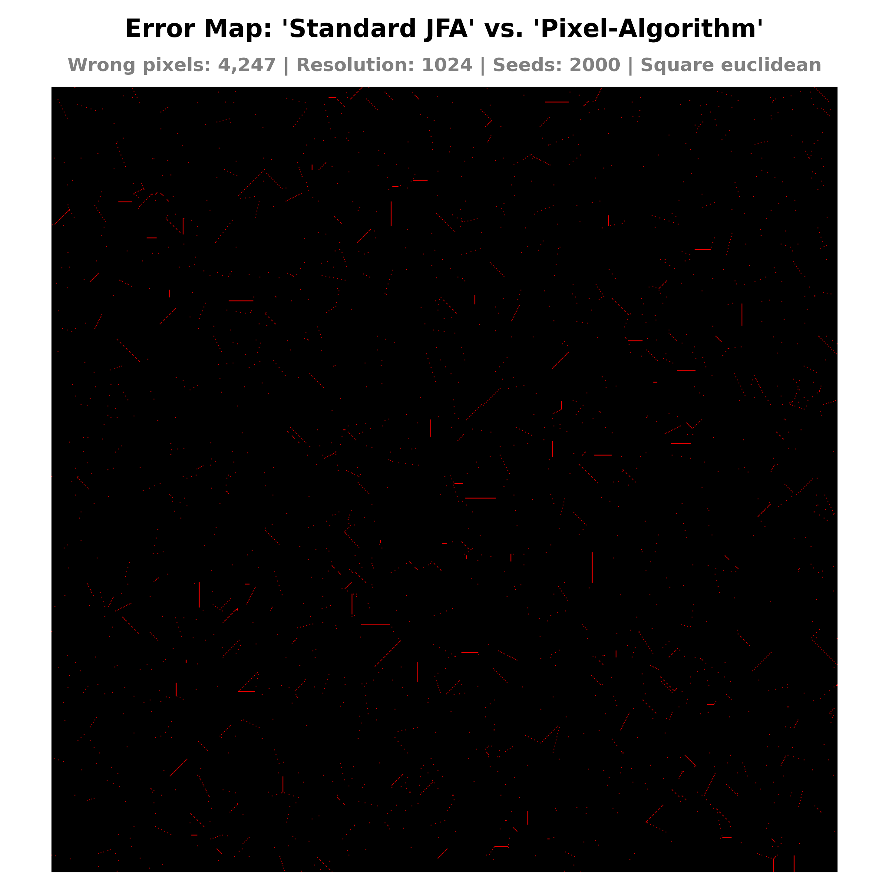 |  | 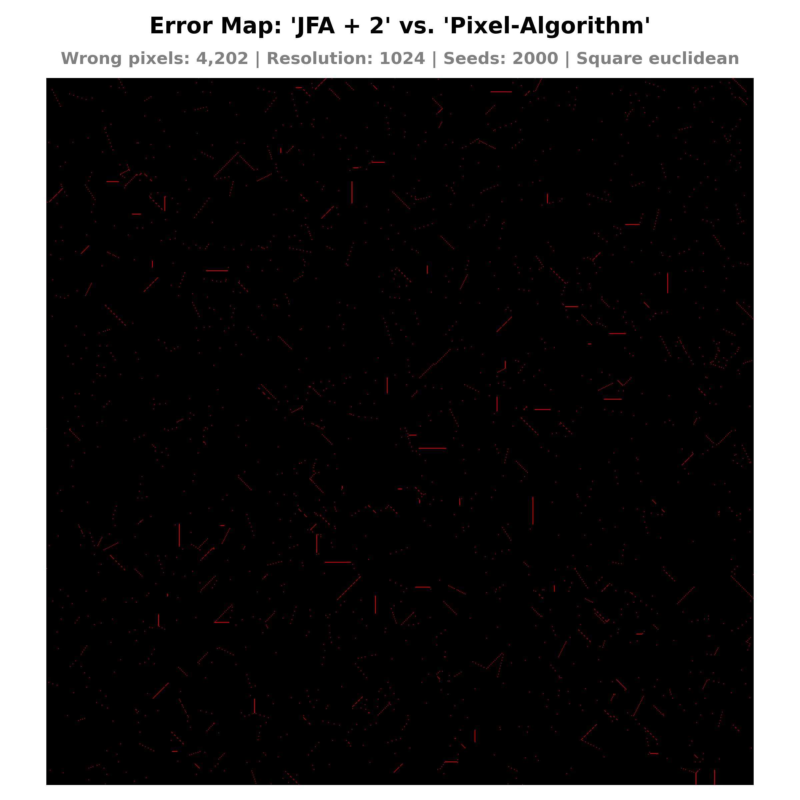 |

```bash
Standard JFA: 99.5950%
JFA + 1: 99.5990%
JFA + 2: 99.5993%
```

_Warp Divergenz_

_Bank Conflicts_

_Was muss bei der Performancemessung beachtet werden?_

| RTX 5070                                                                                                                                      | GTX 1660 Ti                                                                                                                                      |
| --------------------------------------------------------------------------------------------------------------------------------------------- | ------------------------------------------------------------------------------------------------------------------------------------------------ |
|  |  |
|                      |                      |

| RTX 5070                                                                                                                               | GTX 1660 Ti                                                                                                                               |
| -------------------------------------------------------------------------------------------------------------------------------------- | ----------------------------------------------------------------------------------------------------------------------------------------- |
|  |  |
| 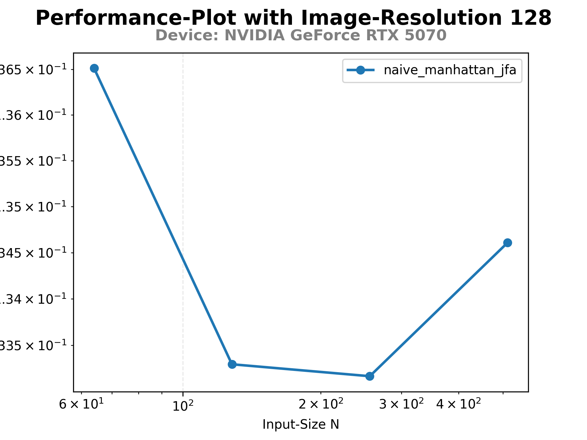                     | 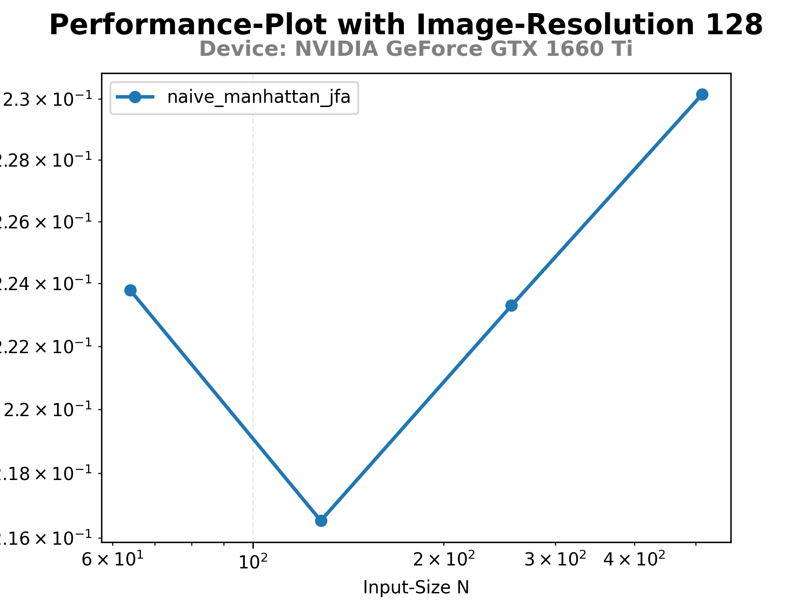                     |

## Aufgabe 6b - Optimierungen

_Können Optimierungen durchgeführt werden? Wenn ja, warum? Wenn nein, warum nicht?_

**1. Integer statt Floats**

Ursprünglich wurde zur Initialisierung der kürzesten Distanz Folgendes verwendet:

```python
best_dist = np.float32(np.inf)
```

Ein `.inspect_types()`-Aufruf nach dem Kernel-Lauf zeigt jedoch, dass trotz des expliziten `float32`-Casts eine `float64`-Variable initialisiert wird, was auf der GPU zu ressourcenintensiven Fließkommaoperationen führt:

```plaintext
#   best_dist = call $122load_attr.14($152load_attr.16, func=$122load_attr.14, args=[Var($152load_attr.16, task6.py:428)], kws=(), vararg=None, varkwarg=None, target=None)  :: (float64,) -> float32
#   del $152load_attr.16
#   del $122load_attr.14
#   best_dist.5 = best_dist  :: float64
```

Da in dieser Aufgabe die Distanzberechnung auf die quadrierte euklidische Distanz (beziehungsweise im Exkurs auf die Manhattan-Distanz) festgelegt ist und der Kernel auf diskreten Ganzzahl-Koordinaten operiert, ist ein Ausweichen auf Fließkommazahlen mathematisch nicht notwendig: Das Ergebnis einer Summe von Quadraten ganzer Zahlen ist stets wieder eine Ganzzahl. Deshalb wird die kürzeste Distanz (`best_dist`) mit dem maximalen `int64`-Wert initialisiert. Dadurch wird ein Typecast zwischen Float und Integer im GPU-Kernel unterbunden.

Folgender Code zeigt die minimalen und maximalen Werte für den NumPy-Datentyp `int64`:

```python
info = np.iinfo(np.int64)
print("Minimum:", info.min)  # -9223372036854775808
print("Maximum:", info.max)  #  9223372036854775807
```

Eine feste Begrenzung auf `int32` wird dabei aus zwei Gründen nicht erzwungen:

- **Schutz vor Überlauf (Integer Overflow):** Bei der quadrierten euklidischen Distanz wachsen die Werte quadratisch zur Bildgröße. Ein `int32`-Typ würde bei Bildgrößen ab $32768 \times 32768$ Pixeln die Obergrenze (`2147483647`) überschreiten. Dies wäre für die meisten Auflösungen wahrscheinlich ausreichend. Dennoch würde der resultierende mathematische Überlauf fehlerhafte, negative Distanzen erzeugen und die Logik des Algorithmus zerstören.

- **Automatische Typ-Inferenz (Type Promotion):** Da die Thread-Indizierung mittels `cuda.grid(2)` `int64`-Werte zurückgibt, stuft Numba die damit berechneten Distanzen automatisch auf `int64` hoch.

Anschließend zeigt der Aufruf von `.inspect_types()` die Integer-Verarbeitung:

```plaintext
#   best_dist = global(INT64_MAX: 9223372036854775807)  :: Literal[int](9223372036854775807)
#   best_dist.6 = best_dist  :: int64

best_dist = INT64_MAX
```

**2. Loop Unrolling der 8 "Nachbarschafts-Pixeln"**

Da für die acht Nachbarschaftspixel eine verschachtelte For-Loop mit If-Statement zum Überspringen des zentralen Pixels `(0, 0)` verwendet wird, liegt die Vermutung nahe, dass der Compiler ohne explizite Anweisungen kein Loop Unrolling durchführt:

```python
for dy in (-1, 0, 1):
    for dx in (-1, 0, 1):
        # NOTE: We can skip the pixel that this thread computes
        if dx == 0 and dy == 0:
            continue
		...
```

Um ein explizites Loop Unrolling zu forcieren, könnte ein flacher Ansatz mit vorberechneten Tupeln gewählt werden:

```python
OFFSETS = ((-1,-1),(-1,0),(-1,1),(0,-1),(0,1),(1,-1),(1,0),(1,1))
for dy, dx in OFFSETS:
    ...
```

Diesen Ausdruck würde Numba mit hoher Wahrscheinlichkeit unrollen.

Um zu überprüfen, wie der Compiler den naiven Ansatz tatsächlich übersetzt, wurde die erzeugte [Assembly-Datei]() analysiert. Es zeigt sich ... ????
==> TODO: Assembly analysieren `uv run .\src\task7.py naive_square_euclidean_jfa`

```diff

```

**3. Shared Memory**

| RTX 5070                                                                                                                                              | GTX 1660 Ti                                                                                                                                              |
| ----------------------------------------------------------------------------------------------------------------------------------------------------- | -------------------------------------------------------------------------------------------------------------------------------------------------------- |
|  |  |
| 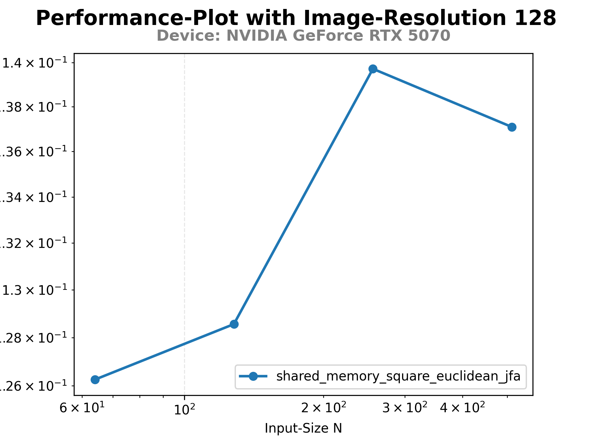                     | 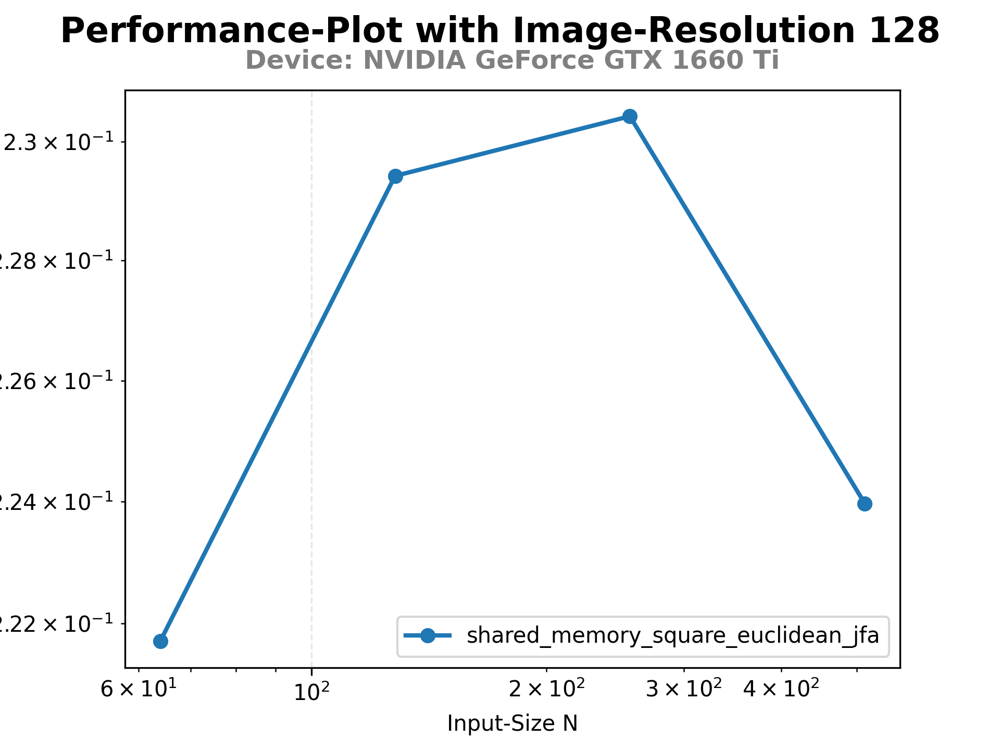                     |

**4. Datenlayout optimieren (_Structure of Arrays (SoA)_ vs. _Array of Structures (AoS)_)**

| RTX 5070                                                                                                                                     | GTX 1660 Ti                                                                                                                                     |
| -------------------------------------------------------------------------------------------------------------------------------------------- | ----------------------------------------------------------------------------------------------------------------------------------------------- |
| 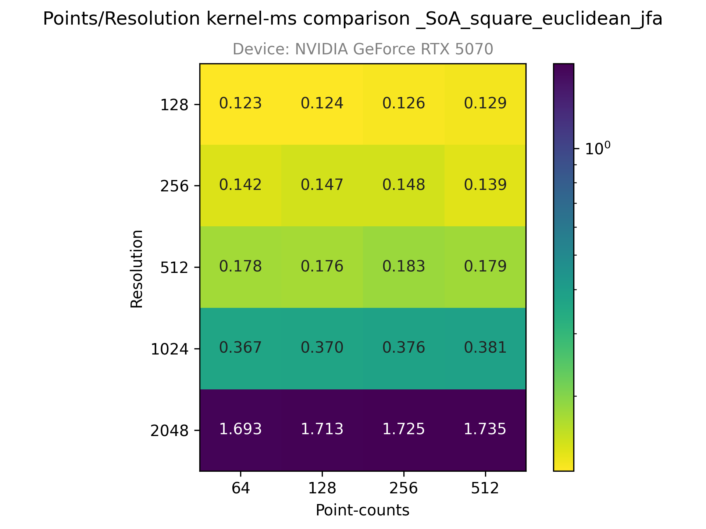 | 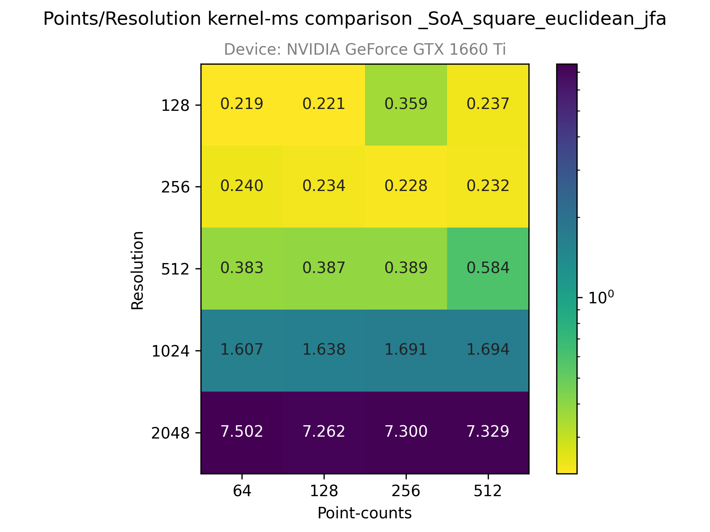 |
| 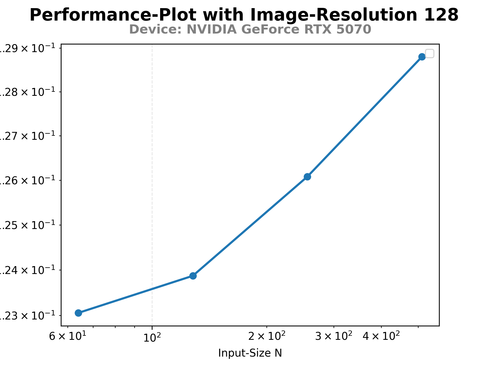                     | 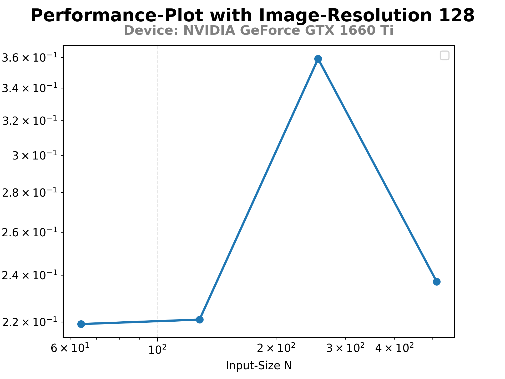                     |

**5. Read-Only Cache**

**6. Shuffle**

```bash
uv run .\src\task7.py all-jfa
```

```bash
uv run .\src\task6b.py jfa-performance
```

| RTX 5070                                                                                                                                                                              | GTX 1660 Ti                                                                                                                                                                              |
| ------------------------------------------------------------------------------------------------------------------------------------------------------------------------------------- | ---------------------------------------------------------------------------------------------------------------------------------------------------------------------------------------- |
| 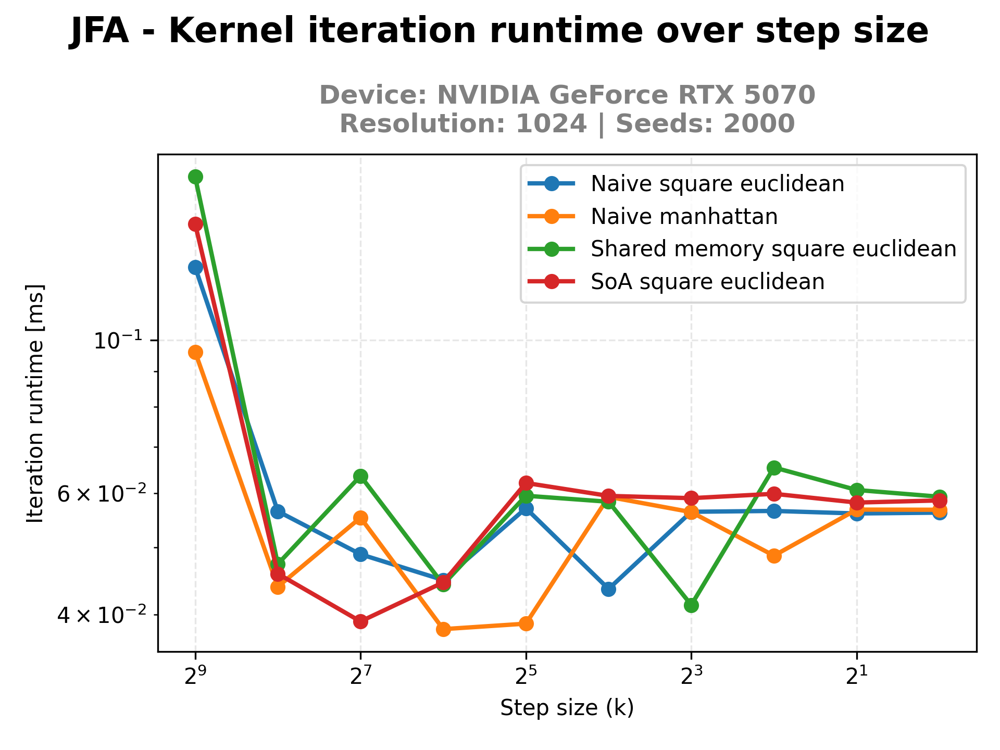 | 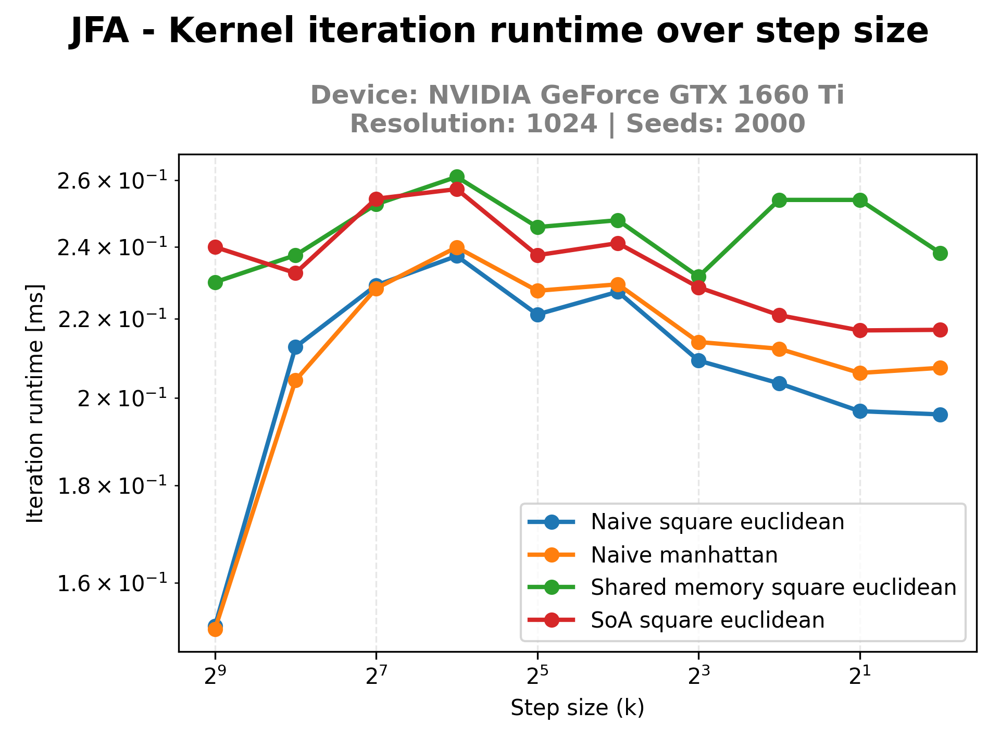 |

# Aufgabe 7 - Ergebnisse

_Welche der Optimierungen hat den größten Laufzeit-gewinn erbracht?_

_Wie viel schneller ist die Finale Implementation im Vergleich zur Naiven Implementation?_

_Welchen Durchsatz haben die verschiedenen Implementationen?_

_Ab welcher Eingabe-Größe erreicht die GPU ihre Sättigung?_

_Was liefern die Profiling-Tools?_

# Anhang

> [!NOTE]
> **Einschränkung bei Keyword (Named)-Arguments in CUDA-Kernels**
>
> Je nach installierter **Numba**-Version kann es zu Problemen kommen, wenn innerhalb eines CUDA-Kernels Keyword-Arguments (benannte Argumente) für Device-Funktionen verwendet werden.
>
> - **Problem:** Die Kompilierung schlägt fehl und scheint direkt bei der Kernel-Signatur "stehenzubleiben". Der Traceback zeigt jedoch, dass die Ursache weiter unten im Kernel liegt. Ein Aufruf der Art `get_thread_position(image=out_image)` kann nicht verarbeitet werden
> - **Lösung:** Den Aufruf auf positionale Argumente umstellen: `get_thread_position(out_image)`
>
> Verwendete Versionen anzeigen: `pip freeze`

> [!NOTE]
> **Fokussierung der hardwarenahen Optimierung auf die NVIDIA GeForce RTX 5070**
>
> Für die Performance-Optimierung werden hardwarespezifische Daten mithilfe der NVIDIA Profiling Tools `nsys`, `ncu` sowie der Numba Funktion `.inspect_asm()` erzeugt. Um eine saubere Vergleichbarkeit der Messergebnisse zu gewährleisten und den Umfang der erzeugten Dateien nicht zu sprengen, beschränken sich die hardwarenahen Analysen auf die **NVIDIA GeForce RTX 5070**. Die Performance-Diagramme werden weiterhin für beide GPUs erstellt.
