# Dokumentation Voronoi Projekt

- Modul: _Fachpraktikum Parallel Programming - 63782 - Prof. Dr. Lena Oden_
- Gruppe B:
  - _Pius Großmann_
  - _Anton Böhler_

---

# Vorgehen und Aufbau

Um ein strukturiertes Vorgehen zu gewährleisten wurde vorab ein Konzept entwickelt. Es beginnt mit dem ersten Abschnitt bei dem das Thema dieses Projekts klar beschrieben und abgesteckt wird.
Im darauf folgendem Abschnitt wird ein Performance Analyse Konzept entwickelt und implementiert und in allen anderen Abschnitten einheitliche Zeitmessungen und Analysen durchzuführen.
Der dritte Abschnitt befasst sich einer Naiven Implementation, wobei geklärt wird wie und warum diese funktioniert. Danach werden in Abschnitt vier und fünf die aus dem Kurs-Text erlernten Optimierungs-Verfahren angewandt. In Abschnitt sechs wird ein Algorithmus aus der Literatur erklärt, implementiert und mit dem bisherigem Algorithmus verglichen.
Zuletzt wird in Abschnitt sieben eine finale Analyse und Zusammenfassung der Ergebnisse dargelegt.

# Aufgabe 1 - Beschreibung des Problems

_Was ist das Problem?_

Ein Voronoi-Diagramm ist eine Aufteilung eines Raumes. Für eine gegebene Punkte-Menge wird diese Aufteilung berechnet, wobei jeder Punkt in genau einer Region liegt. Das Ziel ist es, den Raum so in Regionen zu unterteilen, dass alle Punkte innerhalb einer Region als nächst gelegenen Nachbarn den Punkt, der innerhalb der Region liegt, haben. Je nachdem welche Distanz-Metrik verwendet wird sieht das Voronoi-Diagramm unterschiedlich aus.

Als Beispiel wurden folgende Visualisierungen erstellt für die gleiche Punkte-Menge mit Unterschiedlichen Distanz-Funktionen.

| Euklidische Distanz                            | Manhattan Distanz                              | Maximale Distanz                                  |
| ---------------------------------------------- | ---------------------------------------------- | ------------------------------------------------- |
| 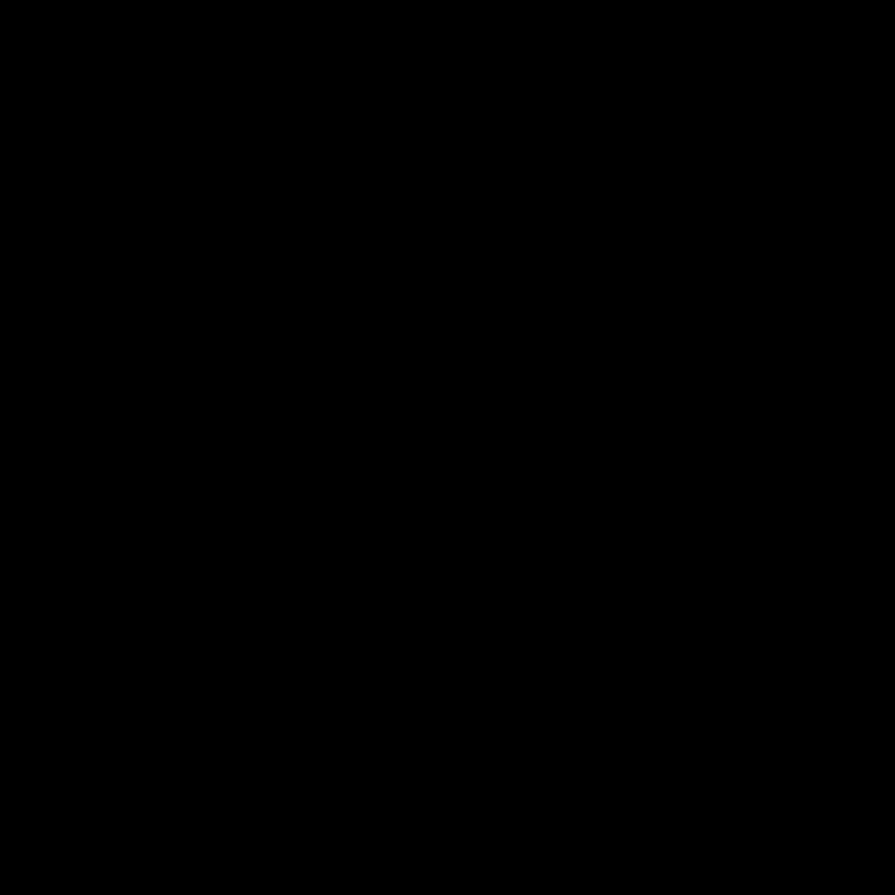 |  |  |

Die Regionen im Voronoi-Diagramm werden Voronoi-Regionen genannt.

_Was sind verwandte Probleme die nicht berücksichtigt werden?_

Um den Rahmen des Projekts abzugrenzen, werden verwandte Problemstellungen wie die Delaunay Triangulation oder Voronoi-Diagramme im mehr-dimensionalen Raum nicht betrachtet. In diesem Projekt werden lediglich diskrete Voronoi-Diagramme berechnet. Es ist somit nicht von Bedeutung die tatsächlichen Voronoi-Regionen tatsächlich zu bestimmen, sondern nur das tatsächliche Diagramm. Bei den Distanz-Funktionen steht die Euklidische-Distanz im Vordergrund. Die Manhattan-Distanz wird an einigen Stellen als Exkurs betrachtet.

_Was wird berechnet?_

Da das Diagramm auf der GPU berechnet wird, wird ein Pixelraster (Gitter) verwendet. Für jeden Pixel $(x, y)$ des Zielbildes wird der Abstand zum nächstgelegenen Punkt bestimmt. Am Ende wird jeder Pixel dem Punkt zugewiesen, zu dessen Voronoi-Region dieser gehört.

Es gibt eine Besonderheit die hierbei zu beachten ist. Bei diskreten Pixeln kann es dazu kommen, dass ein Pixel nächster Nachbar zu zwei Punkten wäre. Dieser Sonderfall ist bei dem Voronoi-Diagramm mit Manhattan-Distanz noch stärker ausgeprägt, da hierbei die Grenzen zwischen zwei Voronoi-Regionen sogar Flächen sein können. Um diese Problematik zu umgehen und einen eindeutigen nächsten Nachbar zu garantieren, wird bei zwei Punkten mit gleichem Abstand der Punkt der weiter am Anfang der Eingabe liegt gewählt.

_Welche Einschränkungen beziehungsweise Annahmen werden gemacht?_

Für dieses Projekt werden die folgenden Einschränkungen und Annahmen getroffen:

- Zweidimensionalität: Die Berechnung ist auf den 2D-Raum beschränkt. Dreidimensionale Räume oder höhere Dimensionen werden ausgeschlossen.

- Quadratischer Raum: Das Diagramm ist **quadratisch**. Es werden keine rechteckigen Auflösungen der Form $W \times H$ unterstützt, sondern ausschließlich Dimensionen der Form $N \times N$.

- Statische Eingabe Punkte: Die Positionen der Punkte sind nach der Initialisierung fix und verändern sich während der Kernel-Laufzeit nicht.

_Was ist die Eingabe und Ausgabe und welcher Daten-Typ wird genutzt?_

Für die Berechnung des Voronoi-Diagramms sind folgende Parameter definiert:

| Parameter          | Beschreibung                                                             | Datentyp            |
| ------------------ | ------------------------------------------------------------------------ | ------------------- |
| **Bildauflösung**  | Die Seitenlänge des quadratischen Gitters ($N \times N$)                 | `int32`             |
| **Punkte / Seeds** | Ein Array, das die 2D-Koordinaten der im Raum verteilten Zentren enthält | `float32` / `int32` |
| **Ausgabe-Grid**   | Das resultierende zweidimensionale Bildraster/Voronoi-Diagramm           | `int32`             |

_Welche Parameter sind entscheidend für das Problem und welchen Einfluss haben diese?_

Das Laufzeitverhalten und die Skalierbarkeit des Problems hängen von zwei Parametern ab:

1. Die Bildauflösung ($N$): Mit steigender Auflösung wächst die Anzahl der zu berechnenden Pixel quadratisch ($N^2$).

2. Die Anzahl der im Raum zufällig verteilten Punkte/Seeds, die bei der Distanzberechnung berücksichtigt werden müssen.

# Aufgabe 2 - Performance Analyse Konzept

```
TODO

- 512, 1024, ... 2^16
- log scale (x & y)
- single or multiple lines
- kernel only (no transfer or context switching)
```

_Wie werden im folgenden Performance Analysen durchgeführt?_

Für die Performance-Analyse werden die Aufnahme der Messergebnisse und die daraus resultierende Generierung der Diagramme getrennt.

Aufgrund der unterschiedlichen Algorithmenstrukturen und Kernelsignaturen wurde die Messlogik in zwei nahezu identische Funktionen aufgeteilt (`compute_performance_metrics` und `compute_performance_metrics_jfa`). Dies hält den Code übersichtlich und verhindert übermäßig komplexe Funktionsparameter. Sie unterscheiden sich vor allem in der Allokation der benötigten Daten auf der GPU und dem tatsächlichen Kernelaufruf auf der Host-Seite (siehe auch die Hinweise zur [Performance-Messung beim JFA](#aufgabe-6---alternativer-ansatz-jump-flooding-algorithmus-jfa)).

Bei der Messung werden für jede Konfiguration mehrere Durchläufe (`run_count`) durchgeführt und einzeln gespeichert. Dabei werden sowohl die Bildauflösung (`resolution_sizes`) als auch die Punkteanzahl (`point_counts`) variiert. Für die folgenden Analysen werden dabei `RUNS = 20` durchgeführt. Die Messfunktionen liefern für die weitere Verarbeitung und Visualisierung ein dreidimensionales Array der Form `(Auflösungen, Punkteanzahlen, Durchläufe)`. Für die anschließende Analyse wird der Median der Durchläufe gebildet, da dieser robuster gegenüber vereinzelten Ausreißern ist.

Zusätzlich wird die Numba-Funktion `.inspect_asm()` verwendet, um für jeden Kernel eine Assembly-Datei zu generieren. Diese wird für spätere Optimierungen herangezogen, um einen direkten Einblick in den tatsächlich erzeugten Maschinencode zu erhalten.

_Wie wird die Zeit für das kompilieren und den Daten-Transfer in der Analyse berücksichtigt?_

Um saubere Messergebnisse zu erhalten, wird zu Beginn ein _Dry Warm-up_ (5 Durchläufe) durchgeführt. Dadurch wird sichergestellt, dass die erste Just-In-Time-Kompilierung (JIT) des Kernels die eigentlichen Performance-Messungen zeitlich nicht verfälscht.

Gemessen wird ausschließlich die reine Ausführungszeit des Kernels auf der GPU für die Berechnung des Voronoi-Diagramms. Es werden **keine** Transferzeiten wie Host-to-Device (H2D) oder Device-to-Host (D2H) berücksichtigt. Zur Messung kommen CUDA-Events (`cuda.event(timing=True)`) zum Einsatz: Ein Start-Event unmittelbar vor dem Kernelaufruf markiert den Beginn und ein End-Event unmittelbar danach das Ende der Messung. Ein `cuda.synchronize()` nach dem Kernelaufruf stellt sicher, dass die GPU alle Berechnungen vollständig abgeschlossen hat, bevor die tatsächliche Laufzeit via `.elapsed_time()` auf der CPU bestimmt wird.

_Welche Eingabe- beziehungsweise Ausgabe-Größen werden verwendet?_

Für die **Eingabe** werden folgende Größen variiert:

| Bildauflösung   | Punkteanzahl |
| --------------- | ------------ |
| 128 ($2^7$)     | 64 ($2^6$)   |
| 256 ($2^8$)     | 128 ($2^7$)  |
| 512 ($2^9$)     | 256 ($2^8$)  |
| 1024 ($2^{10}$) | 512 ($2^9$)  |
| 2048 ($2^{11}$) |              |

Zur visuellen Auswertung der Ergebnisse (**Ausgabe**) stehen zwei Diagrammtypen zur Verfügung:

- Performance-Vergleichsplot (`create_kernel_performance_plot()`): Dieses Diagramm zeigt die Kernel-Laufzeit in Abhängigkeit von der Punkteanzahl bei einer **festen** Bildauflösung. Sowohl die X-Achse (Input-Größe $N$) als auch die Y-Achse (Laufzeit in ms) nutzen eine logarithmische Skalierung. Da die Funktion eine Liste von Kerneln entgegennehmen kann, ist es möglich, mithilfe dieses Plots mehrere Kernel-Implementierungen direkt miteinander zu vergleichen.

- Performance-Matrix / Heatmap (`create_kernel_performance_matrix()`): Da die Performance auf beide Eingabeparameter (Bildauflösung und Punkteanzahl) reagiert, zeigt diese Matrix die gegenseitige Beeinflussung der beiden Parameter. Die Zeilen repräsentieren die Auflösungen, die Spalten die Punkteanzahlen. In jeder Zelle wird die konkrete Laufzeit angezeigt. Das Diagramm zeigt, ab welchen Auflösungen oder Punktmengen der Algorithmus an seine Grenzen stößt (Skalierbarkeit).

# Aufgabe 3 - Naive Implementation

_Wie viele Threads werden gestartet und welche Aufgabe hat ein jeder?_

Für jeden Pixel des Ergebnis wird ein Thread initialisiert. Jeder Thread iteriert durch alle Punkte und berechnet die Distanz zu jedem Punkt. Der Punkt mit der geringsten Distanz wird dabei gefunden und das Ergebnis in die Ausgabe geschrieben.

_Wie wird entschieden ob ein Punkt nächster Nachbar ist?_

Beim iterieren wird die Distanz zu jedem Punkt mit Hilfe von `cuda.libdevice.hypotf` berechnet und der Index des am nächsten liegenden Punkt gespeichert. Wenn nun ein Punkt mit geringerer Distanz gefunden wird, wird der Index überschrieben.

Folgende Animation gibt an, wie das Ergebnis nach jeder Iteration, also Hinzunahme eines weiteren Punkt, aussieht.

| Voronoi                                        | Distanzen                                            |
| ---------------------------------------------- | ---------------------------------------------------- |
|  |  |

Aus dieser Animation ist ersichtlich, dass jeder Pixel immer den bisherigen nächsten Nachbar verwaltet und inkrementell weitere Punkte hinzunimmt. In der beistehenden Animation sind die Distanzen zu sehen. Hierbei ist zu erkennen, dass die Distanzen sich mit jeder Iterationen verringern (oder gleich bleiben).

> [!note]
> Das berechneten Distanzen wurden aus dem Wertebereich $0$ bis $\sqrt{2}$ in den Wertebereich $0$ bis $255$ abgebildet. Zur besseren Visualisierung wurden die Distanzen mit dem Faktor $4$ hoch-skaliert und an der Oberen-Grenze abgeschnitten. Die Begründung hierfür ist, dass auch bei den letzten Iterationen der Animation noch Änderungen mit bloßem Auge zu erkennen sind. Für andere Animationen der Distanzen wird ebenfalls mit dem gleichen Faktor hoch-skaliert um Vergleiche zu ermöglichen.

_Wieso arbeitet der Algorithmus korrekt?_

Der Algorithmus arbeitet korrekt, weil für jeden Pixel jeder Punkt bei der Suche nach dem nächsten Nachbar berücksichtigt wird. Es kann also keinen Punkt geben der näher liegt als der berechnete Punkt.

_Müssen Race-Conditions beachtet werden?_

Da der Algorithmus für jeden Pixel einen Thread startet und Threads sich um nur deren zugewiesenen Pixel kümmern gibt es keine Race-Conditions. Es müssen also keine Atomic- oder Sync-Operationen durchgeführt werden.

_Gibt es warp divergence in dieser Implementation?_

Diese Implementation hat sehr wenig warp divergence. Bei dem Kernel Aufruf terminieren Threads die Pixel außerhalb des Ergebnis berechnen würden frühzeitig. Die Schleife wird in jedem Thread für jeden Punkt der Eingabe einmal ausgeführt. Das bedeutet jeder Thread führt die Schleife genau gleich-oft aus. An dieser Stelle gibt es also keine warp divergence. Hingegen bei der Verzweigung, ob die neu-berechnete Distanz näher liegt, kann es zu warp divergence kommen. Hierbei gibt es jedoch eine kleine Besonderheit. Die Pixel eines Warp liegen beieinander, weswegen Abstände zu den meisten Punkten ähnlich ausfallen und in vielen Fällen keine warp divergence auftritt.

_Welche Probleme beziehungsweise Grenzen hat der Kernel?_

Die Ausführungszeit eines Thread des Kernel wächst linear mit der Anzahl an Punkten. Gleiches gilt für die Anzahl an benötigten Threads in Bezug auf die Ausgabe-Größe. Diese Implementation kann keinen Punkt überspringen, da der Algorithmus dadurch nicht korrekt arbeiten würde.

_Welche Parameter haben den größten Einfluss auf die Performance und wieso?_

Die Anzahl an Punkten und die Ausgabe-Größe haben den größten Einfluss auf die Performance, da weitere Schleifen-Iterationen durchgeführt beziehungsweise weitere Threads gestartet werden müssen.

Folgendes Diagramm gibt die Laufzeit für verschiedene eine feste Ausgabe-Größe als Matrix. Das Diagram darunter ist für die feste Ausgabe-Größe von `128x128`.

| RTX 5070                                                                                                                           | GTX 1660 Ti                                                                                                                           |
| ---------------------------------------------------------------------------------------------------------------------------------- | ------------------------------------------------------------------------------------------------------------------------------------- |
|  | 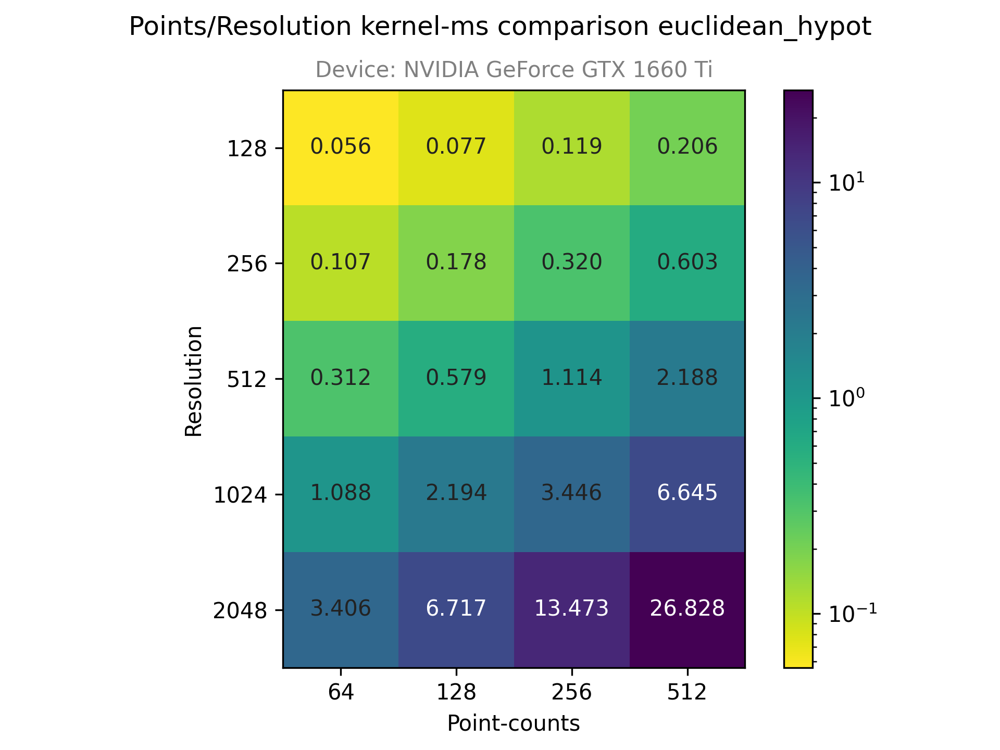 |
| 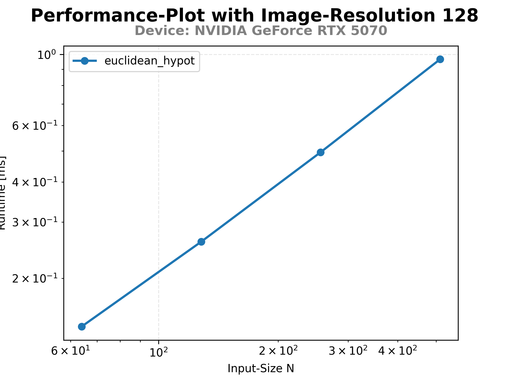                     | 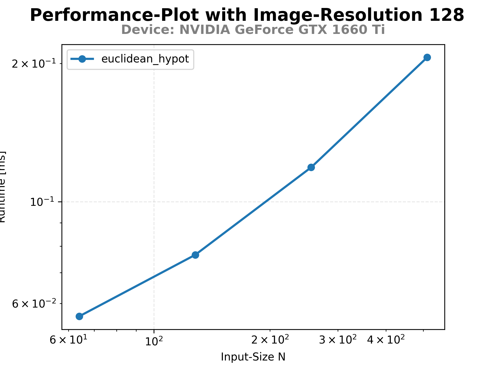                     |

Es ist leicht zu erkennen, dass größenordnungsmäßig ein verdoppeln der Anzahl an Punkten ein verdoppeln der Laufzeit mit sich bringt. Ein verdoppeln der Auflösung führt größenordnungsmäßig zu einem vervierfachen der Laufzeit. Das liegt daran, dass ein verdoppeln der Auflösung dazu führt, dass viermal so viele Pixel berechnet werden müssen.

Für den Fall `resolution=2048` und `points=512` wurde `ncu` ([Nsight Compute](https://developer.nvidia.com/nsight-compute)) für die `RTX 5070` ausgeführt. Folgender Ausschnitt der Ausgabe ist hierbei wichtig:

```
    Section: GPU Speed Of Light Throughput
    ----------------------- ----------- -------------
    Metric Name             Metric Unit  Metric Value
    ----------------------- ----------- -------------
    DRAM Frequency                  Ghz         13,79
    SM Frequency                    Ghz          2,54
    Elapsed Cycles                cycle    18.014.478
    Memory Throughput                 %         31,15
    DRAM Throughput                   %          0,35
    Duration                         ms          7,09
    L1/TEX Cache Throughput           %         31,21
    L2 Cache Throughput               %          0,55
    SM Active Cycles              cycle 17.971.334,48
    Compute (SM) Throughput           %         87,20
    ----------------------- ----------- -------------

    INF   This workload is utilizing greater than 80.0% of the available compute or memory performance of this device.
          To further improve performance, work will likely need to be shifted from the most utilized to another unit.
          Start by analyzing workloads in the Compute Workload Analysis section.
```

Laut `ncu` lastet der Algorithmus die GPU einigermaßen gut aus. Dem Vorschlag von `ncu` die `Compute Workload` näher zu betrachten wollen wir nachgehen. Um eine nahe-liegende Optimierung zu motivieren, wird als Exkurs die Manhattan-Distanz betrachtet.

_Exkurs Manhattan-Distanz: Welchen Einfluss hat die Manhattan-Distanz als alternative Metrik, und wie verändert sich das visuelle Ergebnis?_

Die Manhattan-Distanz ist eine alternative Distanz-Funktion zur Euklidischen Distanz-Funktion. Sie ist definiert als die Summe der absoluten Abstände für jede Dimension.

$$\sum_{i=0}^n \left|a_i - b_i\right|$$

Der zuvor beschriebene Algorithmus ist Distanz-Funktion agnostisch, weswegen nur eine kleine Änderung nötig ist, um das Voronoi-Diagram mit Manhattan-Distanz-Funktion zu berechnen.

Folgende Animation wurde für die Manhattan-Distanz erstellt.

| Voronoi                                        | Distanzen                                            |
| ---------------------------------------------- | ---------------------------------------------------- |
|  | 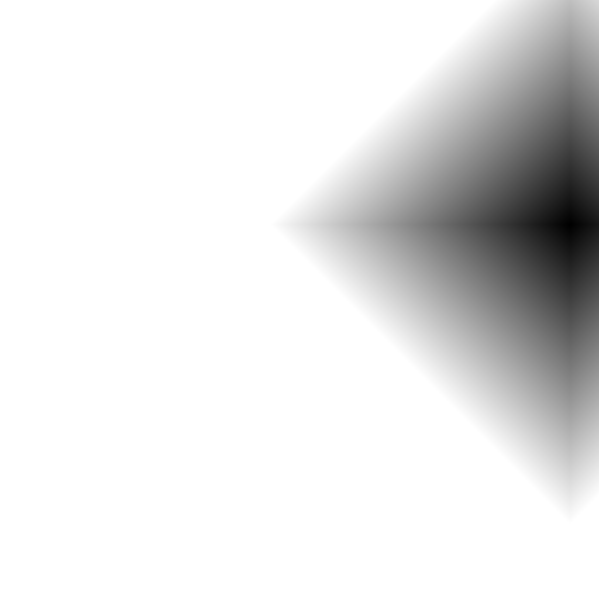 |

Der Algorithmus funktioniert auf die gleiche Weise, es gibt jedoch abgesehen von der Ausgabe einen deutlichen Unterschied in der Laufzeit.
Der gleiche Algorithmus mit Manhattan-Distanz ist deutlich schneller als mit Euklidischer-Distanz, wie folgendes Diagramm zeigt.

| RTX 5070                                                                                                                 | GTX 1660 Ti                                                                                                                 |
| ------------------------------------------------------------------------------------------------------------------------ | --------------------------------------------------------------------------------------------------------------------------- |
| 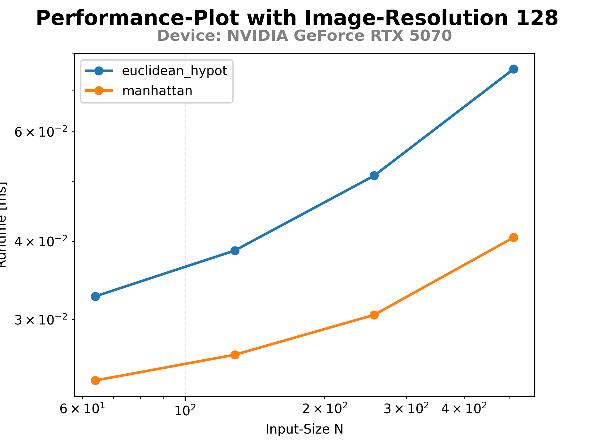 | 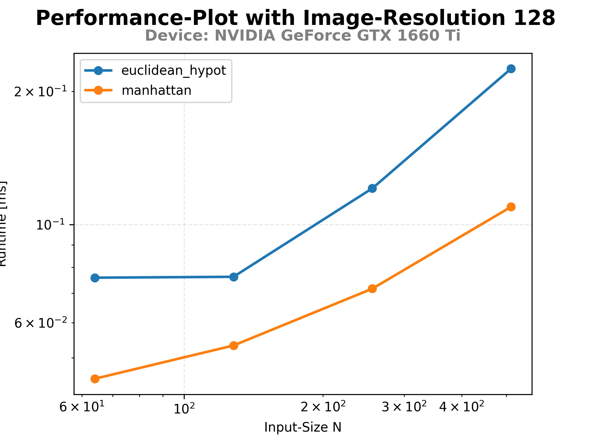 |

Dies ist natürlich nicht verwunderlich, da für die Berechnung der Manhattan-Distanz nur Addition und die Absolut-Funktion nötig sind, welche sehr leicht zu berechnen sind.
Hingegen für die Euklidische-Distanz wird die `cuda.libdevice.hypotf` Funktion aufgerufen, welche schwerer beziehungsweise langsamer zu berechnen ist.
Es ist also ersichtlich, dass durch eine effizientere Distanz-Prüfung eine schnellere Laufzeit möglich ist.

Das Ausführen von `ncu` für die Manhattan-Distanz hat folgende Ausgabe geliefert:

```
    Section: GPU Speed Of Light Throughput
    ----------------------- ----------- ------------
    Metric Name             Metric Unit Metric Value
    ----------------------- ----------- ------------
    DRAM Frequency                  Ghz        13,79
    SM Frequency                    Ghz         2,54
    Elapsed Cycles                cycle    8.809.962
    Memory Throughput                 %        63,71
    DRAM Throughput                   %         0,06
    Duration                         ms         3,47
    L1/TEX Cache Throughput           %        63,83
    L2 Cache Throughput               %         1,10
    SM Active Cycles              cycle 8.787.657,25
    Compute (SM) Throughput           %        73,60
    ----------------------- ----------- ------------

    INF   Compute and Memory are well-balanced: To reduce runtime, both computation and memory traffic must be reduced.
          Check both the Compute Workload Analysis and Memory Workload Analysis sections.
```

In diesem Fall ist der Algorithmus laut `ncu` besser ausgelastet. Es ist zu erkennen, dass die Anzahl an Rechenzyklen stark gesunken ist und damit die Rechenzeit. Um den Algorithmus für die Euklidische-Distanz zu optimieren wäre es also wünschenswert, wenn die Anzahl an Rechenzyklen ebenfalls niedriger wäre. Diese Thematik wollen wir in der nächsten Aufgabe betrachten.

# Aufgabe 4 - Optimierung durch billigere Distanz-Prüfung

_Welche Optimierungen können bei der Distanz-Prüfung problemlos gemacht werden und warum?_

Der bisherige Algorithmus arbeitet jeden Punkt ab und berechnet den Abstand um einen nächsten Nachbar zu bestimmen. Es gibt zwei Ansätze die an dieser Stelle untersucht werden könnten.

1. Schnellere Distanz Berechnung

Es kann versucht werden das berechnen von Distanz-Funktionen zu verbessern. Hierbei gibt es die Möglichkeit die `sqrt` Funktion aufzurufen.

Ansonsten können schnellere Mathe-Operationen ermöglicht werden mit der `fastmath=True` Annotation. Laut dem [nvidia-numba-cuda-user-guide](https://nvidia.github.io/numba-cuda/user/fastmath.html) werden einige Operationen wie `sqrt` durch schnellere Approximationen ersetzt und Multiplikations- und Additions-Operationen verschmolzen. Da unser Algorithmus nicht die exakten Distanzen benötigt sondern nur Distanzen vergleichen muss ist dies ein klarer Anwendungsfall.

Zuletzt kann darauf verzichtet werden die tatsächliche Euklidische Distanz zu berechnen. Da nur Distanzen verglichen werden, können wir auch die quadratische euklidische Distanz vergleichen. Auf den ersten Blick erscheint dies aufwendiger, jedoch kann auf diese Weise auf alle kompliziertere Mathe-Operationen verzichtet werden.

2. Distanz Berechnung überspringen

Es können schnelle Approximationen der Distanz-Funktion verwendet werden um sich die exakte Berechnung einzusparen. Beispielsweise kann der Abstand unter Berücksichtigung nur einer Dimension bestimmt werden. Auf diese Weise können Punkte die definitiv zu Weit entfernt sind übersprungen werden, indem eine Verzweigung eingesetzt wird.

Um den Rahmen dieses Projekt nicht zu sprengen beschränken wir uns in diesem Projekt nur mit dem ersten Ansatz. Es sei hier jedoch am Rande erwähnt, dass Abzweigungen wie sie im zweiten Ansatz beschrieben sind, vermutlich zu Warp-Divergence führen würden. Dadurch könnten ein solcher Ansatz die performance potentiell verschlechtern.

_Welchen Einfluss hat `sqrt` und wieso?_

Für die bisherigen Berechnungen wurde die `cuda.libdevice.hypotf` Funktion verwendet, da diese genau die Euklidische-Distanz berechnet. Es ist auch möglich das equivalent der `cuda.libdevice.hypotf` Funktion zu berechnen, indem der Ausdruck $\sqrt{(a_x - b_x)^2 + (a_y - b_y)^2}$ ausgeschrieben wird mit Hilfe der Funktion `cuda.libdevice.sqrtf`.

Die Annahme vorab ist, dass die beiden Funktionen die gleiche Laufzeit haben. Es wäre auch denkbar, dass die `cuda.libdevice.hypotf` Funktion bestimmte Optimierungen ermöglicht, die bei der generischen Funktion `cuda.libdevice.sqrtf` nicht möglich wären. Tatsächlich hat sich in der Praxis das gegenteil gezeigt, wie folgender Ausschnitt aus dem Assembly zeigt.

```diff
$L__BB0_6:
	mul.lo.s64 	%rd66, %rd76, %rd8;
	add.s64 	%rd67, %rd1, %rd66;
	add.s64 	%rd68, %rd5, %rd66;
	ld.global.b32 	%r132, [%rd67];
	add.s64 	%rd69, %rd9, %rd68;
-	ld.b32 	%r133, [%rd69];
+   ld.b32 	%r61, [%rd69];
-	sub.f32 	%r134, %r1, %r132;
-	sub.f32 	%r135, %r2, %r133;
+	sub.f32 	%r62, %r1, %r60;
+	sub.f32 	%r63, %r2, %r61;
-	abs.f32 	%r136, %r134;
-	abs.f32 	%r137, %r135;
-	min.s32 	%r138, %r137, %r136;
-	max.s32 	%r139, %r136, %r137;
-	and.b32 	%r140, %r139, -33554432;
-	xor.b32 	%r141, %r140, 2122317824;
-	mul.f32 	%r142, %r138, %r141;
-	mul.f32 	%r143, %r139, %r141;
-	mul.f32 	%r144, %r142, %r142;
-	fma.rn.f32 	%r145, %r143, %r143, %r144;
-	sqrt.rn.f32 	%r146, %r145;
+	mul.f32 	%r64, %r63, %r63;
+	fma.rn.f32 	%r65, %r62, %r62, %r64;
+	sqrt.rn.f32 	%r66, %r65;
-	or.b32 	%r147, %r140, 8388608;
-	mul.f32 	%r148, %r146, %r147;
-	setp.eq.f32 	%p36, %r138, 0f00000000;
-	selp.f32 	%r149, %r139, %r148, %p36;
-	setp.eq.f32 	%p37, %r138, 0f7F800000;
-	selp.f32 	%r150, 0f7F800000, %r149, %p37;
-	setp.lt.f32 	%p38, %r150, %r151;
-	selp.b64 	%rd75, %rd76, %rd75, %p38;
+	setp.lt.f32 	%p24, %r66, %r67;
+	selp.b64 	%rd75, %rd76, %rd75, %p24;
```

Es ist zu erkennen, dass die `cuda.libdevice.hypotf` zu einem größeren Ausdruck übersetzt wird und innerhalb dieses Ausdruck wird die intrinsic Funktion `sqrt.rn.f32` aufgerufen. Das explizite Ausschreiben des Ausdruck $\sqrt{(a_x - b_x)^2 + (a_y - b_y)^2}$ führt dazu, dass gewisse Anweisungen wegfallen.

Ein Abgleich mit der Dokumentation von CUDA für die [hypotf Funktion](https://docs.nvidia.com/cuda/cuda-math-api/cuda_math_api/group__CUDA__MATH__SINGLE.html#group__cuda__math__single_1ga2880a4ebf5500aeb74fb01340ea91215) gibt einen Einblick weswegen diese Anweisungen existieren.
Die `cuda.libdevice.hypotf` Funktion muss garantieren, dass:

- $\mathrm{hypot}(x,y)$, $\mathrm{hypot}(y,x)$ und $\mathrm{hypot}(x,-y)$ äquivalent sind
- $\mathrm{hypot}(x, \pm 0)$ äquivalent zu $\mathrm{fabsf}(x)$ ist
- $\mathrm{hypot}(\pm \infty,y)$ immer $+ \infty$ ergibt, selbst wenn $y=\mathrm{NaN}$
- $\mathrm{hypot}(\mathrm{NaN},y)$ immer $\mathrm{NaN}$ ergibt, selbst wenn $y \neq \pm \infty$

Diese Bedingungen erfordern zusätzliche Anweisungen.

Für den Algorithmus sind die meisten dieser Bedingungen tatsächlich irrelevant. Das Verhalten des Algorithmus ändert sich nicht, wenn die Funktion $\mathrm{NaN}$ statt $\infty$ oder andersherum zurückgibt, da Distanzen nur verglichen werden und der Algorithmus in beiden Fällen die gleiche Verzweigung wählt.

Durch die verringerte Anzahl an Anweisungen ist eine klare Verbesserung in der Laufzeit zu erkennen.

| RTX 5070                                                                                                                          | GTX 1660 Ti                                                                                                                          |
| --------------------------------------------------------------------------------------------------------------------------------- | ------------------------------------------------------------------------------------------------------------------------------------ |
| 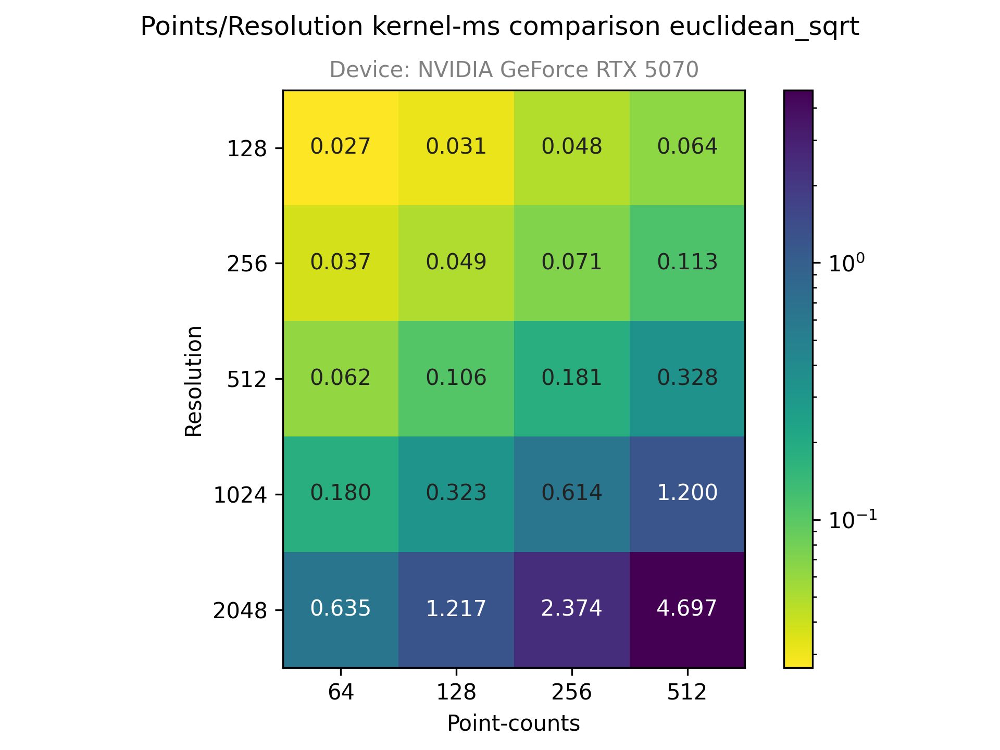 |  |
| 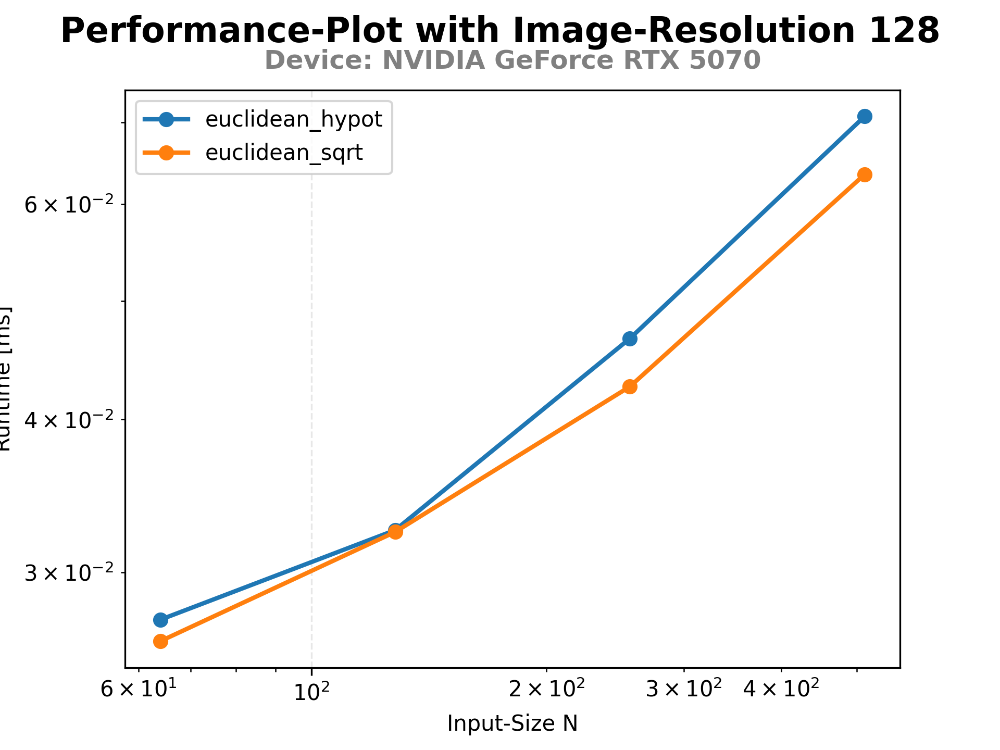     | 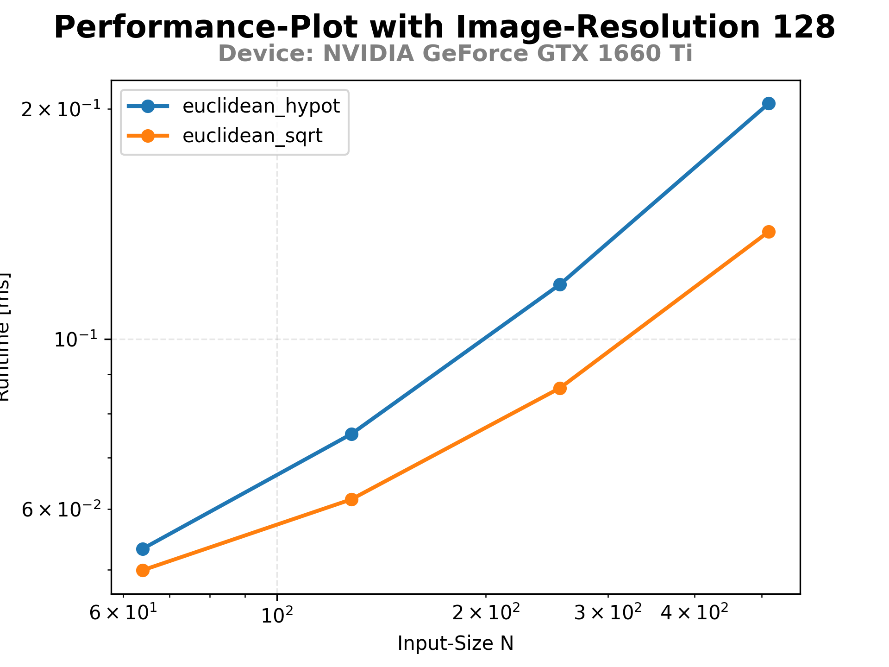     |

Die verringerte Anzahl an Anweisungen ist auch in der Ausgabe von `ncu` zu sehen.

```
    ----------------------- ----------- -------------
    Metric Name             Metric Unit  Metric Value
    ----------------------- ----------- -------------
    DRAM Frequency                  Ghz         13,79
    SM Frequency                    Ghz          2,54
    Elapsed Cycles                cycle    13.419.397
    Memory Throughput                 %         41,82
    DRAM Throughput                   %          0,12
    Duration                         ms          5,28
    L1/TEX Cache Throughput           %         41,90
    L2 Cache Throughput               %          0,72
    SM Active Cycles              cycle 13.386.779,33
    Compute (SM) Throughput           %         83,84
    ----------------------- ----------- -------------

    INF   This workload is utilizing greater than 80.0% of the available compute or memory performance of this device.
          To further improve performance, work will likely need to be shifted from the most utilized to another unit.
          Start by analyzing workloads in the Compute Workload Analysis section.
```

Im Vergleich zur initialen Implementation hat diese implementation `4.595.081` (`~25.508 %`) weniger Rechenzyklen. Durch diese Einsparung ist der Algorithmus schneller geworden.

Es ist hierbei zu beachten, dass effektiv keine günstigere Distanz-Rechnung durchgeführt wurde, sondern es wurde auf gewisse Garantien bei der bisherigen Distanz-Berechnung verzichtet, da diese für den Algorithmus keinen Unterschied machen. Im folgenden wird auf exakte Ergebnisse verzichtet um den Algorithmus noch schneller zu machen.

_Welchen Einfluss hat `fastmath` und wieso?_

Wie bereits erwähnt ermöglicht die Annotation `fastmath=True`, auf Genauigkeit zu verzichten im Austausch für schnellere Laufzeiten. Als Beispiel ist folgender Ausschnitt aus dem Assembly der regulären `sqrtf`-Variante und der `sqrtf`-Variante mit `fastmath=True` gegeben.

```diff
$L__BB0_6:
	mul.lo.s64 	%rd66, %rd76, %rd8;
	add.s64 	%rd67, %rd1, %rd66;
	add.s64 	%rd68, %rd5, %rd66;
	ld.global.b32 	%r60, [%rd67];
	add.s64 	%rd69, %rd9, %rd68;
	ld.b32 	%r61, [%rd69];
	sub.f32 	%r62, %r1, %r60;
	sub.f32 	%r63, %r2, %r61;
	mul.f32 	%r64, %r63, %r63;
	fma.rn.f32 	%r65, %r62, %r62, %r64;
-	sqrt.rn.f32 	%r66, %r65;
+	sqrt.approx.ftz.f32 	%r66, %r65;
	setp.lt.f32 	%p24, %r66, %r67;
	selp.b64 	%rd75, %rd76, %rd75, %p24;
```

In diesem Fall hat der Compiler wegen `fastmath=True` die intrinsic Funktion `sqrt.approx.ftz.f32` statt `sqrt.rn.f32` ausgewählt. Gleichermaßen wurden Divisionen `div.rn.f32` durch `div.approx.ftz.f32` ersetzt. Abgesehen von diesen beiden Operationen bleibt das Assembly größtenteils gleich.

Für die Laufzeit ergeben sich folgende Unterschiede.

| RTX 5070                                                                                                                               | GTX 1660 Ti                                                                                                                               |
| -------------------------------------------------------------------------------------------------------------------------------------- | ----------------------------------------------------------------------------------------------------------------------------------------- |
|  | 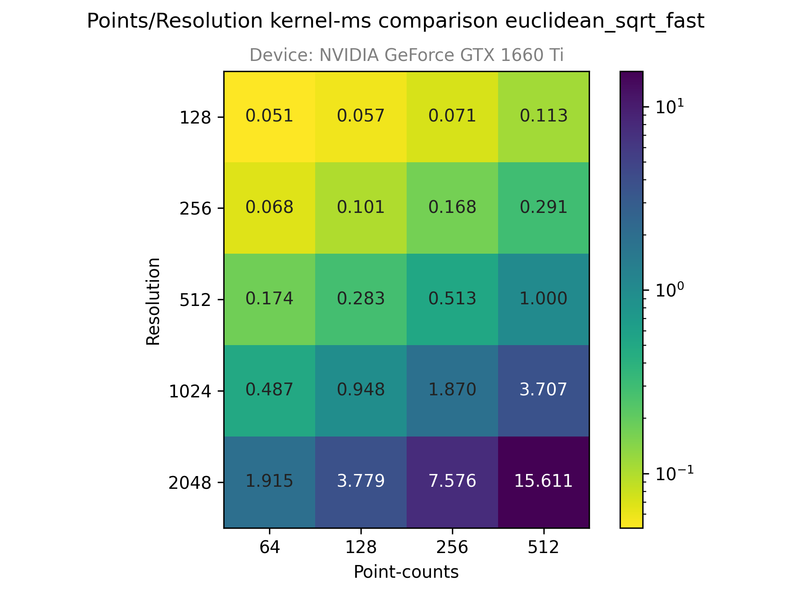 |
| 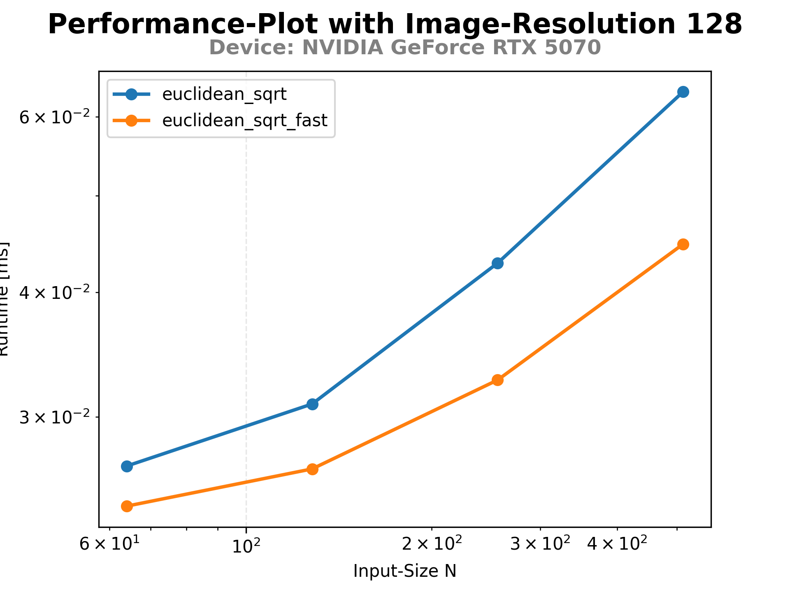      | 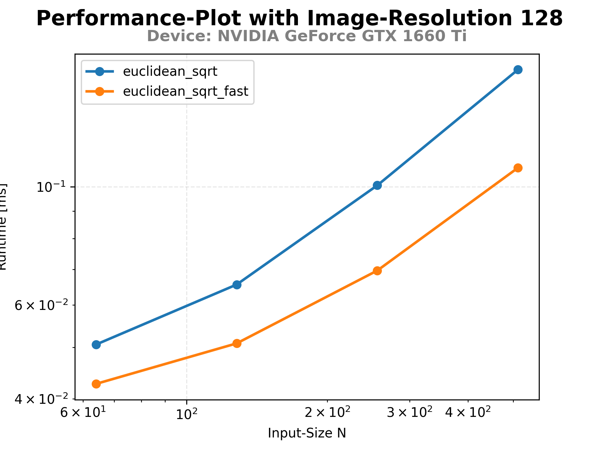      |

Die Laufzeit hat sich deutlich verbessert durch den Einsatz von der `fastmath=True` Annotation. Für den Fall `Resolution=2048` und `Point-count=512` hat sich die Laufzeit ungefähr halbiert im Vergleich zur initialen Implementation aus _Aufgabe 3_.

_Welchen Einfluss hat schlicht $a^2 + b^2$ und wieso?_

Es gibt nun noch eine weitere wichtige Optimierung bei der Berechnung der Distanz-Funktion, nämlich das Verzichten auf die `sqrt` Operation. Im Algorithmus werden Distanzen nur verglichen und nicht anderweitig verwendet. Aus diesem Grund können wir folgende Folgerung ausnutzen: $\sqrt{a} \leq \sqrt{b} \implies a \leq b$, wenn $a \geq 0$ und $b \geq 0$. Da im Algorithmus die Eingaben für `sqrt` immer Quadrate (`^2`) sind, sind die Eingaben immer $0$ oder positiv.

Im Assembly ist die Änderung wie zu erwarten (An dieser Stelle wurden Register-Namen geändert, um die Übersichtlichkeit zu verbessern):

```diff
$L__BB0_6:
	mul.lo.s64 	%rd66, %rd76, %rd8;
	add.s64 	%rd67, %rd1, %rd66;
	add.s64 	%rd68, %rd5, %rd66;
	ld.global.b32 	%r60, [%rd67];
	add.s64 	%rd69, %rd9, %rd68;
	ld.b32 	%r61, [%rd69];
	sub.f32 	%r62, %r1, %r60;
	sub.f32 	%r63, %r2, %r61;
	mul.f32 	%r64, %r63, %r63;
	fma.rn.f32 	%r65, %r62, %r62, %r64;
-	sqrt.rn.f32 	%r66, %r65;
-	setp.lt.f32 	%p24, %r66, %r67;
+	setp.lt.f32 	%p24, %r65, %r67;
	selp.b64 	%rd75, %rd76, %rd75, %p24;
```

Diese Änderung erscheint auf den ersten Blick ernüchternd, jedoch ist die `sqrt.rn.f32` eine Aufwendige Operation, diese Operation einzusparen macht einen großen Unterschied.

In dem bisherigen Assembly hat der Compiler Loop-Unrolling durchgeführt mit bis zu vier Iterationen der Schleife. Durch das verzichten auf `sqrt.rn.f32` scheint der Compiler bis zu acht Iterationen der Schleife aufzurollen.

Folgende Diagramme zeigen die Laufzeit des Algorithmus mit der neuen Distanz-Funktion.

| RTX 5070                                                                                                                            | GTX 1660 Ti                                                                                                                            |
| ----------------------------------------------------------------------------------------------------------------------------------- | -------------------------------------------------------------------------------------------------------------------------------------- |
| 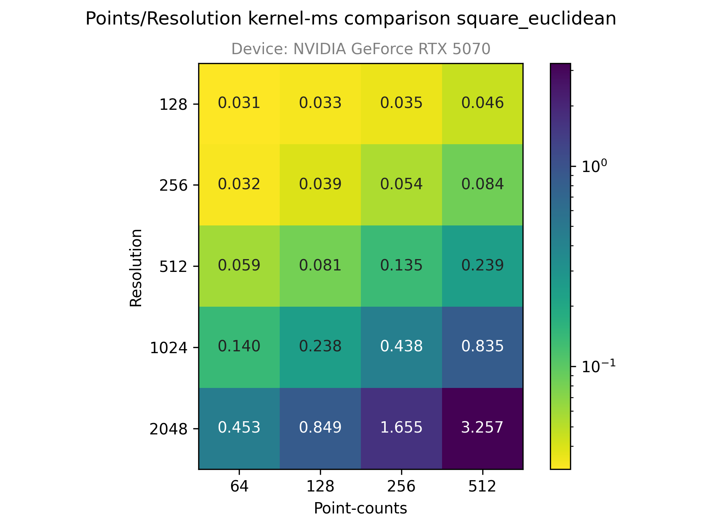 | 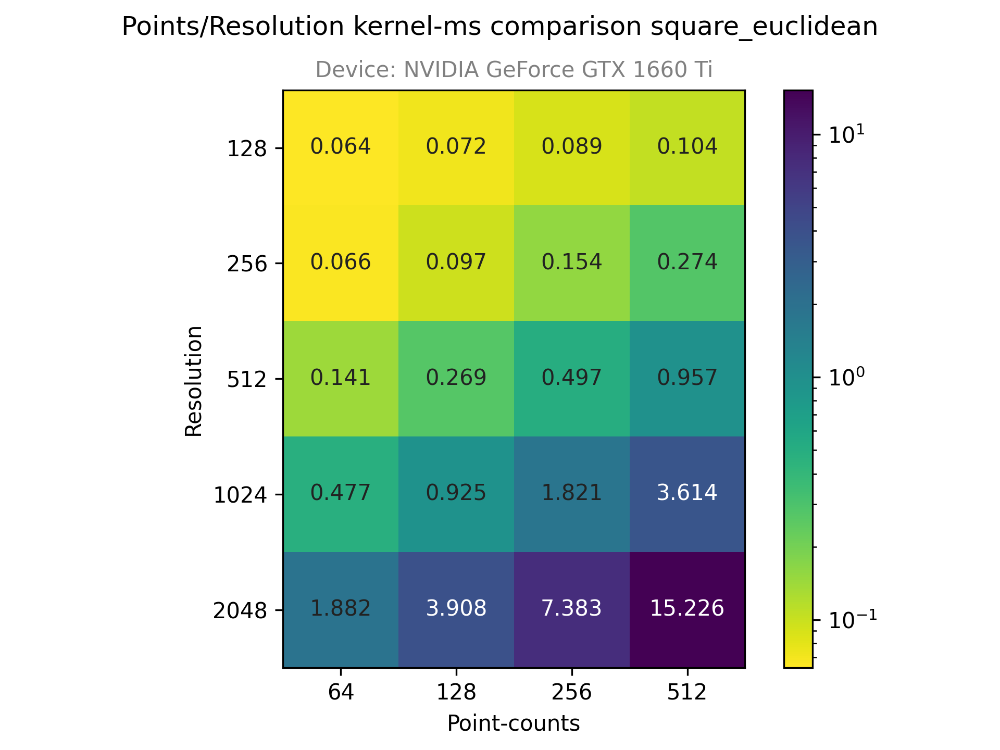 |
| 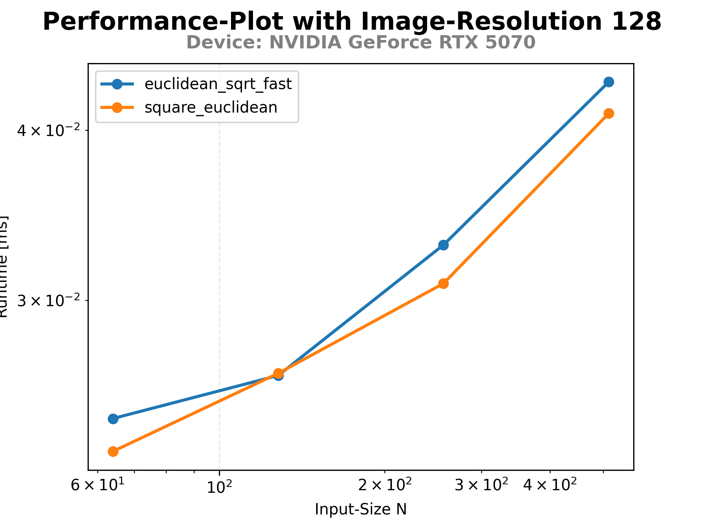 | 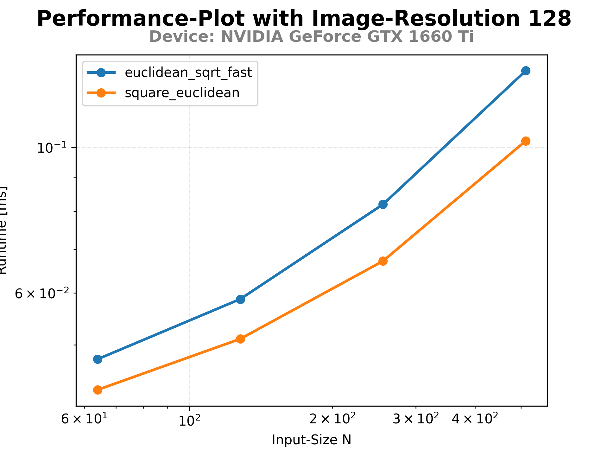 |

Es ist zu sehen, dass ein verzichten auf die `sqrt` Funktion die Performance steigert, jedoch ist auch zu erkennen, dass die Laufzeit zwischen der `sqrt` Funktion mit `fastmath=True` und keiner `sqrt` Funktion relativ nahe beieinander liegen.

An dieser Stelle ist es erneut interessant die Ausgabe von `ncu` zu betrachten:

```
    Section: GPU Speed Of Light Throughput
    ----------------------- ----------- ------------
    Metric Name             Metric Unit Metric Value
    ----------------------- ----------- ------------
    DRAM Frequency                  Ghz        13,79
    SM Frequency                    Ghz         2,54
    Elapsed Cycles                cycle    9.264.207
    Memory Throughput                 %        60,58
    DRAM Throughput                   %         0,12
    Duration                         ms         3,65
    L1/TEX Cache Throughput           %        60,70
    L2 Cache Throughput               %         1,03
    SM Active Cycles              cycle 9.240.057,88
    Compute (SM) Throughput           %        73,55
    ----------------------- ----------- ------------

    OPT   Compute is more heavily utilized than Memory: Look at the Compute Workload Analysis section to see what the
          compute pipelines are spending their time doing. Also, consider whether any computation is redundant and
          could be reduced or moved to look-up tables.
```

Hierbei weist `ncu` darauf hin, dass der Algorithmus viele Berechnungen durchführt und vergleichsweise wenig auf Speicherauslastung hat. Den Vorschlag die Anzahl an Berechnungen zu verringern oder Ergebnisse zwischenzuspeichern funktioniert für diesen Algorithmus leider jedoch nicht. Die Ausgabe von `ncu` wollen wir an dieser Stelle nicht ignorieren, jedoch wird erst im nächsten Abschnitt die Speicherauslastung optimiert. Vorab betrachten wir noch die Kombination aus Quadratischer-Euklidischer-Distanz und `fastmath=True`.

Das Verwenden von `fastmath=True` für die neue Distanz-Funktion hat nur minimale Auswirkungen, da im Algorithmus nur noch Divisionen, die nur selten durchgeführt werden beschleunigt werden, wie folgende Diagramme zeigen.

| RTX 5070                                                                                                                                 | GTX 1660 Ti                                                                                                                                 |
| ---------------------------------------------------------------------------------------------------------------------------------------- | ------------------------------------------------------------------------------------------------------------------------------------------- |
| 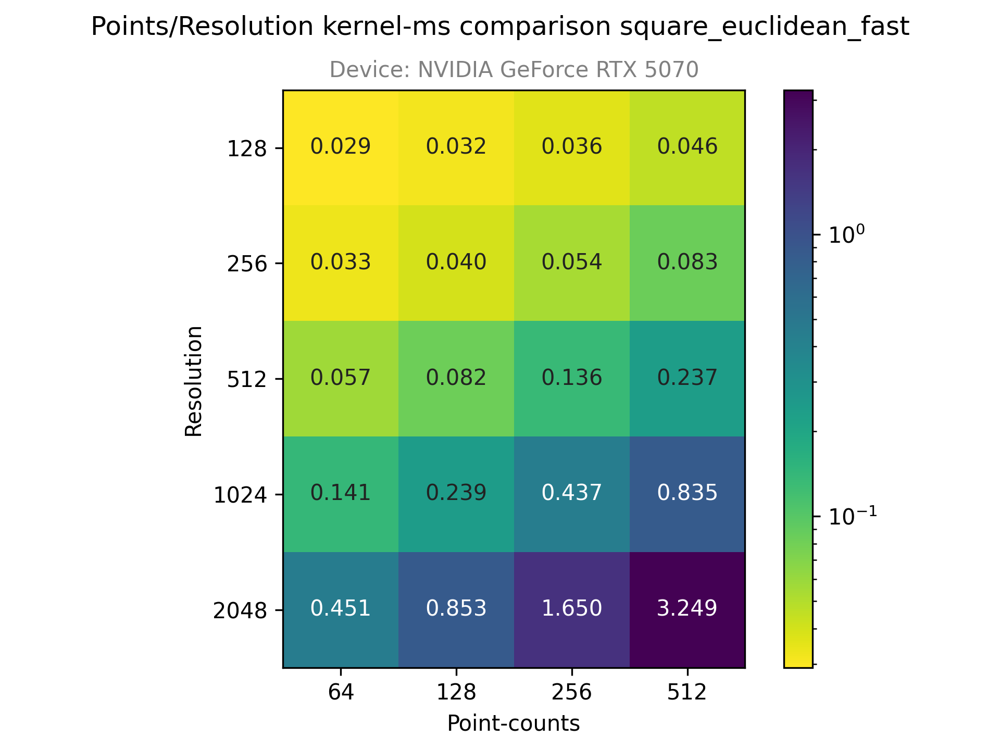 | 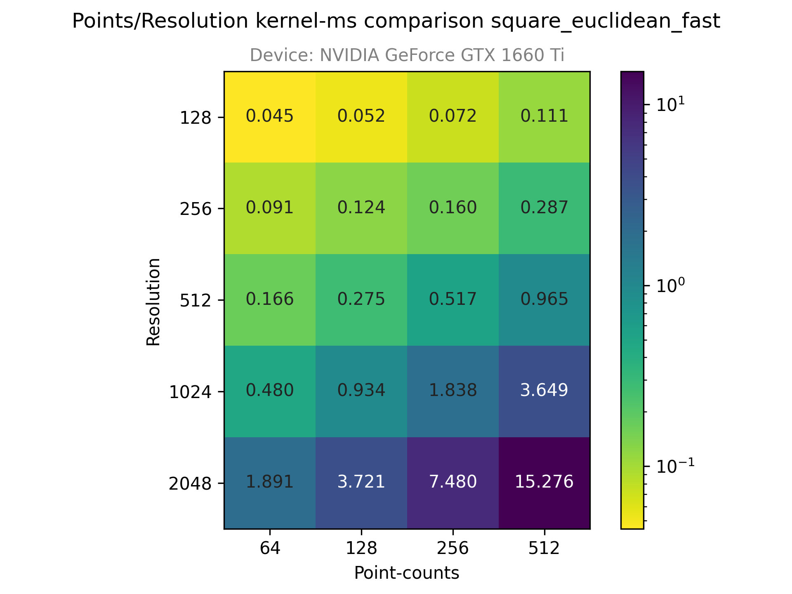 |
| 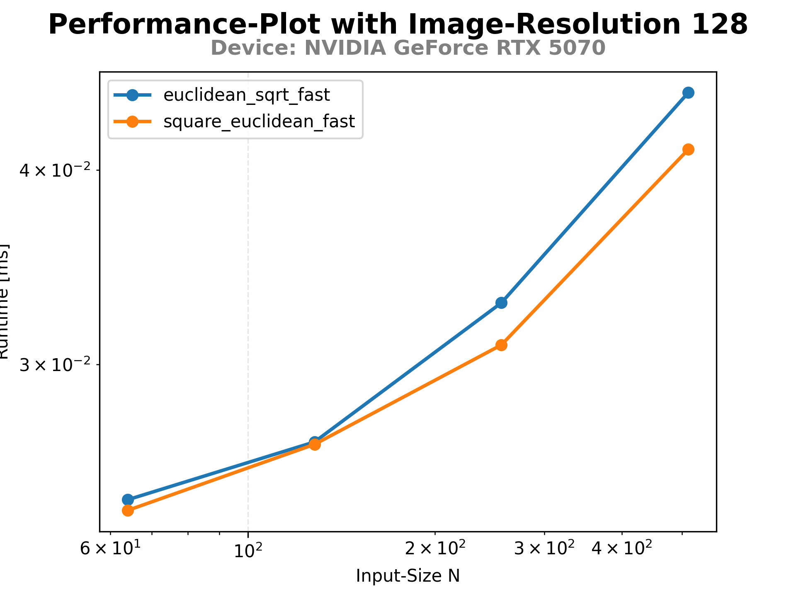 | 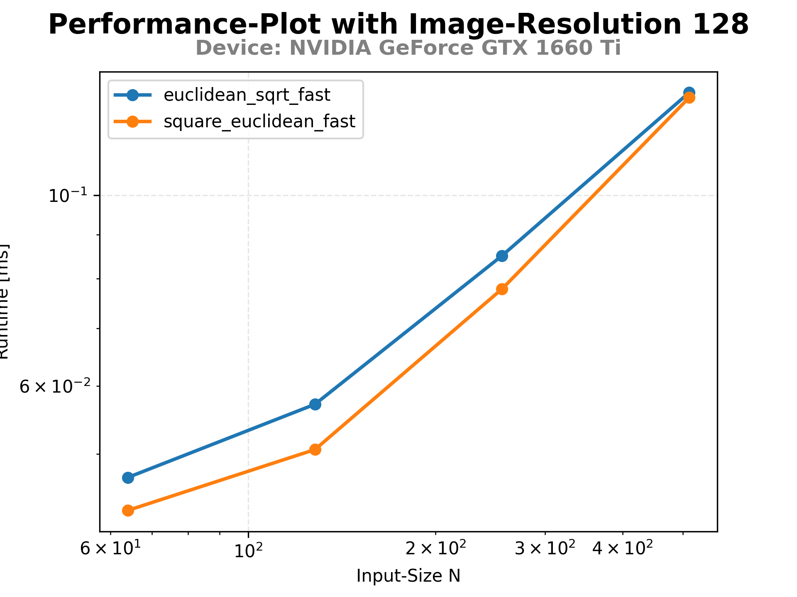 |

# Aufgabe 5 - Effizienteres Laden von Daten

_Wie wurden Daten in der Naiven Implementation geladen?_

Die Naive Implementation iteriert in jedem Thread mit einer Schleife über die Punkte. Das bedeutet jeder Thread greift in den globalen Speicher für jeden Punkt.

_Was kann beim Laden der Daten verbessert werden?_

Da in der Naiven Implementation zu jedem Zeitpunkt bekannt ist, welcher Punkt als nächstes benötigt wird, wäre es möglich die Daten in mehreren Bündeln (Batch-Processing) zu verarbeiten. Das bedeutet, dass ein Teil der Daten gleichzeitig geladen wird und danach gleichzeitig verarbeitet wird.

_Wie können die Daten ins Shared Memory geladen und mit einem Grid-Stride-Loop verarbeitet werden?_

Der gewählte Ansatz besteht darin eine feste Konstante `GRID_STRIDE_SIZE` zu definieren. Auf diese weise kann ein `cuda.shared.array` definiert und im Kernel zugegriffen werden. Dieser hat wie die Punkte Eingabe auch zwei Dimensionen, nämlich `GRID_STRIDE_SIZE` und `2`. Nun werden die ersten `GRID_STRIDE_SIZE` Punkte in das Shared Memory geschrieben. Hierbei werden `2 * GRID_STRIDE_SIZE` Threads benötigt, da für jeden Punkt ein `x` und ein `y` geladen werden muss. Je zwei aufeinander folgende Threads laden also die Daten für einen Punkt. Threads die keinen Punkt berechnen sollen warten beziehungsweise falls keine Punkte mehr vorhanden sind wird `np.inf` ins Shared Memory geschrieben um Fehler bei Rechnungen zu vermeiden. Bevor lesend auf das Shared Memory zugegriffen werden kann, muss `cuda.syncthreads()` aufgerufen werden, um Race-Conditions zu vermeiden. Nun können alle Threads aus dem Block durch das Array iterieren und Distanzen berechnen. Falls ein neuer Nächster Nachbar entdeckt wurde, muss der korrekte index des Punkt berechnet werden (Der Index in das Shared Memory Array wäre nicht korrekt). Zuletzt muss erneut `cuda.syncthreads()` aufgerufen werden, bevor die Schleife sich wiederholt, erneut um Race-Conditions zu vermeiden.

Ein weiteres Detail ist, dass ein early-exit nicht mehr möglich ist für Threads die Pixel außerhalb des Diagram berechnen. Das liegt daran, dass Threads neben dem Pixel ausrechnen auch Punkte laden müssen. Es kann also sein, dass ein Thread zwar außerhalb des Diagram liegt, aber trotzdem Punkte für andere Threads laden muss. Erst nachdem keine Punkte mehr geladen werden müssen ist ein exit für diese Threads möglich beziehungsweise nötig.

_Welchen Einfluss hat das Laden der Daten ins Shared Memory und Verarbeiten mit einem Grid-Stride-Loop und wieso?_

Um den Einfluss der Shared Memory Verarbeitung mit Grid-Stride-Loop besser darzustellen wird im folgenden mit der naiven Implementation aus _Aufgabe 3_ verglichen. Die Distanz-Berechnung wird für beide Varianten mit `cuda.libdevice.hypotf` durchgeführt um vergleichbare Resultate zu erhalten.

Die Größe `GRID_STRIDE_SIZE` ist natürlich maßgeblich für die Laufzeit, beispielsweise führt ein `GRID_STRIDE_SIZE=128` zu schlechterer performance. Mit `GRID_STRIDE_SIZE=8` haben wir die besten Ergebnisse erzielt. In den folgenden Analysen gilt deswegen stets `GRID_STRIDE_SIZE=8`.

Ein Blick auf das Assembly zeigt, dass der Compiler wegen der Konstante `GRID_STRIDE_SIZE=8` ein Loop-Unrolling der inneren Schleife, welche Distanz-Berechnungen übernimmt, durchgeführt hat. Im Vergleich zur Naiven Variante konnte der Compiler darauf verzichten mehrere Loop-Unrolling Schritte für verschiedene Längen durchzuführen, da bereits beim Kompilieren des Programm die Anzahl an Iterationen feststeht.

| RTX 5070                                                                                                                                       | GTX 1660 Ti                                                                                                                                       |
| ---------------------------------------------------------------------------------------------------------------------------------------------- | ------------------------------------------------------------------------------------------------------------------------------------------------- |
|  | 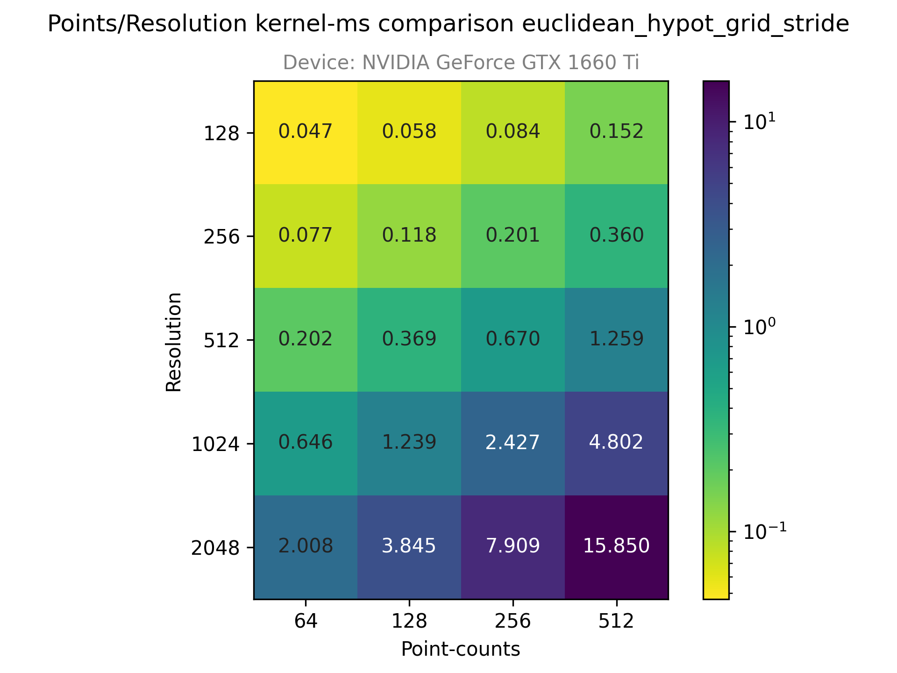 |
| 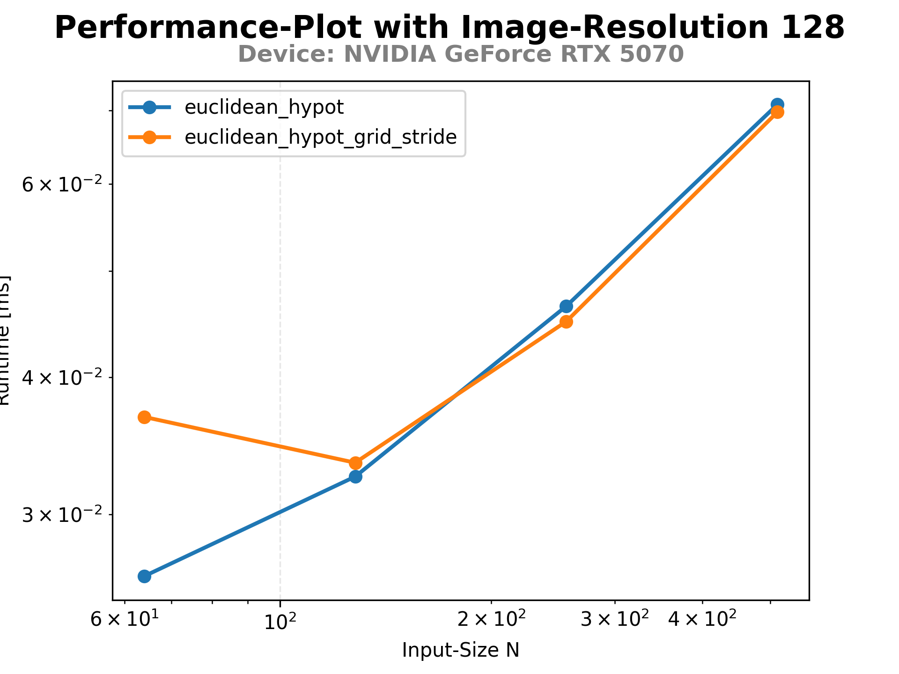     | 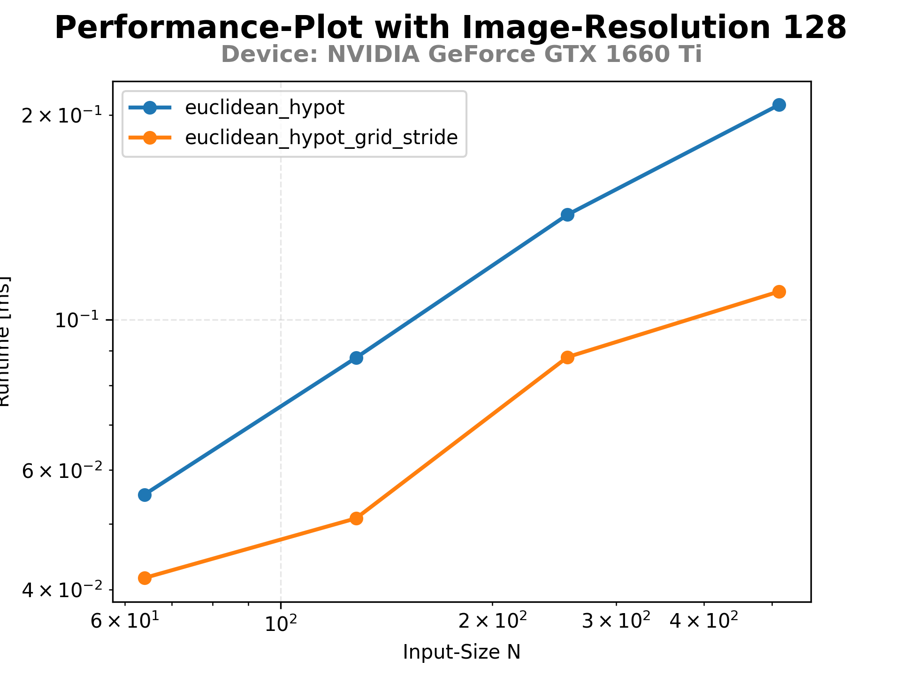     |

Es ist zusehen, dass im Vergleich zur Naiven Variante bei höherer Auflösung und Punkt-Anzahl deutlich Laufzeit eingespart wurde. Interessanterweise ist zu sehen, dass der Algorithmus für kleine Eingaben langsamer geworden ist. Der Grund hierfür ist vermutlich darauf zurückzuführen, dass mehr Overhead durch das Shared-Memory beziehungsweise das Loop-Unrolling entstanden ist. Erst bei größeren Eingaben fällt dieser Overhead weg.

Ein Blick auf die `ncu` Ausgabe zeigt, dass trotz der langsameren Distanz-Berechnung die `Compute (SM) Throughput` so hoch wie noch bei keiner anderen Implementation liegt.

```
    Section: GPU Speed Of Light Throughput
    ----------------------- ----------- -------------
    Metric Name             Metric Unit  Metric Value
    ----------------------- ----------- -------------
    DRAM Frequency                  Ghz         13,79
    SM Frequency                    Ghz          2,54
    Elapsed Cycles                cycle    14.116.124
    Memory Throughput                 %         40,37
    DRAM Throughput                   %          0,11
    Duration                         ms          5,56
    L1/TEX Cache Throughput           %         40,45
    L2 Cache Throughput               %          0,20
    SM Active Cycles              cycle 14.081.178,23
    Compute (SM) Throughput           %         92,81
    ----------------------- ----------- -------------

    INF   This workload is utilizing greater than 80.0% of the available compute or memory performance of this device.
          To further improve performance, work will likely need to be shifted from the most utilized to another unit.
          Start by analyzing workloads in the Compute Workload Analysis section.
```

Es ist zu beachten das wie bei den anderen `ncu` Ausgaben stets der Fall `resolution=2048` und `points=512` betrachtet wird. Die Laufzeit hat sich deutlich verringert, obwohl die Anzahl an Rechenzyklen nur leicht gesunken ist. Der Grund hierfür der größere Durchsatz.

_Wie können die Daten innerhalb eines Warp geladen und mit `shfl_sync` verarbeitet werden werden?_

Das Verfahren hat starke Ähnlichkeit mit dem vorherigen Ansatz. In diesem Fall werden Daten nicht mehr auf auf Block-Ebene geladen, sondern auf Warp-Ebene. Da Threads in einem Warp synchron ablaufen ist kein Aufruf von `cuda.syncthreads()` mehr nötig. Ein Nachteil hierbei ist, dass nun jeder Warp die Daten laden muss. Da nun kein `cuda.shared.array` vorhanden ist, muss eine lokale Variable definiert werden, welches auf ähnliche Weise verwendet wird. Die Variable wurde `point_component_warp_value` benannt und wird für jeden zweiten Thread eines Warp die `x`-Komponente und für jeden anderen Thread des Warp die `x`-Komponente laden. Falls ein Punkt nicht vorhanden ist, werden die Komponenten jeweils auf `np.inf` gesetzt um Fehler bei Rechnungen zu vermeiden. Wenn ein Warp nun die Variable `point_component_warp_value` eines jeden Thread befüllt wurden 16 `x`- und 16 `y`-Komponenten geladen, da es insgesamt 32 Threads pro Warp sind. Nun kann mit `cuda.shfl_sync` auf einen beliebigen Wert eines anderen Thread des gleichen Warp zugegriffen werden. Mit `cuda.shfl_sync(0xFFFFFFFF, point_component_warp_value, index)` und `cuda.shfl_sync(0xFFFFFFFF, point_component_warp_value, index + 1)` werden die Komponenten eines Punkt geladen und es kann die Distanz-Rechnung durchgeführt werden. Die beiden `cuda.shfl_sync` Aufrufe werden 16-mal wiederholt, bis vom Warp geladenen alle Punkte verarbeitet sind. Danach können die nächsten Punkte geladen werden, erneut ohne ein Aufruf von `cuda.syncthreads()`, da die Threads eines Warp synchron ablaufen.

Wie auch beim vorherigen Ansatz ist ein early-exit nicht möglich aus den gleichen Gründen.

_Welchen Einfluss hat das Laden der Daten in einen Warp und das Verarbeiten mit `shfl_sync` und wieso?_

Diese Variante benötigt kein Ausprobieren von verschiedenen `GRID_STRIDE_SIZE`, da hierbei die Konstante `WARP_SIZE=32` verwendet wird.

Wie zu erwarten ist im Assembly die intrisic Operation `shfl.sync.idx` zu sehen. Der Compiler hat in diesem Fall wegen der Konstante `WARP_SIZE=32` erneut ein Loop-Unrolling durchgefürt. Erneut konnte der Compiler darauf verzichten mehrere Loop-Unrolling für verschiedenen Längen zu erzeugen, da die Anzahl an Iterationen der inneren Schleife eindeutig ist. Der Compiler hat jedoch nicht 16 sondern nur vier Iterationen aufgerollt.

| RTX 5070                                                                                                                                     | GTX 1660 Ti                                                                                                                                     |
| -------------------------------------------------------------------------------------------------------------------------------------------- | ----------------------------------------------------------------------------------------------------------------------------------------------- |
| 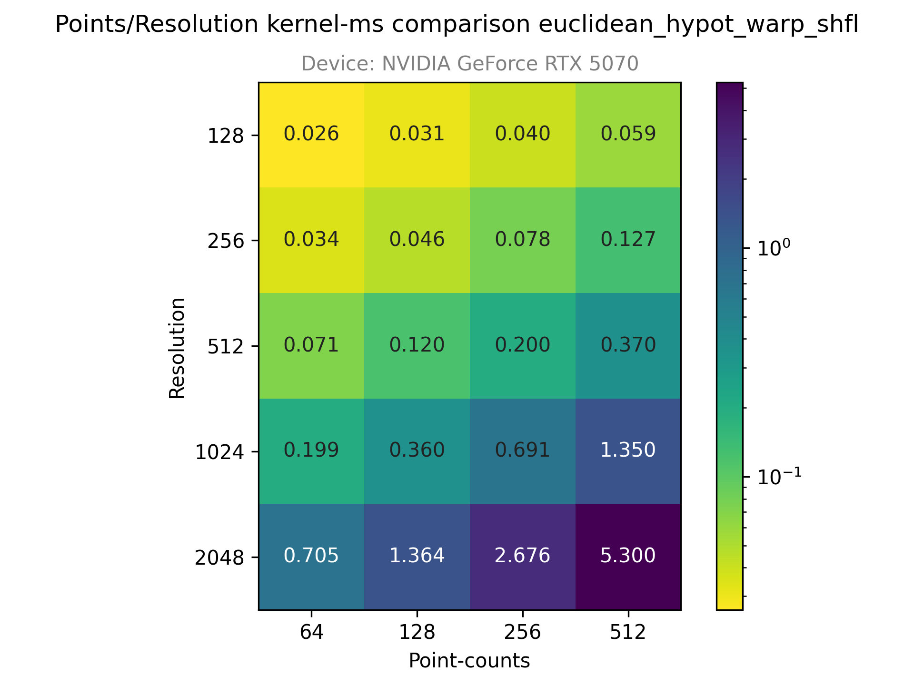 |  |
| 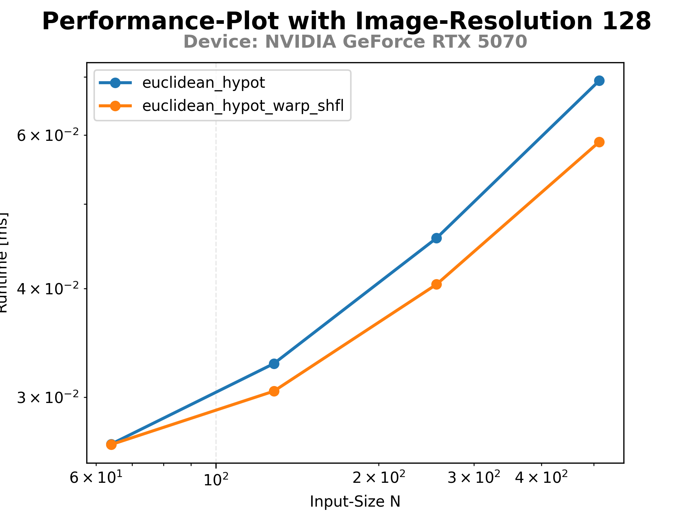     | 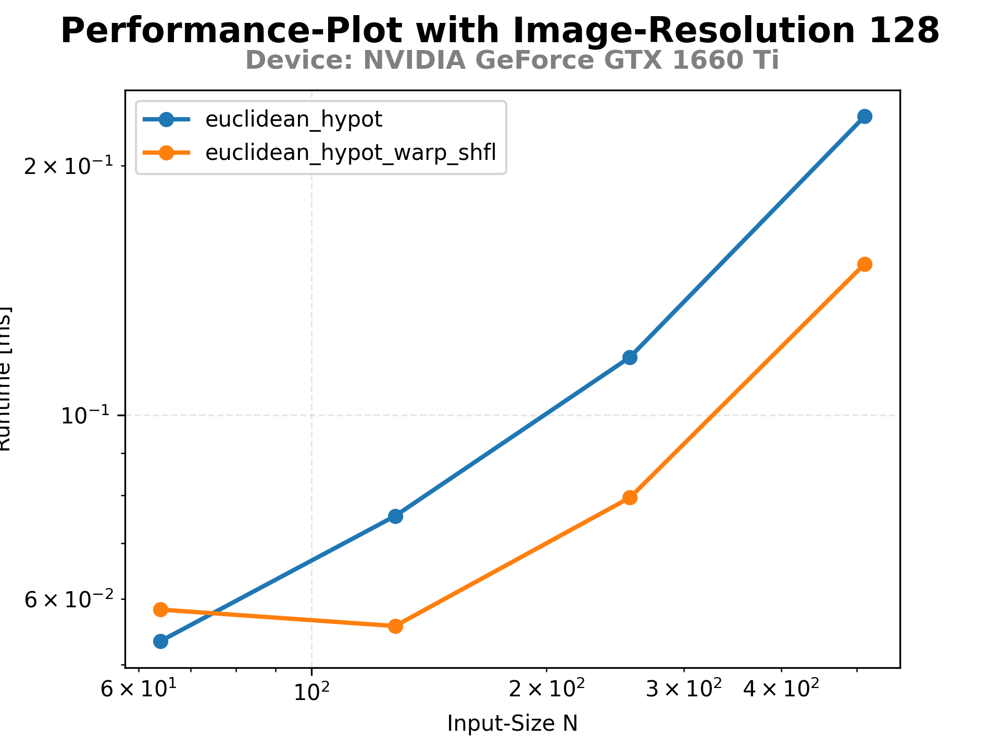     |

Es ist zu sehen, dass diese Variante ebenfalls schneller arbeitet, als die initiale Variante. Interessanterweise ist nun kein Unterschied bei kleinen Eingaben zu sehen, der Grund ist an dieser Stelle leider nicht ganz eindeutig, aber es könnte daran liegen, dass kein `cuda.syncthreads` nötig ist. Für größere Eingaben erscheint der Grid-Stride-Loop mit Shared-Memory effektiver.

_Wie verhalten sich die Kernel durch den Einsatz von schnelleren Distanz-Berechnungen und effizienterem Laden von Daten?_

Wir haben nun die Berechnungen (Compute) und die Speicherzugriffe (Memory) separat voneinander optimiert. Nun möchten wir die beiden Optimierungen zusammenführen. Von der Distanz-Berechnung wählen wir die Square-Euclidean Variante mit `fastmath=True` und kombinieren diese mit je der Grid-Stride-Loop mit Shared-Memory als auch Warp mit `shfl_sync`. Der Grund hierfür ist, dass bei den Speicher-Optimierungen nicht eindeutig (nicht immer) eine Methode schneller als eine andere war.

Folgende Diagramme geben die Laufzeiten wieder.

| RTX 5070                                                                                                                                             | GTX 1660 Ti                                                                                                                                             |
| ---------------------------------------------------------------------------------------------------------------------------------------------------- | ------------------------------------------------------------------------------------------------------------------------------------------------------- |
| 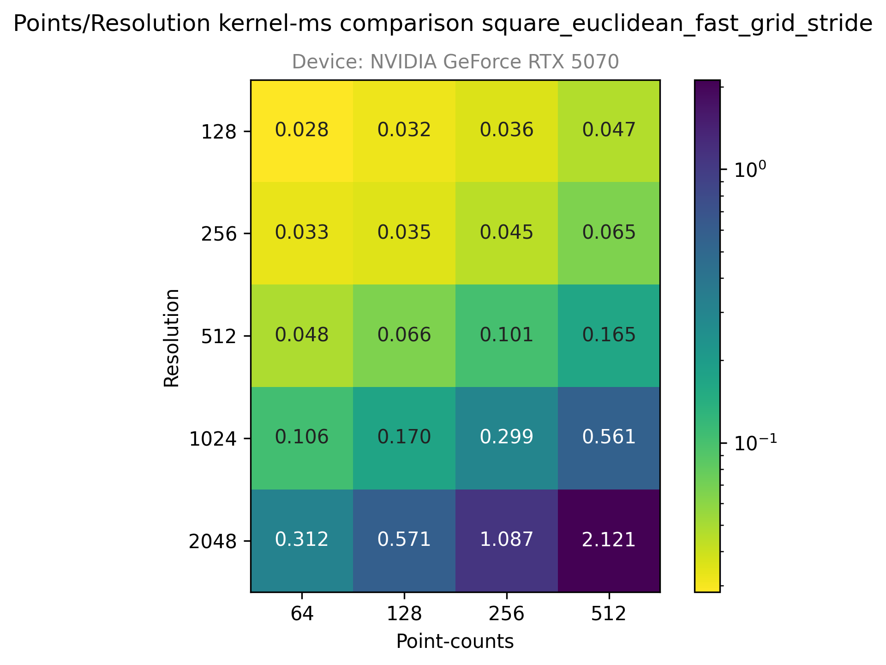 | 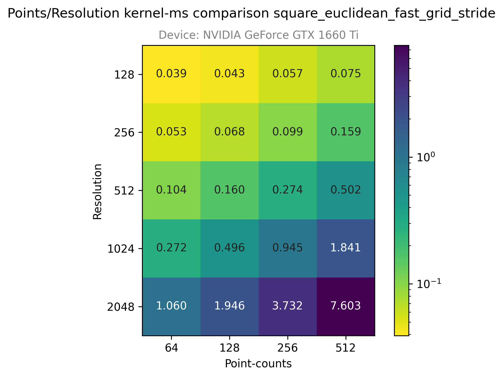 |
| 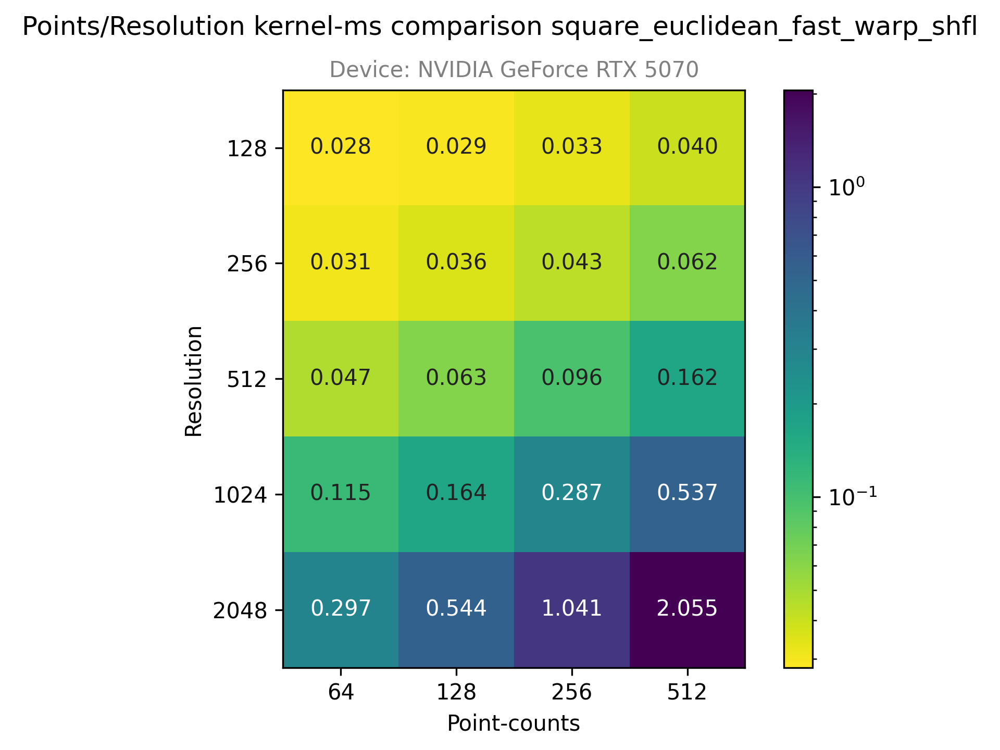   |    |

Es hat sich ergeben, dass die Warp mit `shfl_sync` Variante für jede Eingabe eine bessere Laufzeit aufweis.

Interessanterweise hat sich in der `ncu` Ausgabe ebenfalls eine deutliche Verbesserung für die Warp mit `shfl_sync` Variante gezeigt.

```
    Section: GPU Speed Of Light Throughput
    ----------------------- ----------- ------------
    Metric Name             Metric Unit Metric Value
    ----------------------- ----------- ------------
    DRAM Frequency                  Ghz        13,79
    SM Frequency                    Ghz         2,54
    Elapsed Cycles                cycle    5.815.751
    Memory Throughput                 %        99,51
    DRAM Throughput                   %         0,91
    Duration                         ms         2,29
    L1/TEX Cache Throughput           %        99,74
    L2 Cache Throughput               %         1,66
    SM Active Cycles              cycle 5.798.622,54
    Compute (SM) Throughput           %        99,51
    ----------------------- ----------- ------------

    INF   This workload is utilizing greater than 80.0% of the available compute or memory performance of this device.
          To further improve performance, work will likely need to be shifted from the most utilized to another unit.
          Start by analyzing workloads in the Compute Workload Analysis section.
```

Die `Compute (SM) Throughput` beziehungsweise `Memory Throughput` Metrik liegt nun fast beim Maximum und ist erneut so hoch wie bei keiner der bisherigen Analysen. Ebenso ist die Anzahl an Rechenzyklen so niedrig wie bei keinem der anderen Implementationen.

Dieser Algorithmus ist nun möglichst effizient implementiert. Im folgenden wollen wir betrachten, ob durch einen alternativen Algorithmus beziehungsweise Ansatz eine weitere Verbesserung der Laufzeit möglich ist.

# Aufgabe 6 - Alternativer Ansatz: Jump Flooding Algorithmus (JFA)

> [!NOTE]
>
> - Für die Diastanzberechnung wird im Folgenden die quadrierte euklidische Distanz - beziehungsweise im Exkurs die Manhattan-Distanz - verwendet.
> - Der in den vorherigen Aufgaben verwendete Algorithmus wird im Folgenden teilweise referenziert und verwendet. Dabei wird er als _"Pixel-Algorithmus"_ bezeichnet.

Der Jump Flooding Algorithmus (JFA) wurde im Jahr 2006 von **Guodong Rong** und **Tiow-Seng Tan** auf der Computergrafik-Konferenz _ACM Symposium on Interactive 3D Graphics and Games (I3D)_ in Redwood City vorgestellt (vgl. [Jump Flooding in GPU](https://www.comp.nus.edu.sg/~tants/jfa/i3d06.pdf)). Die Autoren konzipierten den Algorithmus gezielt für die parallele Architektur von GPUs, um geometrische Probleme wie die Berechnung von Voronoi-Diagrammen oder Distanzfeldern zu lösen.

## Aufgabe 6a - Beschreibung und naive Implementation

_Wie funktioniert der Algorithmus?_

Für den Algorithmus wird ein quadratisches Grid der Größe $N \times N$ definiert. Bevor der Algorithmus startet, wird das leere Grid initialisiert, indem die zuvor zufällig generierten Seed-Koordinaten gesetzt werden: Jeder Seed weiß zu Beginn, zu welchem Pixel er gehört. Alle anderen Pixel werden mit einem **undefinierten** Startzustand initialisiert. Das bedeutet, ein normaler Pixel weiß anfangs nicht, zu welchem Punkt er am nächsten liegt.

Der Jump Flooding Algorithmus wird nun in mehreren Schritten iterativ ausgeführt. Die erste Schrittweite beträgt $k = \frac{N}{2}$, wobei $N$ die Auflösung des Grids ist. Für jede Schrittweite $k$ prüft jeder Pixel im Grid seine 8 **Nachbarpixel** (Norden, Nordost, Osten, Südost, Süden, Südwest, Westen, Nordwest), die genau $k$ Pixel entfernt sind. Dabei wird überprüft, ob diese Nachbarn bereits gültige Seed-Koordinaten besitzen (also nicht mehr das _Uninitialized-Flag_ haben):

- Ist das der Fall, übernimmt der aktuelle Pixel die Seed-Koordinaten des Nachbarpixels und betrachtet diesen Seed vorerst als den nächstgelegenen Punkt.
- Hat ein Nachbarpixel ebenfalls keine Seed-Koordinaten, wird er ignoriert.
- Wird bei einer späteren Prüfung oder in einem späteren Schritt ein Seed gefunden, dessen Distanz zum aktuellen Pixel kürzer ist als die des bereits gespeicherten Seeds, werden die neuen, näheren Koordinaten übernommen und die alten überschrieben.

Nach jeder Iteration wird die Schrittweite $k$ halbiert ($k = \frac{k}{2}$), bis der Wert **1** erreicht und berechnet wurde.

Aufgrund dieser fortlaufenden Halbierung ist es **zwingend erforderlich**, dass das Grid eine Auflösung mit einer Zweierpotenz ($2^m$) besitzt. Für rechteckige Grids müsste man das schrittweise Halbieren der Schrittweite entlang der längeren Kante durchführen.

_Wie wird der JFA implementiert?_

In dieser **ersten naiven** Implementation wird das Grid als 3D-Array der Form `shape=(resolution, resolution, 2)` vom Typ `int32` definiert. Dieses Layout wird auch als _Array of Structures (AoS)_ bezeichnet, weil es für jeden Pixel die X- und Y-Koordinate des nächstgelegenen Seeds speichert (vgl. `generate_AoS_grid_jfa()`). Für den undefinierten Startzustand der Pixel, die kein Seed sind, wird der Wert `-1` verwendet. Dieser signalisiert, dass der Pixel noch keine Seed-Koordinaten kennt.

Eine Besonderheit liegt in der Steuerung auf der Host-Seite: Das Voronoi-Diagramm wird hier iterativ in einer Schleife nach dem eben beschriebenen Verfahren bestimmt. Die Kernel-Implementierung auf der GPU beinhaltet also keine vollständige Berechnung des gesamten Diagramms, sondern führt nur einen einzelnen **Pass** (einen Iterationsschritt) aus. Der Kernel nimmt folgende Parameter entgegen:

- Ein Eingabe-Grid-Array (`grid_in`)
- Ein Ausgabe-Grid-Array (`grid_out`)
- Die aktuelle Schrittweite $k$ für den Pass (`step_size`)
- Die Auflösung des Diagramms (`size`)

Die Verwendung von zwei getrennten Grids ist notwendig, da das Eingabe-Grid während des Schrittes gelesen wird, um das Ausgabe-Grid parallel zu aktualisieren. Bei der Verwendung eines gemeinsamen Grids kann es zu **Race Conditions** kommen: Ein Thread liest dann möglicherweise den von einem anderen Thread neu geschriebenen Wert anstelle des ursprünglichen Werts vor diesem Pass. Da die X- und Y-Koordinate eines Punktes als zwei separate Schreiboperationen erfolgen, könnte ein Thread die X-Koordinate eines Punktes sogar mit der noch nicht aktualisierten Y-Koordinate eines anderen Punktes kombinieren, wodurch ein Punkt entsteht, der in der Form gar nicht existiert. Auf der Host-Seite wird der Kernel in einer Schleife so oft aufgerufen, bis die Schrittweite den Wert **1** abgearbeitet hat. Nach jedem Kernel-Aufruf werden das Eingabe- und Ausgabe-Grid getauscht (**Swapping**), sodass ein Ping-Pong-artiges Konstrukt entsteht.

Um am Ende aus dem 3D-Array (das die Seed-Koordinaten als X/Y-Tupel speichert) ein finales 2D-Array mit eindeutigen UIDs der Seeds zu erzeugen, wird für jeden Pixel der berechnete X-Wert mit dem Wert $Y \cdot \mathrm{resolution}$ addiert:

$$\text{UID} = X + (Y \cdot \text{resolution})$$

Dadurch entstehen eindeutige IDs für identische Seed-Koordinaten.

Die folgenden Visualisierungen zeigen den Zustand des Diagramms nach jedem Schritt $k$ (Auflösung: $2048 \times 2048$, Punkte: $256$):

```bash
uv run .\src\task6a.py jfa-euclidean-visualization
uv run .\src\task6a.py jfa-manhattan-visualization
```

| `JFA - square euclidean distance`                   | `JFA - manhattan distance`                          |
| --------------------------------------------------- | --------------------------------------------------- |
|  |  |

Sowohl bei der quadratischen euklidischen Distanz als auch bei der Manhattan-Distanz ist gut zu erkennen, wie das zu Beginn leere, schwarze Bild mit jedem Schritt "voller" wird. Das typische _"Flooding-Verhalten"_ (Fluten) des Algorithmus wird hierbei in jeder Iteration sichtbar.

_Wo liegen die Unterschiede zum Ansatz der vorherigen Implementierung?_

Ursprünglich wurde zur Initialisierung der kürzesten Distanz wie beim Pixel-Algorithmus Folgendes verwendet: `best_dist = np.float32(np.inf)`. Ein `.inspect_types()`-Aufruf nach dem Kernel-Lauf zeigt jedoch, dass trotz des expliziten `float32`-Casts eine `float64`-Variable initialisiert wird.

Da in dieser Aufgabe die Distanzberechnung auf die quadrierte euklidische Distanz (beziehungsweise im Exkurs auf die Manhattan-Distanz) festgelegt ist und der Kernel auf diskreten Ganzzahl-Koordinaten operiert, ist ein Ausweichen auf Fließkommazahlen mathematisch nicht notwendig: Das Ergebnis einer Summe von Quadraten ganzer Zahlen ist stets wieder eine Ganzzahl. Deshalb wird die kürzeste Distanz (`best_dist`) mit dem maximalen `int32`-Wert initialisiert. Folgender Code zeigt die minimalen und maximalen Werte für den NumPy-Datentyp `int32`:

```python
info = np.iinfo(np.int32)
print("Minimum:", info.min)  # -2147483647
print("Maximum:", info.max)  #  2147483647
```

Bei der Festlegung auf `int32` muss sichergestellt sein, dass die quadrierte euklidische Distanz das Limit von $2147483647$ nicht überschreitet:

$$\mathrm{dist} = \Delta x^2 + \Delta y^2$$

Geht man von einem quadratischen Bild der Seitenlänge $N \times N$ aus, tritt die maximale Distanz im Worst Case zwischen den diagonal gegenüberliegenden Bildeckpunkten auf. Daraus folgt für die maximale quadrierte Distanz:

$$\mathrm{dist}_{\max} = N^2 + N^2 = 2N^2$$

Um einen Überlauf zu verhindern, muss gelten:

$$2N^2 \le 2147483647$$

$$N^2 \le 1073741823,5$$

$$N \le \sqrt{1073741823,5} = 32768$$

Demnach würde diese Obergrenze bei Bildgrößen ab $32768 \times 32768$ Pixeln überschritten werden, was für die meisten Auflösungen allerdings ausreichend sein sollte. Da beim JFA zudem nie zwei diagonal gegenüberliegende Bildeckpunkte verwendet werden - aufgrund der höchsten Schritte von $\frac{N}{2}$ zu Beginn - ist die tatsächliche maximale Grenze für den JFA nochmal höher.

_Gibt es Qualitätsunterschiede (Pixelfehler) im Diagramm?_

In der Literatur wird der JFA als Approximations-Algorithmus bezeichnet. Das bedeutet, dass der Algorithmus mathematisch nicht immer ein zu `100%` korrektes Ergebnis liefert. Auch im originalen Paper von Guodong Rong und Tiow-Seng Tan wird dieses Thema explizit behandelt (vgl. [5. Errors in Jump Flooding](https://www.comp.nus.edu.sg/~tants/jfa/i3d06.pdf)). Die Autoren zeigen dort aber auch auf, dass die Fehlerrate in der Praxis minimal ist.

Experimente in der Studie zeigen, dass diese Fehler hauptsächlich entlang der Grenzen von Voronoi-Regionen auftreten. Genauer gesagt: Bei Voronoi-Zellen, die entlang der Gittergrenze liegen, können sich fehlerhafte Gitterpunkte um die Voronoi-Kanten herum ansammeln. Bei den übrigen Voronoi-Zellen sind fast alle fehlerhaften Gitterpunkte überwiegend Voronoi-Eckpunkte oder gruppieren sich um diese herum.

Als Ursache für diese Fehler wird der Informationstransport des JFA über abnehmende Schrittweiten genannt. Ein Pixel im Gitter speichert zu jedem Zeitpunkt immer nur **eine** Information zu einem ihm nächstgelegenen Punkt. Wenn nun in einer Iteration mehrere Punktkoordinaten verglichen werden, speichert das Pixel am Ende nur die aktuell lokal optimalste Koordinate. Andere Koordinaten, die für umliegende Pixel relevant sein könnten, breiten sich über dieses Pixel nicht weiter aus. Man spricht dabei von einem _getöteten_ Punkt (_killed seed_). Für die weiteren Iterationsschritte fehlen nachfolgenden Pixeln im Gitter genau diese verloren gegangenen Informationen, um ihren mathematisch tatsächlich nächstgelegenen Punkt zu finden. Dies resultiert letztlich in einer fehlerhaften Zuordnung der Punktkoordinaten.

Zur Verbesserung der Ergebnisse schlägt die Studie mehrere Varianten vor, um diese Fehler gezielt an den Voronoi-Eckpunkten und entlang der Kanten zu eliminieren - darunter `JFA+1` und `JFA+2`. Dabei wird zunächst der Standard-JFA durchgeführt. Am Ende werden jedoch zusätzliche Durchläufe mit einer Schrittweite von **1** (für `JFA+1`) beziehungsweise **2** und anschließend **1** (für `JFA+2`) angehängt. Diese lokalen Suchen erlauben es den betroffenen Pixeln, korrekte Daten aus ihrer unmittelbaren Nachbarschaft zu übernehmen, selbst wenn der primäre Ausbreitungspfad zuvor blockiert wurde.

Um diesem Aspekt im Projekt quantitativ nachzugehen, wurde der naive JFA-Ansatz mit der quadrierten euklidischen Distanz (`_jfa_pass_naive_square_euclidean_kernel`) mit der Referenzimplementierung aus der vorherigen Aufgabe (`_voroni_square_euclidean_kernel`) verglichen. Der pixelbasierte Algorithmus dient dabei als exakte `100%`-Referenz. Der Vergleich wurde mit einer Auflösung von **$2048 \times 2048$ Pixeln** und **512** Punkten durchgeführt.

Die folgenden _Error Maps_ visualisieren die Abweichungen der verschiedenen JFA-Varianten, wobei identische Zuordnungen schwarz und fehlerhafte Pixel rot dargestellt werden:

```bash
uv run .\src\task6a.py jfa-accuracy
```

| `Standard JFA`                                                  | `JFA+1`                                                       | `JFA+2`                                                       |
| --------------------------------------------------------------- | ------------------------------------------------------------- | ------------------------------------------------------------- |
| 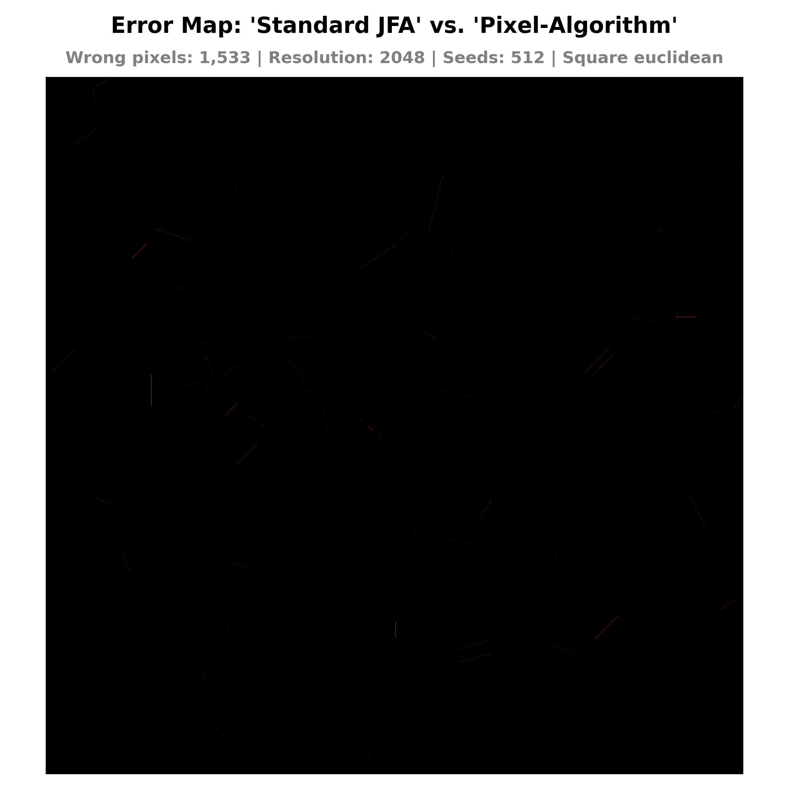 | 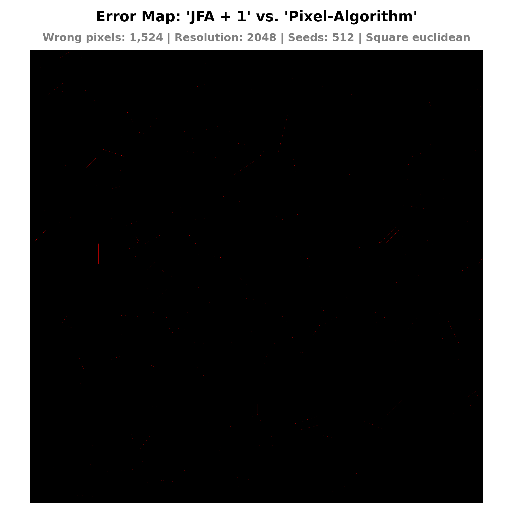 | 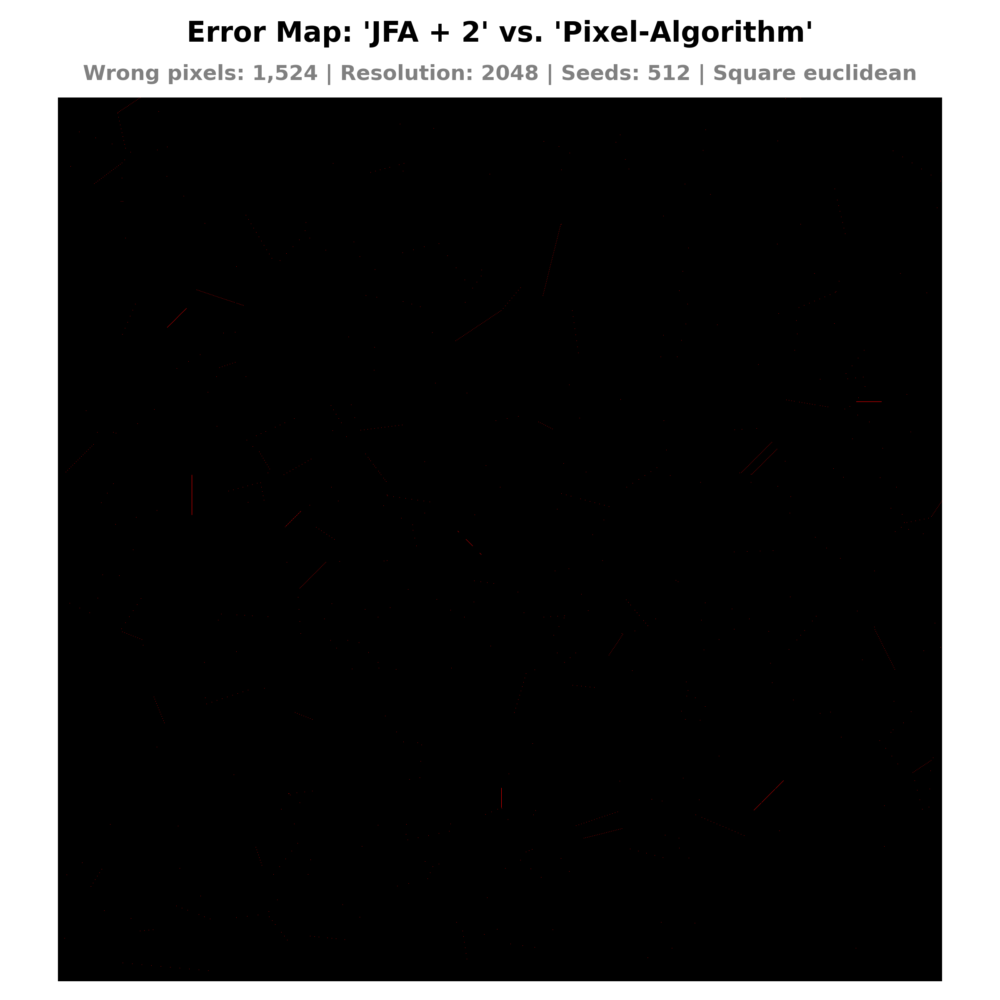 |

Die Auswertung der Genauigkeiten lieferte folgende Ergebnisse:

```bash
Standard JFA: 99.9635%
JFA + 1: 99.9637%
JFA + 2: 99.9637%
```

Es ist zu erkennen, dass bereits beim Standard-JFA ohne zusätzliche Durchläufe der Anteil fehlerhafter Pixel im Vergleich zur Gesamtpixelanzahl deutlich unter 1 % liegt. Mit den zusätzlichen Durchläufen von `JFA+1` und `JFA+2` lassen sich im Experiment zwar messbare Verbesserungen der Genauigkeit erzielen, diese fallen bei der gewählten Konstellation jedoch nicht mehr allzu signifikant aus, da die Basisgenauigkeit bereits recht hoch ist.

_Was muss bei der Performancemessung beachtet werden?_

In [Aufgabe 2](#aufgabe-2---performance-analyse-konzept) wurde das Konzept für die Performanceanalyse vorgestellt. Für den JFA ergeben sich hierbei besondere Herausforderungen. Neben der unterschiedlichen Kernel-Signatur ist vor allem die Hostseitige Steuerung ein wesentlicher Unterschied: Während beim Pixel-Algorithmus ein einzelner Kernel-Aufruf das Voronoi-Diagramm vollständig berechnet, benötigt der Standard-JFA mehrere sequenzielle Kernel-Aufrufe. Das beeinflusst, wie die tatsächliche Kernel-Laufzeit korrekt gemessen werden kann.

Zwischen jedem Kernel-Aufruf müssen Ein- und Ausgabe-Grid getauscht (_Ping-Pong-Swap_) und die Schrittweite halbiert werden. Diese Operationen werden vom Python-Interpreter ausgeführt. Die dabei entstehenden Zeiten sollen bei der Laufzeitmessung möglichst nicht erfasst werden.

Da in _Aufgabe 2_ entschieden wurde, CUDA-Events für die Laufzeitmessung zu verwenden, scheidet `time.perf_counter()` aus. Für CUDA-Events stehen zwei Varianten zur Auswahl:

**Variante 1: Events pro Iteration mit Synchronisierung:**

```python
kernel_time: float = 0.0
while k >= 1:
    kernel_start.record()
    kernel[blocks_per_grid, threads_per_block](grid_in, grid_out, k, resolution)
    kernel_end.record()
    cuda.synchronize()
    kernel_time += kernel_start.elapsed_time(kernel_end)
    grid_in, grid_out = grid_out, grid_in
    k //= 2
```

Hier wird jeder Kernel-Aufruf einzeln geklammert und seine Laufzeit zur Gesamtzeit addiert. Dies entspricht dem Vorgehen beim Pixel-Algorithmus. Der Vorteil ist, dass ausschließlich reine Kernel-Ausführungszeiten summiert werden. Der entscheidende Nachteil ist jedoch, dass `cuda.synchronize()` _innerhalb_ der Schleife die CPU nach jedem Kernel-Aufruf blockiert, bis die GPU fertig ist. Dadurch wird die GPU _serialisiert_: Sie kann erst dann den nächsten Kernel empfangen, wenn die CPU nach der Synchronisierung wieder die Kontrolle übernommen hat.

**Variante 2: Events um die gesamte Ping-Pong-Schleife:**

```python
kernel_start.record()
while k >= 1:
    kernel[blocks_per_grid, threads_per_block](grid_in, grid_out, k, resolution)
    grid_in, grid_out = grid_out, grid_in
    k //= 2
kernel_end.record()
cuda.synchronize()
total_ms = kernel_start.elapsed_time(kernel_end)
```

Das Start-Event wird einmalig vor der Schleife, das End-Event einmalig danach in den GPU-Stream eingetragen. Laut [Numba-Dokumentation](https://numba.readthedocs.io/en/stable/cuda-reference/host.html#numba.cuda.cudadrv.driver.Event) gilt ein Event als eingetreten, sobald alle Aufgaben, die zum Zeitpunkt des Aufrufs von `.record()` in der Warteschlange des Streams standen, abgeschlossen sind. Da Kernel-Aufrufe in Numba standardmäßig asynchron sind und in den Default-Stream eingereiht werden, sieht die GPU den Stream als geordnete Sequenz:

```
[start_event => kernel_1 => kernel_2 => ... => kernel_N => end_event]
```

Der Python-Code (Swap, Halbierung von `k`) läuft ausschließlich auf der CPU und erscheint **nicht** in der GPU-Timeline. `elapsed_time` misst daher reine GPU-Zeit zwischen den beiden Markern.

Für die Messungen in _Aufgabe 2_ wurde **Variante 2** gewählt.

_Was liefert die Performance-Analyse?_

Die folgenden Diagramme zeigen die gemessenen Kernellaufzeiten für die **quadratische euklidische Distanz**:

```bash
uv run .\src\task7.py naive_square_euclidean_jfa
```

| RTX 5070                                                                                                                                      | GTX 1660 Ti                                                                                                                                      |
| --------------------------------------------------------------------------------------------------------------------------------------------- | ------------------------------------------------------------------------------------------------------------------------------------------------ |
| 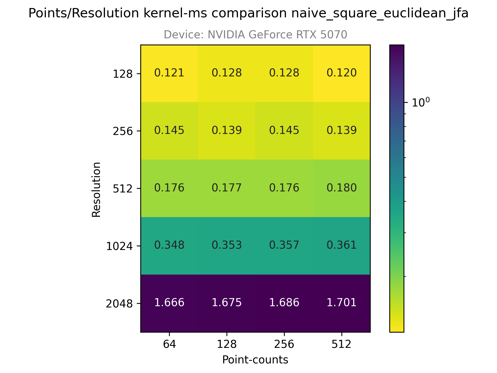 | 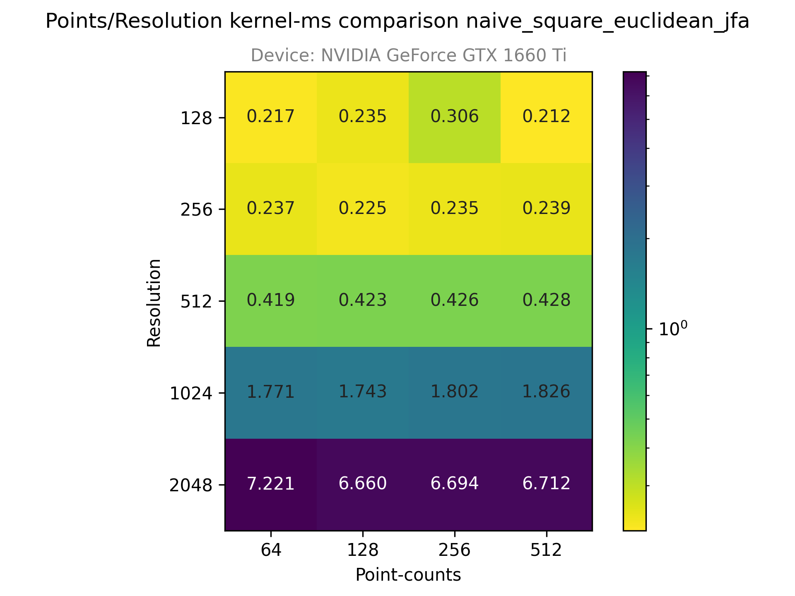 |
| 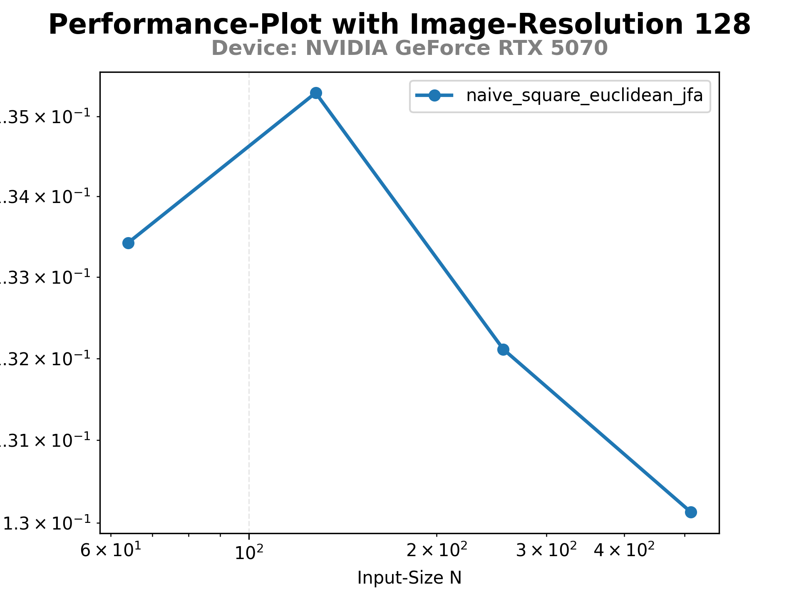                     | 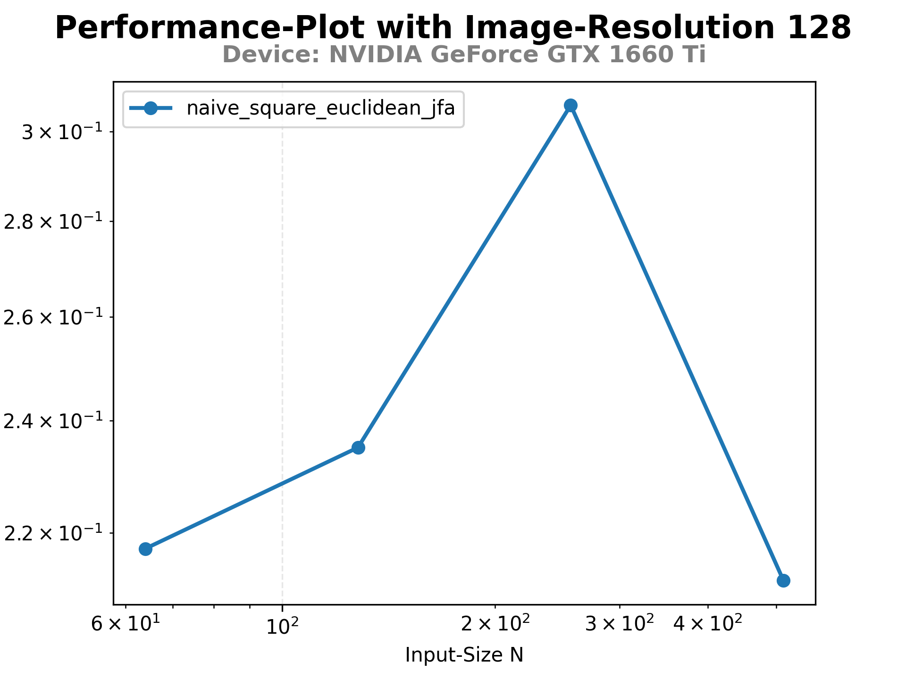                     |

Aus den Messungen geht hervor, dass die Kernellaufzeit primär von der Bildauflösung abhängt und unabhängig von der Anzahl der gesetzten Punkte ist. In den _Heatmaps_ ist visuell deutlich zu erkennen, dass der Farbverlauf innerhalb einer Zeile (also bei konstanter Bildauflösung) gleich bleibt und die Laufzeit erst beim Wechsel in die nächste Zeile (steigende Bildauflösung) zunimmt.

Dieses Verhalten spiegelt die Charakteristik des JFA wider: Da der Algorithmus in jedem Schritt das gesamte Gitter parallel durchläuft und die Anzahl der Gesamtschritte durch die Auflösung vorgegeben ist, bleibt der Rechenaufwand pro Pixel konstant - unabhängig davon, wie viele Punkte die Voronoi-Regionen erzeugen. Pro Iterationsschritt besitzt der JFA eine Komplexität von $O(1)$, da ein Thread pro Pixel immer die gleiche Arbeit macht. Bezogen auf die Gesamtgrafik ergibt sich durch die Halbierung der Schrittweite eine logarithmische Laufzeitabhängigkeit von der Auflösung $N$:

$$O(\log_2(N))$$

Auch in den unteren Linien-Diagrammen (Performance-Plots bei einer festen Auflösung von $128 \times 128$) wird dieses Verhalten bei genauerer Betrachtung deutlich. Obwohl die Kurve auf den ersten Blick stark schwankt, zeigt ein Blick auf die Zahlen der Y-Achse, dass sich die Werte in einem kleinen Wertebereich bewegen. Die visuellen Schwankungen resultieren aus der automatischen Skalierung des Diagramms, welches auf die Kurve _"herangezoomt"_ hat. In absoluten Zahlen ausgedrückt sind diese Schwankungen vernachlässigbar und bestätigen die Unabhängigkeit von der Punkteanzahl.

Die folgenden Diagramme zeigen die gemessenen Kernellaufzeiten für die **Mannhatten-Distanz**:

```bash
uv run .\src\task7.py naive_manhattan_jfa
uv run .\src\task7.py compare-naive_square_euclidean_jfa-naive_manhattan_jfa
```

| RTX 5070                                                                                                                                      | GTX 1660 Ti                                                                                                                                      |
| --------------------------------------------------------------------------------------------------------------------------------------------- | ------------------------------------------------------------------------------------------------------------------------------------------------ |
|         | 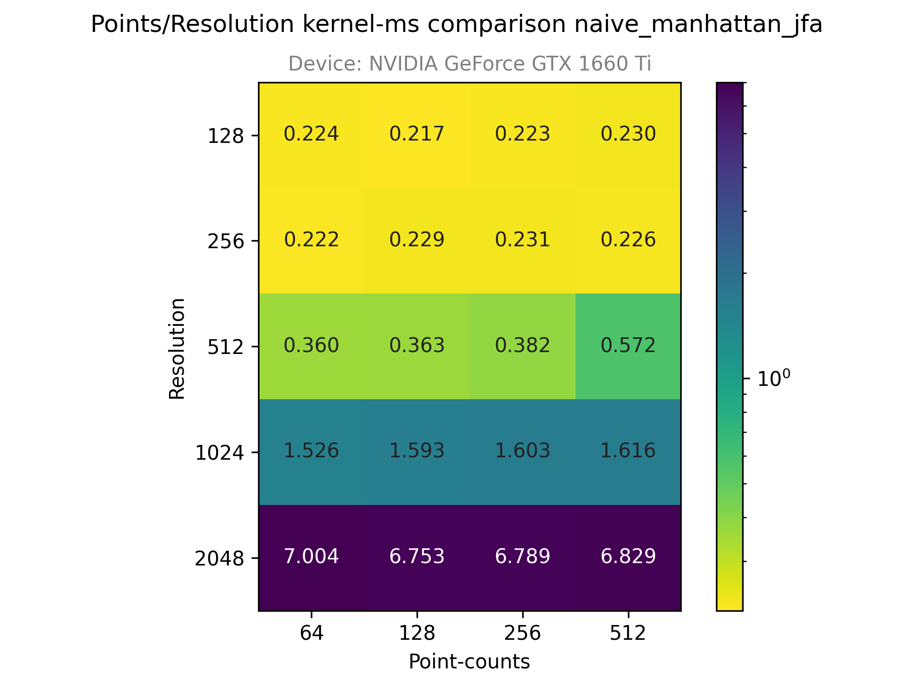        |
|  | 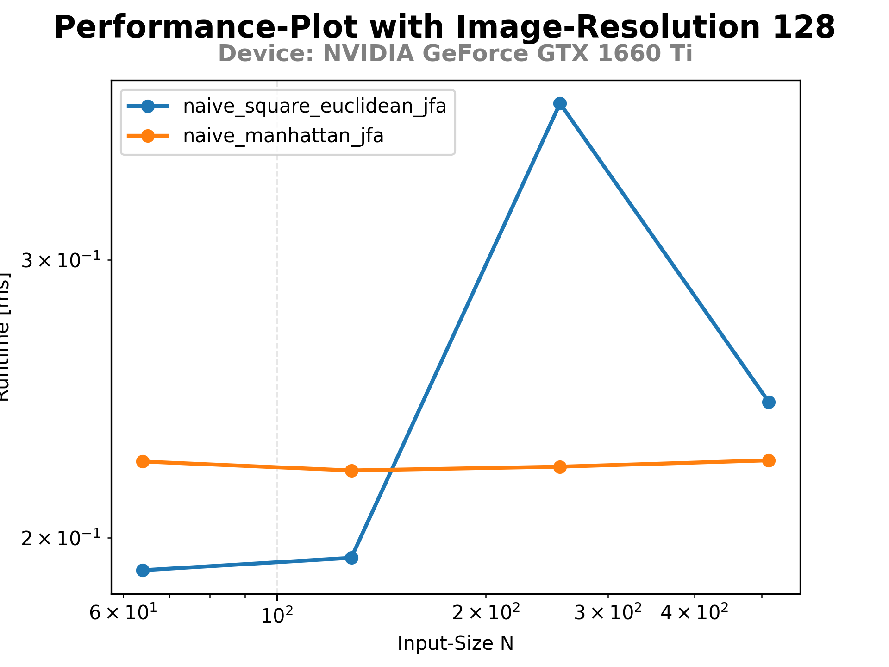 |

Die Diagramme der Manhattan-Distanz zeigen vergleichbare Laufzeiten und Verhaltensmuster wie die der quadratischen euklidischen Distanz. Die Wahl der Metrik zur Distanzberechnung hat folglich keinen spürbaren Einfluss auf die Gesamtperformance des Kernels. Daraus lässt sich schließen, dass der JFA-Kernel primär _memory-bound_ (speicherbandbreitenbegrenzt) und nicht _compute-bound_ (rechenleistungsbegrenzt) ist. In jeder Iteration müssen die Threads auf die Informationen der 8 benachbarten Pixel zugreifen. Der Aufwand für das Laden dieser Daten aus dem globalen VRAM dominiert die Laufzeit. Ob im Rechenwerk anschließend eine Multiplikation mehr durchgeführt wird (wie bei der euklidischen Distanz: $dx \cdot dx + dy \cdot dy$) oder eine Betragsfunktion (Manhattan: $\left|dx\right| + \left|dy\right|$), fällt leistungstechnisch nicht ins Gewicht.

_Was liefert die ncu-Analyse?_

Schaut man sich die ncu-erzeugten Logdateien [square_euclidean_ncu](../data/ncu_NVIDIA-GeForce-RTX-5070_sqaure_euclidean_jfa_resolution=2048_points=512.log) und [manhattan_ncu](../data/ncu_NVIDIA-GeForce-RTX-5070_manhattan_jfa_resolution=2048_points=512.log) an, fällt zunächst auf, dass für jeden Iterationsschritt ein separater Eintrag anlegt wird (Auflösung von `2048` mit `512` Punkten). Dies liegt daran, dass ncu für jeden der insgesamt **11** Kernelaufrufe ($\log_2(2048) = 11$) eine separate Analyse durchführt. Da die Performance-Metriken der quadratischen euklidischen Distanz und der Manhattan-Distanz nahezu identisch sind, beschränkt sich die weitere Analyse exemplarisch auf die euklidische Metrik.

Ein interessanter Aspekt ist die Betrachtung der Laufzeit (_Duration_) auf der GPU in der _Section: GPU Speed Of Light Throughput_. Summiert man die Werte aller 11 Iterationen, erhält man die kumulierte Kernellaufzeit - ohne Overhead des Python-Interpreters für das Tauschen der Gitter und der Berechnung der neuen Schrittweite:

$$t_{\mathrm{kernel}} = 158.34 + 140.83 + 138.75 + 139.78 + 140.13 + 141.28 + 144.64 + 132.51 + 128.58 + 125.18 + 125.66 = 1515.68 \mathrm{µs}$$

Vergleicht man diese ca. **1,516 ms** mit dem in der Performancemessung (Heatmap) ermittelten Gesamtwert von **1,592 ms** (Auflösung=$2048$, Punkte=$512$, quadratische euklidische Distanz, `RTX 5070`), zeigt sich eine sehr hohe Übereinstimmung. Die geringe Differenz von rund **0,076 ms** lässt sich auf den CPU- und Synchronisations-Overhead zurückführen, der mit steigender Iterationsanzahl leicht zunimmt. Dies verifiziert, dass die verwendete Methode zur Leistungsmessung valide und nah arbeitet.

Darüber hinaus identifiziert die ncu-Analyse auch den primären Flaschenhals des JFA: Der Kernel ist **memory-bound** (speicherbandbreitenbegrenzt). Zwar scheint die Auslastung in einzelnen Iterationen ausgewogen (NCU meldet: _"Compute and Memory are well-balanced"_), der überwiegende Hinweis ist jedoch, dass der Speicher stärker genutzt wird als der Compute: _"Memory is more heavily utilized than Compute"_. Bei der Manhattan-Distanz ist dies noch deutlicher zu erkennen. Der Durchsatz des Speichers (_Memory Throughput_) liegt in der ersten Iteration bei `81,08 %` und sinkt in den späteren Verläufen leicht auf Werte um die `70 %`. Im Gegensatz dazu starten die Recheneinheiten (_Compute (SM) Throughput_) bei lediglich `30,42 %` und erreichen zum Ende hin `65,21 %`. Ausschlaggebend ist hierbei die Auslastung der Caches L1 und L2. Zu Beginn des Algorithmus ist die Schrittweite sehr groß. Benachbarte Threads eines Warps fragen Pixeldaten ab, die im globalen Speicher weit auseinanderliegen. Die Caches können diese verstreuten Daten kaum puffern, weshalb die Recheneinheiten auf Daten warten müssen und blockieren. Bei kleinen Schrittweiten am Ende des Algorithmus liegen die benötigten Nachbarpixel im Speicher hingegen nah beieinander. Das zeigt auch der _L1/TEX Cache Throughput_ bzw. _L2 Cache Throughput_: Zu Beginn ist die Aulastung bei `23,00 %` bzw. `30,82 %` und erreicht im Laufe des JFA maximale Werte von `55,06 %` bzw. `66,95 %`. Dadurch kann der Zugriff auf den globalen VRAM reduziert und die Rechenauslastung teilweise erhöht werden. Nichtsdestotrotz dominieren die Speicherzugriffe die Kernellaufzeit (**memory-bound**).

_Wie verhält sich die Kernel-Laufzeit bei jedem Iterationsschritt?_

Um dem Ergebnis der ncu-Analyse weiter nachzugehen, wurde die Kernellaufzeit über die Schrittweite $k$ analysiert. Um Vergleiche ziehen zu können, wurden auch hier eine Auflösung von `2048` und eine Punktemenge von `512` gewählt. Die folgenden Diagramme zeigen das Verhalten:

```bash
uv run .\src\task6b.py naive-jfa-step-analysis
```

| RTX 5070                                                                                                                          | GTX 1660 Ti                                                                                                                          |
| --------------------------------------------------------------------------------------------------------------------------------- | ------------------------------------------------------------------------------------------------------------------------------------ |
| 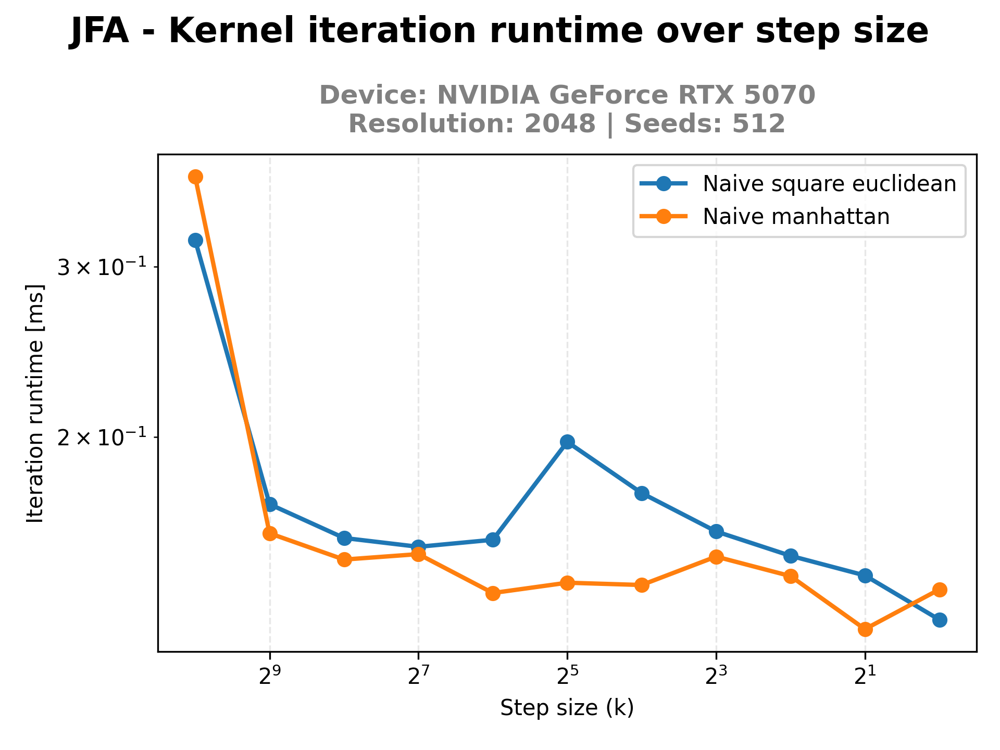 | 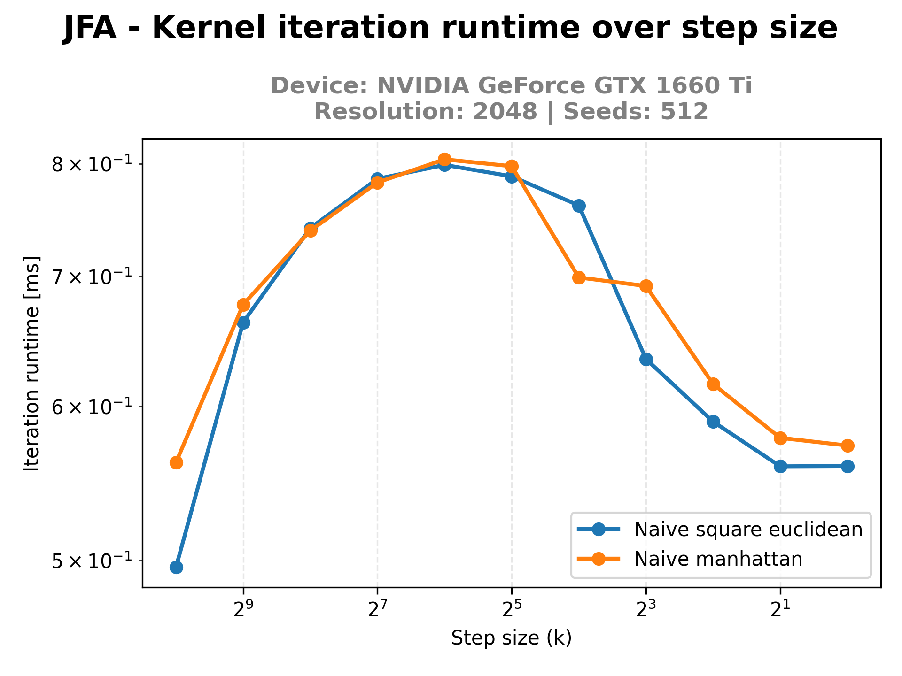 |

<table>
<tr>

<td>

...

</td>
<td>

NVIDIA GeForce GTX 1660 Ti | Resolution: 2048 | Seeds: 512

| Step size ($k$) | Naive square euclidean | Naive manhattan |
| --------------- | ---------------------- | --------------- |
| 1024            | 0.4962 ms              | 0.5618 ms       |
| 512             | 0.6631 ms              | 0.6772 ms       |
| 256             | 0.7414 ms              | 0.7391 ms       |
| 128             | 0.7859 ms              | 0.7825 ms       |
| 64              | 0.7989 ms              | 0.8042 ms       |
| 32              | 0.7882 ms              | 0.7977 ms       |
| 16              | 0.7615 ms              | 0.6992 ms       |
| 8               | 0.6349 ms              | 0.6922 ms       |
| 4               | 0.5895 ms              | 0.6164 ms       |
| 2               | 0.5591 ms              | 0.5783 ms       |
| 1               | 0.5593 ms              | 0.5731 ms       |

</td>
</tr>
</table>

Für die `RTX 5070` ist die Laufzeit zu Beginn ($k = 1024) maximal und sinkt in der nächsten Iteration stark auf einen Wert, um den sich die Laufzeiten der folgenden Iterationen bewegen. Das unterstützt die Annahme, dass die Laufzeit für die großen Schrittweiten stark durch die globalen Speicherzugriffe begrenzt ist und die Caches L1 und L2 keine Daten zwischenspeichern können (vgl. ncu-Analyse). Ab einer gewissen Größe - in diesem Fall bei der Schrittweite $k = 512$ - reicht die Größe des Caches aus, sodass die Daten überwiegend gepuffert werden können und folglich weniger Zeit für die Speicherzugriffe benötigt wird. Dies wirkt sich auf eine erhöhte Rechenauslastung und eine kürzere Kernellaufzeit aus.

Bei der `GTX 1660 Ti` verhält es sich anders: Die Laufzeit ist zu Beginn ($k = 1024$) recht niedrig, steigt dann für die mittleren Schrittweiten an und flacht für die kleinen wieder ab (parabelförmiges Verhalten). Bei $k = 1024$ liegen viele Nachbarpixel außerhalb des logischen Bildes und müssen somit gar nicht geprüft werden. Dadurch muss keine Speicheranfrage an das globale VRAM gestellt werden, was zu einer reduzierten Kernellaufzeit führt (_Out-of-Bounds-Effekt_). Mit abnehmender Schrittweite liegen immer mehr Nachbarpixel im Raster, wodurch mehr Daten geladen werden müssen und die Kernellaufzeit steigt. Ab $k = 32$ greift dann auch bei der GTX der oben beschriebene Cache-Effekt, der in einer reduzierten Kernellaufzeit resultiert und die Kurve somit abflacht.

Zu beachten ist, dass die ncu-Analyse hier mit der `RTX 5070` durchgeführt wurde (vgl. [Anhang](#anhang)) und es starke Hardwareunterschiede zu der `GTX 1660 Ti` gibt. Das aus der ncu-Analyse resultierende Verhalten muss nicht direkt für die `GTX 1660 Ti` gelten. Der L1- und L2-Cache der `RTX 5070` ist beispielsweise deutlich größer als der der `GTX 1660 Ti`, weshalb der Effekt deutlich früher eintritt (vgl. [Vergleich](https://technical.city/de/video/GeForce-GTX-1660-Ti-vs-GeForce-RTX-5070)).

_Gibt es Warp-Divergenz?_

Ja, in dieser Implementierung gibt es Warp-Divergenz: Die Threads innerhalb eines Warps können sich in unterschiedliche Ausführungspfade aufteilen. Der Grund liegt darin, dass jeder Thread genau einen Pixel bearbeitet und die dabei geprüften Bedingungen datenabhängig sind - insbesondere, ob ein Pixel oder dessen Nachbar bereits eine gültige Punkt-Koordinate kennt (`!= -1`) oder noch den initialen Default-Wert (`-1`) trägt.

Diese Divergenz lässt sich aufgrund der JFA-Charakteristik nur schwer vermeiden: Zu Beginn (großer `step_size`) kennen viele Pixel noch keinen Punkt, wodurch die `-1`-Prüfungen und Distanzvergleiche stark zwischen den Threads eines Warps variieren können. Mit kleiner werdender Schrittweite besitzen zunehmend mehr Pixel bereits einen gültigen Punkt, sodass sich die Pfade der Threads innerhalb eines Warps angleichen können und die Divergenz tendenziell abnimmt.

## Aufgabe 6b - Optimierungen

_Können Optimierungen durchgeführt werden? Wenn ja, warum? Wenn nein, warum nicht?_

**Shared Memory**

Wie zuvor erläutert, ist der JFA primär memory bound (vgl. ncu-Analyse). Um diesem Aspekt nachzugehen, wird als erster Optimierungsansatz **Shared Memory** evaluiert. Der Einsatz von Shared Memory ist primär dann sinnvoll, wenn benachbarte Threads innerhalb eines Blocks redundant auf dieselben Speicheradressen im globalen VRAM der GPU zugreifen müssen. Durch das einmalige, kollektive Laden der Daten aus dem VRAM in das Shared Memory können nachfolgende, mehrfache Lesezugriffe beschleunigt werden.

_Problemstellung bei JFA_

Im bezug auf den Einsatz von shared memory beim JFA ergibt sich folgende Problematik: Pro Iteration benötigt jeder Thread die Daten von sich selbst sowie von 8 Nachbarpixeln. Die Problematik hierbei ist, dass sich das Zugriffsfenszter stark mit der aktuellen Schrittweite (`step_size`) je nach Iterationsschritt variiert:

- **Große Schrittweiten:** Die benötigten Nachbardaten liegen weit auseinander und außerhalb des Thread-Blocks. Um diese Distanzen abzudecken, müsste der Shared-Memory-Buffer unrealistisch groß dimensioniert werden. Dies würde nicht nur das Hardware-Limit des Shared Memory pro Block sprengen, sondern auch zu einem Overhead beim Laden der Daten führen. Der Einsatz von Shared Memory ist in diesen Phasen daher **nicht sinnvoll**.

- **Kleine Schrittweiten:** Erst wenn die Schrittweite klein genug ist und unter einen bestimmten Schwellenwert fällt, liegen alle von einem Thread-Block benötigten Pixeldaten räumlich so nah beieinander, dass sie gemeinsam in den Shared Memory geladen werden können und der Einsatz von Shared Memory könnte von Nutzen sein.

_Die hybride Strategie_

Um diesem Verhalten gerecht zu werden, wurde eine _hybride_ Kernel-Strategie implementiert. Die Konstante `JFA_SHARED_THRESHOLD` dient als Weiche:

- **Schrittweite $<$ Threshold:** Die Shared-Memory-Pipeline wird aktiviert.
- **Schrittweite $\ge$ Threshold:** Die Threads greifen direkt auf das globale VRAM zu (Fallback-Pipeline).

_Edge Cases und das Halo-Padding_

Für die Implementierung wird das Grid in Blöcke aufgeteilt und pro Block soll ein Shared-Memory-Buffer angelegt werden. Ein Problem bei der Blockaufteilung sind die Rand-Threads (_Edge Cases_). Threads, die sich am äußeren Rand eines $16 \times 16$-Blocks befinden, müssen zur Distanzberechnung Pixel abfragen, die außerhalb ihres eigenen Blocks liegen. Um dieses Problem zu adressieren, stehen unter anderem 2 Möglichkeiten zur Auswahl:

- Für Zugriffe auf Edge Cases wieder auf den Zugriff auf das globale VRAM zurückfallen
- Den Shared-Memory-Buffer um eine gewisse Größe vergrößern (Abhängig von der `JFA_SHARED_THRESHOLD`)

Um einen Zugriff auf das globale VRAM zu verhindern, wird der Shared-Memory-Buffer um eine Sicherheitszone - dem **Halo** (Heiligenschein) - in alle vier Richtungen erweitert. Das folgende Bild soll die Aufteilung schematisch darstellen.

<center>


</center>

Die maximale Breite dieses Halos (`MAX_HALO_RADIUS`) leitet sich direkt aus der maximal erlaubten Schrittweite innerhalb des Shared Memorys ab ($\mathrm{JFA\_SHARED\_THRESHOLD} / 2$).

_Kooperatives Laden mittels Grid-Stride-Loop_

Da der Shared-Memory-Buffer inklusive Halo größer ist als die Anzahl der verfügbaren Threads im Block (z.B. $24 \times 24 = 576$ Elemente vs. $16 \times 16 = 256$ Threads), kann nicht jeder Thread einfach genau ein Pixel laden. Um die Daten dennoch komplett ins Shared-Memory-Buffer zu laden, wird eine **Grid-Stride-Loop** verwendet:

1. Das zweidimensionale Array im Shared Memory wird virtuell in ein eindimensionales Array linearisiert.
2. Die 256 Threads arbeiten sich in Schritten der Blockgröße durch die Elemente und laden die Daten kooperativ.
3. Falls ein Block am echten Bildrand liegt und der Halo über die Bildauflösung hinausragt, fangen die Threads dies ab und beschreiben das Shared Memory mit einem _Uninitialized-Flag_ (`-1`).

Nach dem Ladevorgang stellt `cuda.syncthreads()` sicher, dass erst alle Elemente im Shared Memory liegen, bevor die Threads mit der eigentlichen JFA-Distanzberechnung starten. Threads, die außerhalb der echten Bildgrenzen liegen, terminieren erst **nach** diesem Sync, da sie beim kooperativen Laden des Halos mithelfen mussten. Die JFA-Distanzberechnung wird dann auf den Pixeldaten im Shared-Memory-Buffer durchgeführt.

_Dimensionierung von `SHARED_MEMORY_SIZE`_

Der Shared-Memory-Buffer wird statisch für den Worst-Case dimensioniert:

$$\mathrm{SHARED\_MEMORY\_SIZE} = \mathrm{BLOCK\_DIM} + 2 \times \mathrm{MAX\_HALO\_RADIUS}$$

Bei kleiner werdenden Schrittweiten ($2$ und $1$) schrumpft der tatsächlich benötigte Halo-Bereich dynamisch zusammen. Da der Shared-Memory-Buffer jedoch statisch allokiert sein muss, bleibt ein Teil des äußeren Randes in den letzten Schritten ungenutzt. Zudem führt das Halo-Verfahren dazu, dass sich die Speicherbereiche benachbarter Blöcke _"überschneiden"_ und manche Pixeldaten trozdem noch von mehreren Blöcken redundant geladen werden müssen.

Für die Dimensionierung gilt es, das Hardware-Limit von standardmäßig **48 KB Shared Memory pro Thread-Block** nicht zu überschreiten (vgl. [Forum-Beitrag](https://forums.developer.nvidia.com/t/question-about-max-shared-memory-in-block-and-multiprocessor/283345)):

- Für `BLOCK_DIM = 16` und `JFA_SHARED_THRESHOLD = 8` ergeben sich $24 \times 24 = 576$ Pixel-Elemente. Da für jeden Pixel zwei Koordinaten (`x` und `y`) als `int32` (4 Byte) gespeichert werden, belegt der Buffer im Speicher:

$$576 \times 2 \times 4\mathrm{ Byte} = 4608\mathrm{ Byte} \approx 4,6\mathrm{ KB}$$

- Für `JFA_SHARED_THRESHOLD = 16` steigt die Anzahl der Elemente bereits auf $(16 + 2 \times 8)^2 = 1024$ Pixel an, was zu folgendem Speicherbedarf führt:

$$1024 \times 2 \times 4\mathrm{ Byte} = 8192\mathrm{ Byte} = 8\mathrm{ KB}$$

- Für `JFA_SHARED_THRESHOLD = 32` steigt der Speicherbedarf zu:

$$(16 + 2 \times 16)^2 = 48 \times 48 = 2304\mathrm{ Pixel}$$
$$2304 \times 2 \times 4\mathrm{ Byte} = 18432\mathrm{ Byte} \approx 18,4\mathrm{ KB}$$

- Erst bei `JFA_SHARED_THRESHOLD = 64` steigt die Pixelanzahl auf $(16 + 2 \times 32)^2 = 80 \times 80 = 6400$ Pixel. Dies entspricht im Speicher:
  $$6400 \times 2 \times 4\mathrm{ Byte} = 51200\mathrm{ Byte} = 50\mathrm{ KB}$$
  Damit wird das Hardware-Limit von **48 KB** ($\approx$ 0xc000 Bytes) gesprengt. Dies wird bereits beim Kompilieren verhindert und bricht mit folgender Fehlermeldung ab:

```bash
uses too much shared data (0xc800 bytes, 0xc000 max)
```

Da ein zu großer Schwellenwert den Shared-Memory-Bedarf ansteigen lässt und den Ladeaufwand für den Halo-Bereich vergrößert, wird der Schwellenwert `JFA_SHARED_THRESHOLD = 8` festgelegt. Daraus ergeben sich die folgenden Performancemessungen:

```bash
uv run .\src\task7.py shared_memory_square_euclidean_jfa
uv run .\src\task7.py compare-naive_square_euclidean_jfa-shared_memory_square_euclidean_jfa
uv run .\src\task6b.py shared-jfa-step-analysis
```

| RTX 5070                                                                                                                                                     | GTX 1660 Ti                                                                                                                                                     |
| ------------------------------------------------------------------------------------------------------------------------------------------------------------ | --------------------------------------------------------------------------------------------------------------------------------------------------------------- |
| 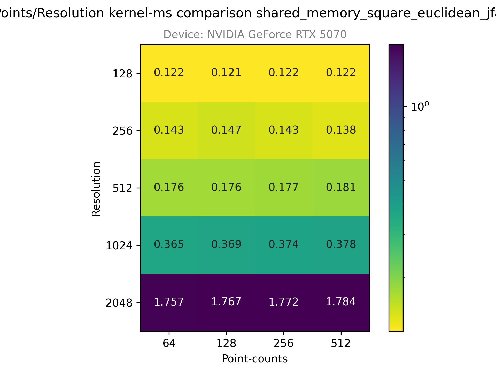        | 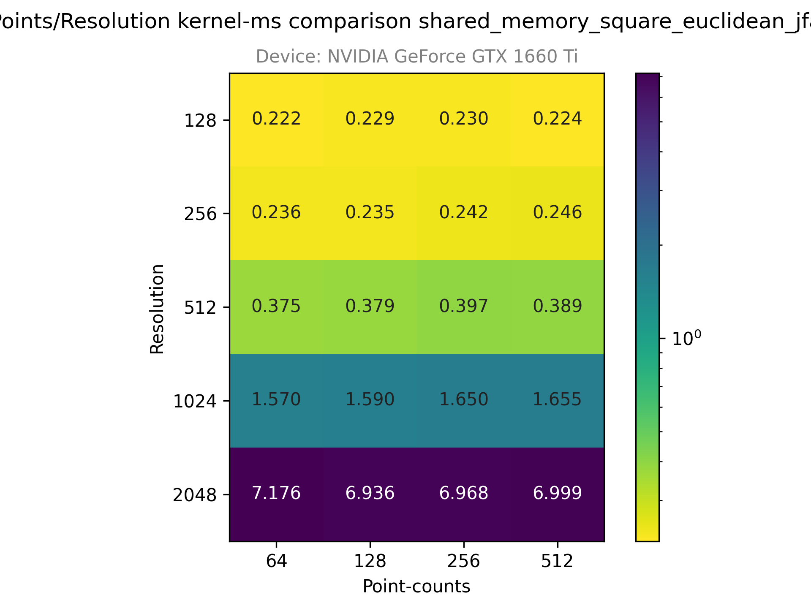        |
|  | 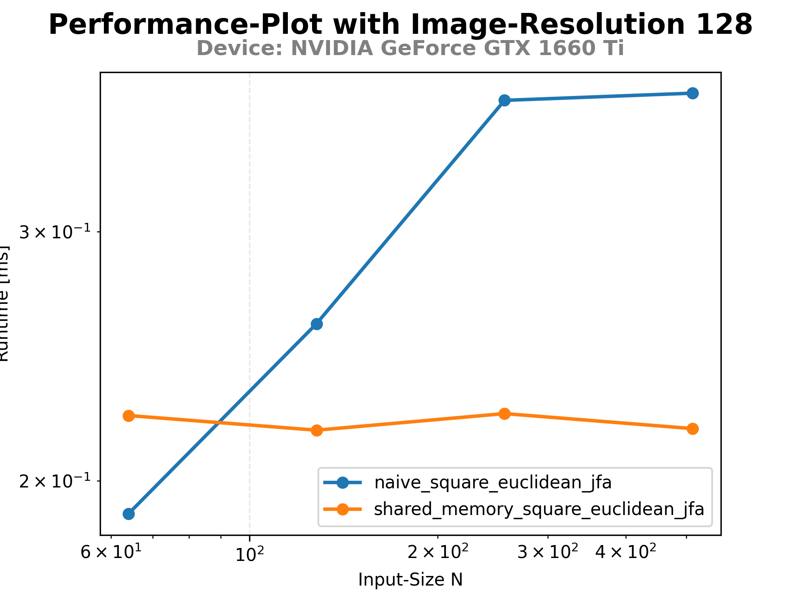 |
| 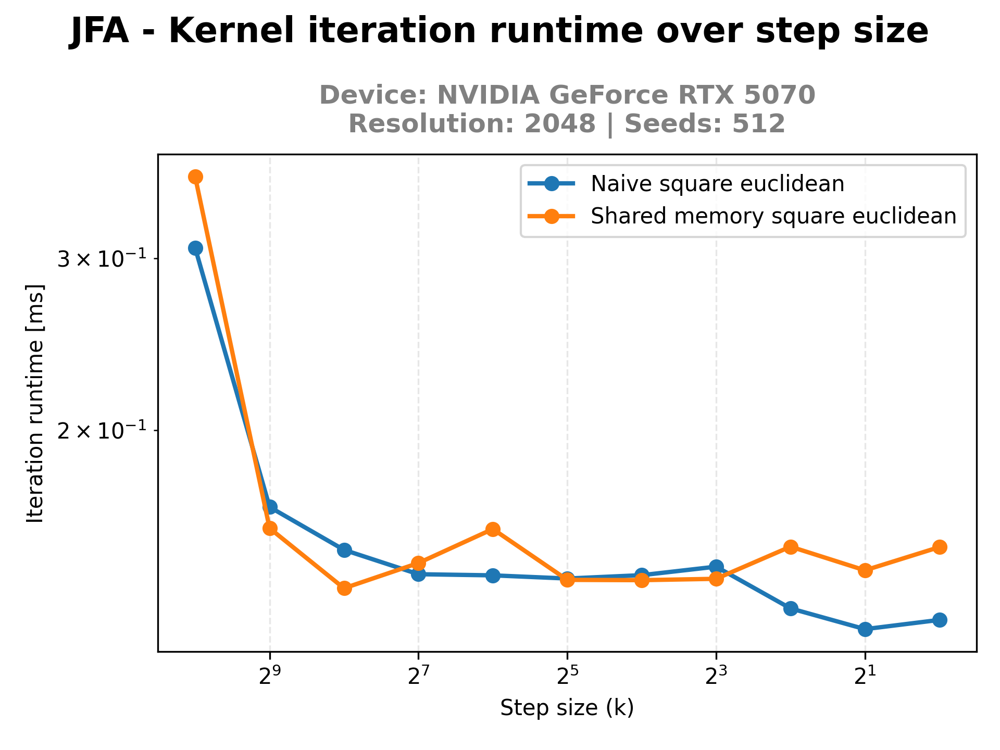             | 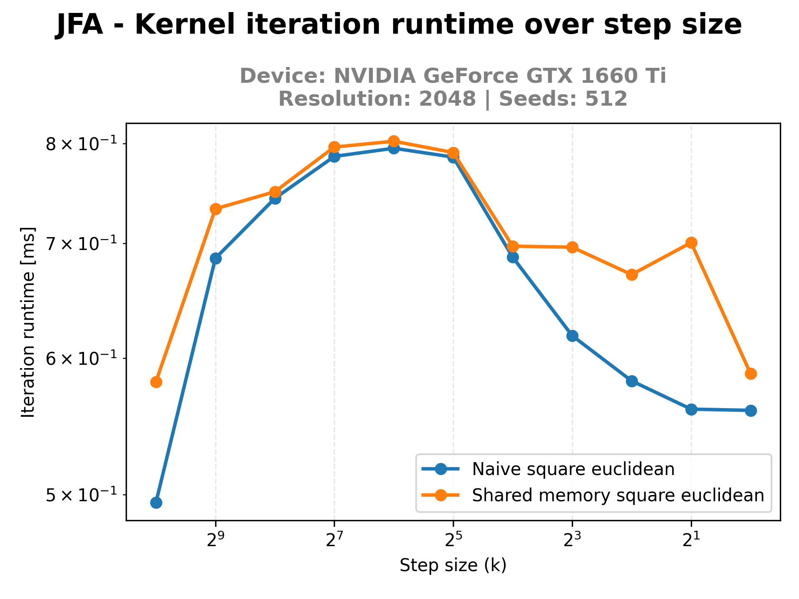             |

Auch hier zeigt sich wieder die typische JFA-Charakteristik bezüglich der Laufzeitkomplexität in Abhängigkeit von Auflösung. In dem Diagramm, das die Laufzeit in Abhängigkeit zur Schrittweite darstellt, ist bei der `GTX 1660 Ti` zu erkennen, dass beide Implementierungen für die großen Schrittweiten übereinander liegen. Dies ist darauf zurückzuführen, dass die Shared Memory Pipeline hier nicht aktiviert ist. Ab Schrittweite 4 greift der Shared-Memory-Ansatz, der eine höhere Laufzeit als der naive Ansatz aufweist. Vergleicht man die Gesamtlaufzeiten mit denen der naiven quadratischen euklidischen Implementierung, stellt man fest, dass der Einsatz von Shared Memory **keinen Laufzeitvorteil** erbracht hat. Dafür lassen sich folgende mögliche Ursachen identifizieren:

- Für das kooperative Laden mittels Grid-Stride-Loop sind innerhalb des Kernels Ganzzahl-Divisionen (`//`) und Modulo-Operationen (`%`) notwendig, um die linearen Thread-Indizes wieder in 2D-Koordinaten für das Shared-Memory-Array zu übersetzen. Diese Operationen sind mathematisch aufwändig und können die Laufzeit verschlechtern.

- Der Befehl `cuda.syncthreads()` ist ein Synchronisations-Barriere, bei der alle 256 Threads des Blocks aufeinander warten müssen, bis das Laden des Buffers abgeschlossen ist. Bei der naiven Implementierung entfällt diese Barriere, wodurch die Threads unabhängiger voneinander agieren können.

- Die hardwareseitigen L1- und L2-Caches leisten bereits bei der naiven Implementierung einen enormen Beitrag bei den kleinen Schrittweiten, wodurch der softwareseitig verwaltete Shared-Memory-Buffer keinen signifikanten Zusatznutzen mehr generieren kann.

<!-- Außerdem hat sich beim Rumprobieren mit JFA_SHARED_THRESHOLD gezeigt, dass die Performance mit kleinerer Größe steigt, sodass bei 1 die beste Laufzeit erreicht wird. Dies entspricht jedoch einer vollständigen Deaktivierung der Shared-Memory-Pipeline, wodurch der gesamte Ansatz mit Shared Memory keinen Gewinn bringt. ... -->

NCU analyse: [ncu-Datei](../data/ncu_NVIDIA-GeForce-RTX-5070_square_euclidean_jfa_shared_resolution=2048_points=512.log)

<!-- Abschließend lässt sich festhalten, dass durch die Optimierung mittels Shared Memory beim JFA **kein Performancegewinn** erzielt werden konnte. Dies hängt mit der Struktur des JFA zusammen: Zwar benötigt jeder Thread 9 Pixeldaten aus dem VRAM, die effektive Redundanz der Zugriffe innerhalb eines Blocks sind jedoch nicht hoch genug, um den zusätzlichen Aufwand durch den Einsatz von shared memory -->

_Gibt es Bank Conflicts?_

Shared Memory ist in 32 Banks aufgeteilt, wobei jede Bank 4 Byte (32 Bit) breit ist. Wenn mehrere Threads desselben Warps im selben Taktzyklus auf unterschiedliche Adressen **innerhalb** derselben Bank zugreifen wollen, entsteht ein Bank Conflict. Der Zugriff auf diese Bank wird dann serialisiert, bis alle anfragenden Threads bedient wurden, was zu einem Leistungsverlust führen kann (vgl. [NVIDIA-Dokumentation](https://docs.nvidia.com/cuda/cuda-programming-guide/02-basics/writing-cuda-kernels.html#shared-memory-access-patterns)).

In diesem Kernel liegt das `shared_buffer`-Array als 3D-Layout `(SHARED_MEMORY_SIZE, SHARED_MEMORY_SIZE, 2)` vor, wobei die letzte Dimension die X- und Y-Koordinate eines Punkts _interleaved_ speichert. Dadurch beträgt der Adressabstand zwischen zwei in `x`-Richtung benachbarten Threads nicht 1 Wort (4 Byte; 32 Bit), sondern 2 Worte (2 Banks). Dadurch, landen bei einem Zugriff wie `shared_buffer[shared_pixel_y, shared_pixel_x, 0]` jeweils zwei Threads in derselben Bank: Thread 0 und Thread 16 greifen auf Bank 0 zu, Thread 1 und Thread 17 auf Bank 2, Thread 2 und Thread 18 auf Bank 4 usw. Es entsteht somit ein **2-way Bank Conflict**, der sowohl beim kooperativen Laden der Shared Memory als auch beim Lesen des eigenen Seeds und bei der Nachbarschaftsauswertung auftritt.

Um diesem Problem der interleaved 3D-Struktur nachzugehen, wird im folgenden Abschnitt ein alternatives Datenlayout betrachtet. Da der Shared-Memory-Ansatz gegenüber der naiven Implementierung keine relevante Laufzeitverbesserung brachte, wird wieder die naive, ursprüngliche Implementierung verwendet, wobei das zugrunde liegende Problem gleich bleibt.

**Datenlayout optimieren**

_Structure of Arrays (SoA) vs. Array of Structures (AoS)_

Bei der naiven Implementierung `_jfa_pass_naive_square_euclidean_kernel` eines JFA-Iterationsschritts wird für das Grid ein **Array of Structures (AoS)** Layout verwendet. Das bedeutet, es wird ein 3D-Array der Form `(Height, Width, 2)` genutzt, welches pro Pixel ein Tupel von (x, y) Seed-Koordinaten speichert. Dieses Layout wird häufig verwendet, weil es für den Menschen einfacher vorzustellen und im Code intuitiv zu handhaben ist. Im Speicher liegen die Daten dabei abwechselnd in folgender Form:

```plaintext
X0 Y0 X1 Y1 X2 Y2 X3 Y3 ...
```

Allerdings hat dieses Layout in CUDA häufig einen Nachteil bezüglich des Speicherzugriffs: Threads innerhalb eines gemeinsamen Warps (32 Threads) können keine vollständig _coalesced_ Speicherzugriff durchführen. Wenn Thread 0 die X-Koordinate des ersten Pixels und Thread 1 die X-Koordinate des zweiten Pixels laden möchte, liegt im Speicher das `Y0` des ersten Threads im Weg. Die Zugriffe sind somit mit einer Schrittweite von 2 gestreckt, was zu einer höheren Anzahl von Speicher-Transaktionen führt.

Um globale Speicherzugriffe zu bündeln, wird in diesem Optimierungsschritt das gegensätzliche Layout **Structure of Arrays (SoA)** verwendet. Dabei werden die Daten nach Komponenten getrennt im Speicher abgelegt:

```plaintext
X0 X1 X2 X3 ... Y0 Y1 Y2 Y3 ...
```

Wenn nun die 32 Threads eines Warps die X-Koordinaten von 32 nebeneinanderliegenden Pixeln abfragen, liegen diese Daten lückenlos hintereinander im Speicher. Die Hardware kann diese Anfrage in einer Speichertransaktion (Coalesced Access) abarbeiten. Das Gleiche gilt anschließend für die Y-Koordinaten (vgl. [hier](https://forums.developer.nvidia.com/t/structures-of-arrays-vs-arrays-of-structures/13581)).

_Umsetzung für JFA_

Im JFA wird das ursprüngliche Grid der Form `shape=(resolution, resolution, 2)` so angepasst, dass es eine Dimension weniger besitzt, dafür aber die doppelte logische Höhe aufweist: `shape=(resolution * 2, resolution)`. Die Daten für die Seed-X- und Y-Koordinaten werden planar untereinander angeordnet:

- **Obere Hälfte (Zeile $0$ bis $\mathrm{size} - 1$):** Hält die X-Koordinaten der Seeds
- **Untere Hälfte (Zeile $\mathrm{size}$ bis $2 \times \mathrm{size} - 1$):** Hält die Y-Koordinaten der Seeds

Um im Kernel auf die Daten zuzugreifen, muss für die Y-Koordinate lediglich der Offset der Bildauflösung (`size`) auf den Zeilenindex hinzuaddiert werden, während der X-Wert auf der normalen Zeile geladen werden kann:

```python
grid_in[pixel_y, pixel_x]
grid_in[pixel_y + size, pixel_x]
```

Für das _Structure of Arrays (SoA)_ Layout ergeben sich folgende Performancemessungen:

```bash
uv run .\src\task7.py SoA_square_euclidean_jfa
uv run .\src\task7.py compare-naive_square_euclidean_jfa-SoA_square_euclidean_jfa
uv run .\src\task6b.py SoA-jfa-step-analysis
```

| RTX 5070                                                                                                                                           | GTX 1660 Ti                                                                                                                                           |
| -------------------------------------------------------------------------------------------------------------------------------------------------- | ----------------------------------------------------------------------------------------------------------------------------------------------------- |
| 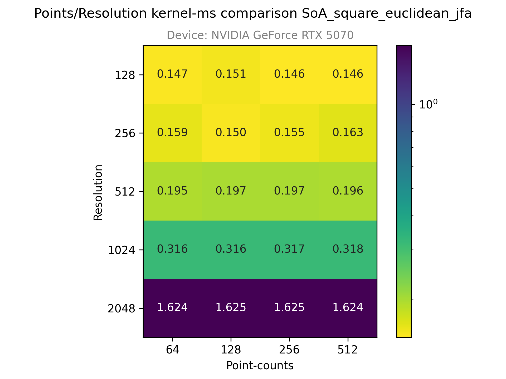        |         |
|  | 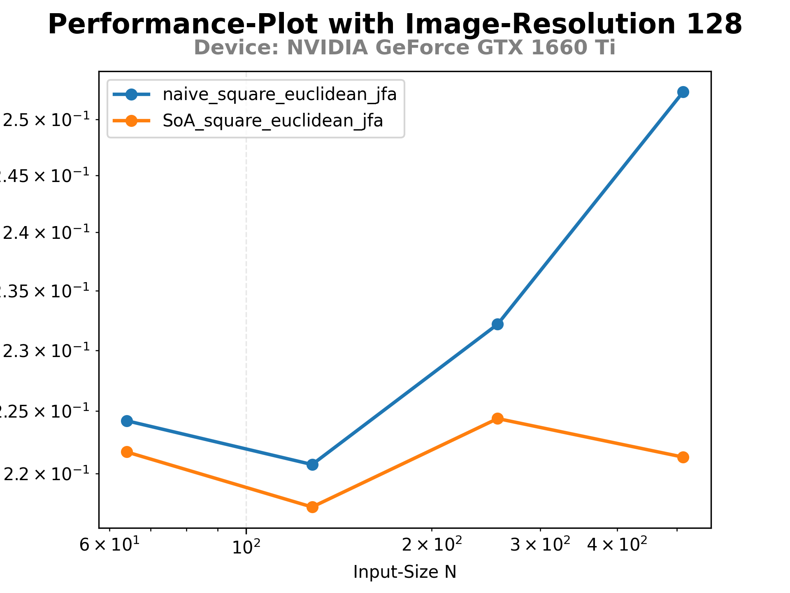 |
| 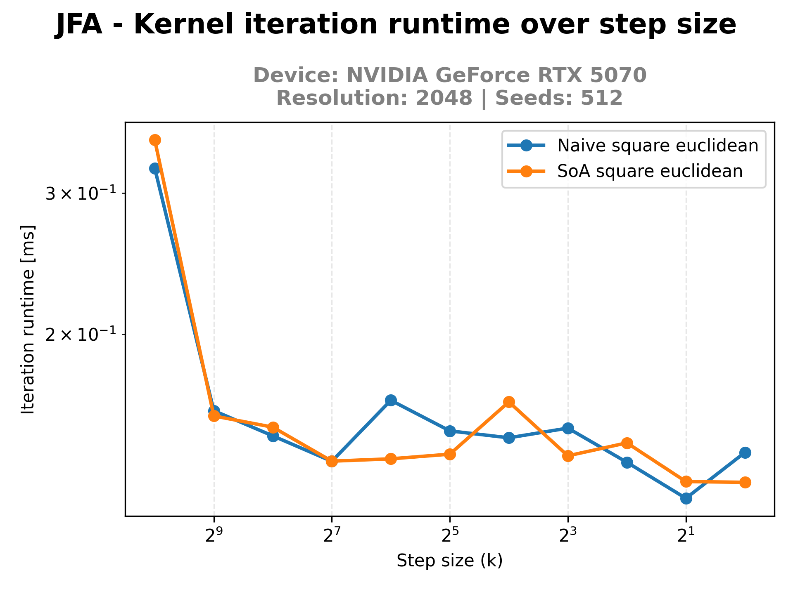             | 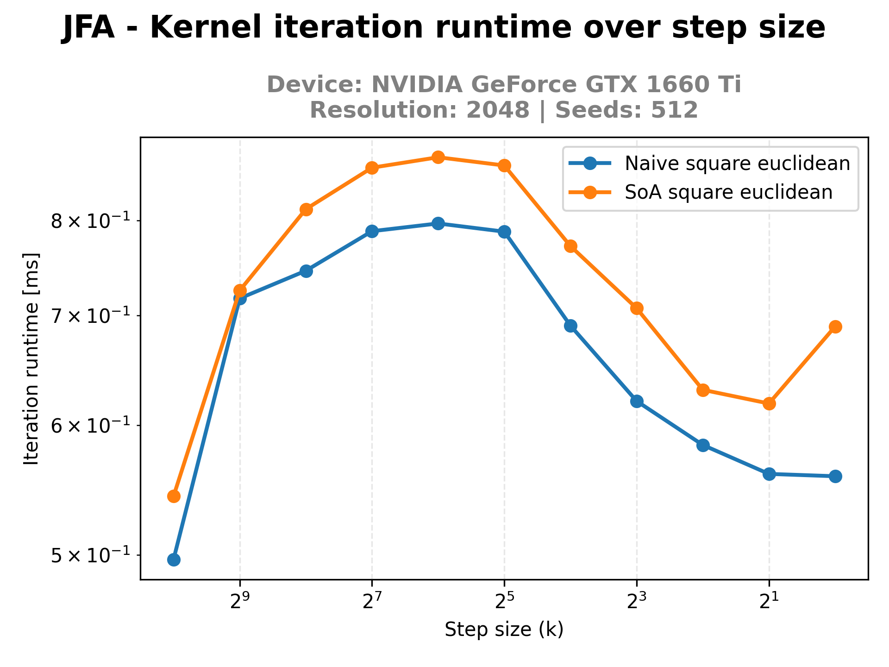             |

Ein Vergleich der Messdaten mit der naiven quadratischen euklidischen Implementierung zeigt, dass das umgestellte _Structure of Arrays (SoA)_ Layout keinen messbaren Laufzeitvorteil gegenüber dem _Array of Structures (AoS)_ Layout liefert. Es lassen sich folgende mögliche Ursachen feststellen:

- Beim laden der Pixel-Koordinaten liegen die Daten im AoS-Layout (`X0 Y0 X1 Y1 ...`) sequenziell hintereinander. Fordert der Warp die X-Koordinate an, lädt die Hardware implizit die dazugehörige Y-Koordinate innerhalb derselben Speicheranfrage in den Cache. Der unmittelbar folgende Lesezugriff auf die Y-Komponente kann direkt aus dem Cache erfolgen.
  - Beim Laden der eigenen Pixel-Koordinaten (`best_seed_x` und `best_seed_y`) ist beim AoS dadurch nur eine Speicheranfrage nötig, wohingegen beim SoA durch die planare Trennung für den Y-Wert eine zweite, separate Speicheranfrage an das VRAM gestellt werden muss.
  - Beim Laden der Koordinaten der 8 Nachbarpixel wirkt sich SoA ebenfalls nachteilig aus. Da sich das SoA-Grid in eine obere (X) und untere (Y) Hälfte mit dem Offset `size` aufteilt, erfordert jede Nachbarabfrage das Laden von zwei weit auseinanderliegenden Speicheradressen. Müssen die Threads eines Warps aufgrund großer Schrittweiten (`step_size`) ohnehin **nicht** zusammenhängende Speicherbereiche anfordern, kann das SoA-Layout die Anzahl der Speicheranforderungen im Vergleich zu AoS - bei dem X- und Y-Wert in derselben Speicheranfrage liegen - erhöhen.

- Das theoretische _Memory Coalescing_ von SoA setzt voraus, dass die Threads **lückenlos** auf benachbarte Adressen zugreifen. Beim JFA ist dies durch die variierenden Sprungweiten (`step_size`) in der horizontalen und insbesondere in der vertikalen Dimension (Zeilensprünge) über die meisten Iterationen hinweg nicht gegeben. Da die Threads dadurch ohnehin nicht zusammenhängende Speichersegmente anfordern müssen, kann der Strukturvorteil von SoA nicht greifen.

NCU-Analyse: [ncu-Datei](../data/ncu_NVIDIA-GeForce-RTX-5070_square_euclidean_jfa_SoA_resolution=2048_points=512.log)

**Shuffle**

Beim Shuffle können Daten von Threads innerhalb desselben Warps direkt ausgetauscht werden, ohne den Umweg über Shared oder Global Memory. Numba stellt dafür unter anderem `shfl_sync`, `shfl_up_sync`, `shfl_down_sync` und `shfl_xor_sync` bereit, die alle auf die `laneid` eines Threads referenzieren - also seine Position (0-31) innerhalb des Warps (vgl. [Numba-Dokumentation](https://numba.pydata.org/numba-doc/0.41.0/cuda-reference/kernel.html#numba.cuda.shfl_sync)).

_Die Grundidee für den Einsatz in JFA_

Zu Beginn jedes Passes lädt jeder Thread den aktuell gespeicherten Punkt seines eigenen Pixels aus dem Grid (als Ausgangsbasis für den Distanzvergleich). Braucht Thread A nun die Punkt-Daten von Pixel $P+k$, so hat Thread B, der zu $P+k$ gehört, diesen Wert im selben Kernel-Aufruf ebenfalls bereits geladen. Sitzen A und B im selben Warp, könnte A die Daten von B per Shuffle direkt lesen, statt diese zusätzlich selbst aus dem Global Memory zu laden. Auf diese Weise ließe sich theoretisch eine der VRAM-Anfragen pro Nachbarschaftsprüfung einsparen.

Dieser Ansatz stößt bei JFA jedoch auf zwei grundlegende Einschränkungen:

1. Die Threads eines Blocks werden nach der X-Dimension zu Warps zusammengefasst, wodurch ein Warp einer horizontalen Gridzeile entspricht. Shuffle kann dann grundsätzlich nur auf die Pixel $P+k$ und $P-k$ **nach rechts bzw. links** zugreifen. Die Nachbarn oben, unten und auf den vier Diagonalen liegen per Definition in anderen Zeilen und damit außerhalb des Warps. Dafür bleibt zwingend ein Fallback auf Global Memory nötig, wodurch Shuffle im besten Fall also nur 2 der 8 Nachbarschaftsprüfungen betreffen würde (`dy == 0 and dx == +/-1`).
   <!-- (Anmerkung: Bei einer Blockkonfiguration, bei der `blockDim.x` **kein** Vielfaches von 32 ist - z. B. unsere BLOCK_DIM = (16, 16) - verschiebt sich dieses Bild leicht: Ein Warp fasst dann automatisch zwei volle Zeilen zusammen (32 = 2 × 16), sodass für einen Teil der Threads sogar der direkt vertikale Nachbar im selben Warp läge. Das ändert am grundsätzlichen Befund aber nichts, da erstens weiterhin nur benachbarte Zeilenpaare betroffen sind (nicht beliebige y-Distanzen) und zweitens die Einschränkung aus Punkt 1 (Schrittweite < 32) unverändert gilt.) -->

2. Ein Warp umfasst **32 Threads**. Damit deckt ein Warp bei der typischen 1D-Lane-Anordnung exakt 32 konsekutive horizontale (x-)Pixel ab. Ein Thread an Lane-Position $L$ kann seinen **rechten** Nachbarn bei Schrittweite $k$ nur dann per Shuffle "erreichen", wenn dieser Nachbar (Lane $L+k$) noch innerhalb desselben Warps liegt, also $L + k \le 31$ gilt. Je größer $k$, desto weniger Threads erfüllen diese Bedingung (Für die **linken** Nachbarn funktioniert dieselbe Logik spiegelverkehrt: Bedingung $L - k \ge 0$):
   - $k=1$: 31 von 32 Threads können shuffeln. Nur der Thread ganz rechts (Lane 31) hat keinen rechten Nachbarn mehr im Warp.
   - $k=2$: 30 von 32 Threads
   - $k=4$: 28 von 32 Threads
   - $k=8$: 24 von 32 Threads
   - $k=16$: 16 von 32 Threads
   - $k=32$: 0 von 32 Threads. Ab hier ist Shuffle vollständig ausgeschlossen.
   - $k>32$: ebenfalls 0 von 32 Threads

   Für alle Schrittweiten ab $k=32$ ist Shuffle also von vornherein nicht einsetzbar. Erst für die letzten, kleinen Passes ($k < 32$) wird überhaupt ein Teil der Threads _shuffle-fähig_, wobei auch dort der nutzbare Anteil mit wachsendem $k$ abnimmt.

_Implementierungsaufwand und Warp-Divergenz_

Eine Umsetzung würde für jeden Thread diverse `if`-Abfragen erfordern. Es muss geprüft werden ob der Nachbar bei gegebener `step_size` tatsächlich innerhalb desselben Warps liegt. Ist das nicht der Fall, muss es einen Fallback-Pfad geben, der auf Global Memory basiert. Da innerhalb eines Warps dann ein Teil der Threads den Shuffle-Pfad und ein anderer Teil den Global-Memory-Pfad nimmt, divergiert der Warp an dieser Stelle (_Warp Divergenz_). Dieser Effekt kann dann einen Großteil des theoretischen Shuffle-Vorteils wieder aufheben und im ungünstigsten Fall verschlechtert sich die Performance sogar gegenüber der naiven, rein VRAM-basierten Variante.

_Fazit_

Sowohl die Analyse zu Shared Memory zuvor als auch die hier dargelegten Überlegungen zu Shuffle deuten für die Schrittweiten-Charakteristik von JFA auf **keinen** Performancegewinn hin: Shuffle wäre lediglich auf **kleine** Schrittweiten ($k < 32$) und auf 2 der 8 Nachbarn anwendbar, wodurch zusätzliche Index-Berechnungen, Index-Prüfungen und Warp-Divergenz resultieren würden. Aus diesem Grund wird eine _JFA-Shuffle-Variante_ nicht implementiert. Der Ansatz wird an dieser Stelle dennoch dokumentiert, da er im Rahmen der Optimierungsüberlegungen diskutiert und geprüft wurde.

**Ausblick: JFA+ und JFA\***

Eine interessante Weiterentwicklung stellen die von **Maciej A. Czyzewski (2019)** vorgeschlagenen Varianten _JFA+_ und _JFA\*_ dar. Beide adressieren das Problem der "leeren" Grid-Bereiche im klassischen JFA, in denen keine Daten vorhanden sind und damit Zeit verloren geht. Als Lösung wird vorgeschlagen, leere Grid-Bereiche mit zufälligem Rauschen zu befüllen, sodass auch initial undefinierte Zellen früh Informationen zu Punkten erhalten. Ziel ist es, den Algorithmus dadurch in einer geringeren Anzahl von Schritten durchzuführen, wodurch die Gesamtlaufzeit reduziert werden soll:

- Foliensatz: [PDF](https://maciejczyzewski.github.io/fast_gpu_voronoi/slides_small.pdf)
- Implementierung: [Git-Hub Repository](https://github.com/maciejczyzewski/fast_gpu_voronoi)

Wichtig zu erwähnen ist, dass eine formale Analyse bzw. ein Beweis dieser Schrittzahl bislang aussteht. Trotzdem soll im Rahmen dieser Arbeit diese mögliche Idee aufgeführt und genannt werden, da die zuvor eigenentwickelten Optimierungsversuche keinen Laufzeitvorteil gegenüber dem klassischen JFA erzielen konnten.

# Aufgabe 6c - Jump Flooding In-Out-Ansatz

_Welche Limitation hat der bisher implementierte JFA Algorithmus?_

Der bisherige JFA Algorithmus verwendet zwei Pixelraster welche abwechselnd gelesen und geschrieben werden. Es sind zwei Raster nötig, da sonst unvollständige Werte in das Raster geschrieben werden könnten, wodurch es zu Race-Conditions kommt. Eine Folge davon könnte sein, dass beim Lesen eines Punkt die `x`-Komponente und die `y`-Komponente von verschiedenen Punkten sind.

_Welche Nachteile bringen zwei Raster?_

Zwei Raster haben einige Nachteile. Zum einen muss ist mehr Speicher auf der GPU nötig. Zum anderen muss der Algorithmus ständig die Zeiger auf die Raster nach jedem Kernel-Aufruf wechseln. Zudem kann es auch sein, dass die GPU caches schlechter ausnutzen kann, da es doppeltsoviele Daten zu verarbeiten gibt.

_Sind zwei Raster tatsächlich nötig?_

Beim Algorithmus wird bei jedem Kernel-Aufruf pro Thread nur ein Pixel beschrieben. Ob ein anderer Thread den Pixel aus dieser Iteration oder aus der nächsten Iteration liest, ist dabei tatsächlich nicht wichtig, da nur der nächste Nachbar relevant ist. Es muss also nur verhindert werden, dass ein ungültiger Punkt gelesen wird. Da der lesende Zugriff auf Pixel weit reicht, vorallem in den ersten Iterationen, können die im Kurstext beschriebenen Synchronisations-Methoden nur schwer angewendet werden. Desweiteren würden Synchronisations-Methoden vermutlich den Algorithmus langsamer machen. Um diese Problematik zu umgehen werden Punkte und das Raster separat gespeichert. Statt die coordinaten der Punkte im Raster zu verwalten, werden Verweise auf die Punkte im Raster gespeichert. Diese Indirektion führt dazu, dass mehr Daten aus dem Global-Memory gelanden werden, aber dafür kann auf das zweite Raster verzichtet werden.

Ein weiterer Vorteil der sich hierraus ergibt, ist, dass für die Punkt-Koordinaten wieder `float32` statt `int32` verwendet werden kann.

Um die Warp-Divergence niedrig zu halten werden zudem alle Verweise im Raster, welche initial keinen Punkt zugewiesen bekommen haben, auf den ersten Punkt der Eingabe gesetzt. Auf diese Weise kann zur Kernel-Laufzeit auf Prüfungen der Punkte verzichtet werden.

_Wie ändert sich die Laufzeit beim verwenden nur eines Rasters?_

Folgene Abbildungen geben die Laufzeiten des beschriebenen Ansatz an.

| RTX 5070                                                                                                                                             | GTX 1660 Ti                                                                                                                                             |
| ---------------------------------------------------------------------------------------------------------------------------------------------------- | ------------------------------------------------------------------------------------------------------------------------------------------------------- |
| 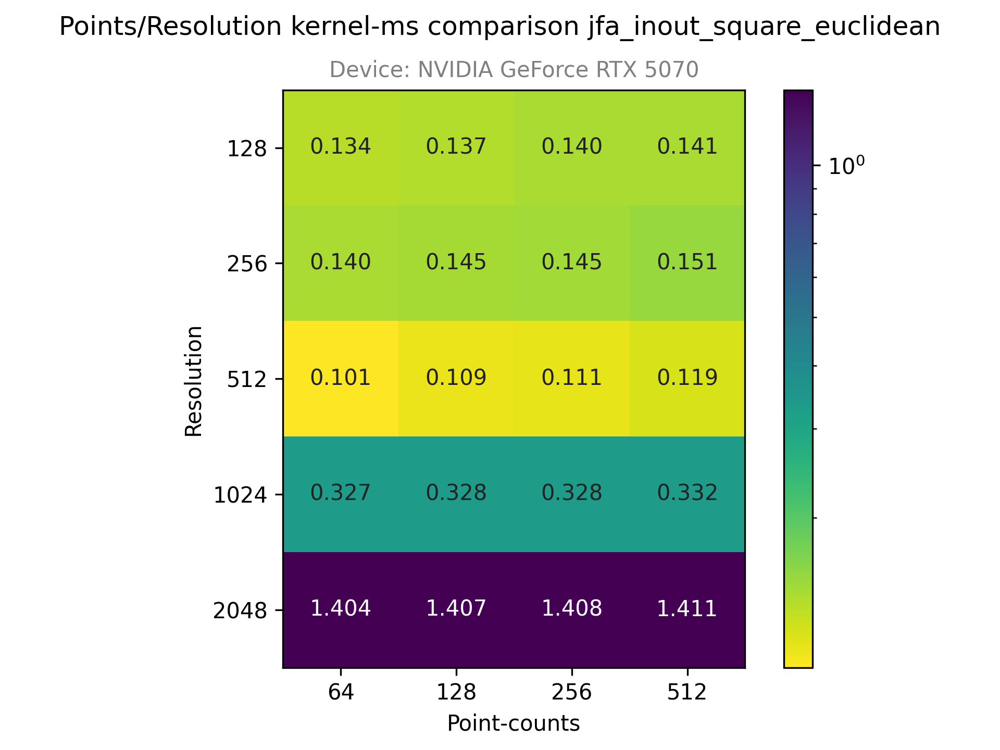        | 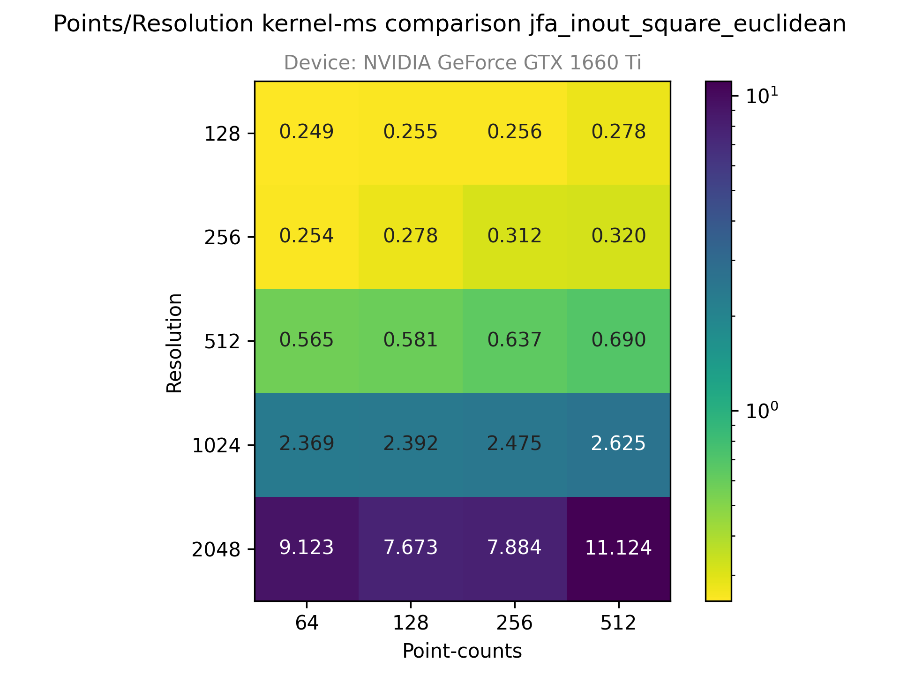        |
| 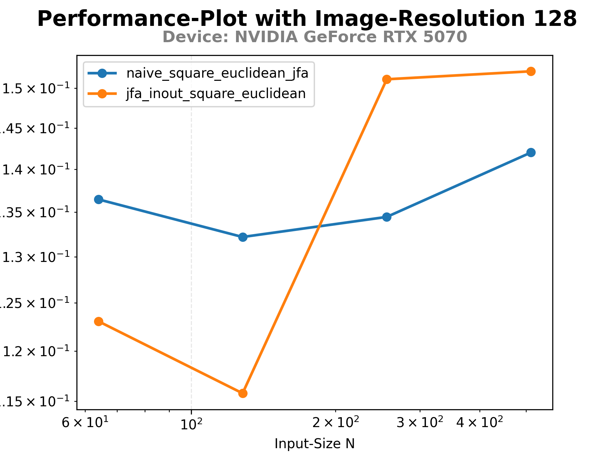 | 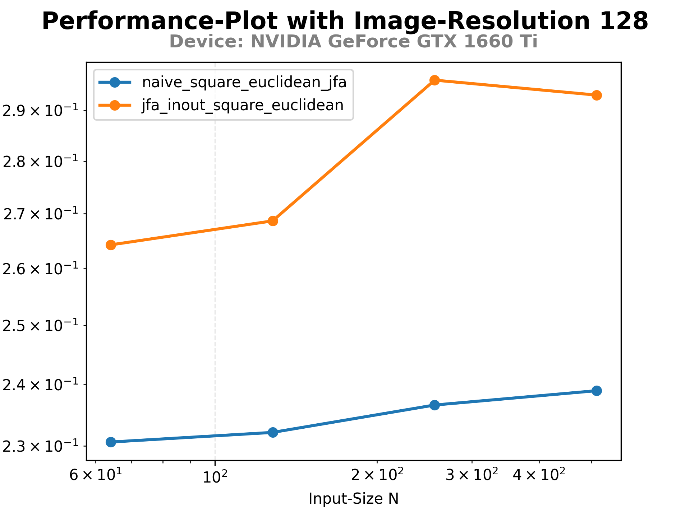 |

Es ist zu sehen, dass für die Eingabe-Größen `512` und `2048` des Raster eine Verbesserung der Laufzeit zu erkennen ist. Die anderen Größen sind in einem ähnlichen Wertebereich wie zuvor. Erstaunlicherweise ist der Algorithmus schneller, wenn die Eingabe-Größe des Raster `512` statt `128` ist. Der Grund hierfür konnte aus zeitlichen Gründen leider nicht bestimmt werden.

# Aufgabe 7 - Ergebnisse

_Welche der Optimierungen hat den größten Laufzeit-gewinn erbracht?_

_Wie viel schneller ist die Finale Implementation im Vergleich zur Naiven Implementation?_

_Ausblick_

# Anhang

> [!NOTE]
> **Einschränkung bei Keyword (Named)-Arguments in CUDA-Kernels**
>
> Je nach installierter **Numba**-Version kann es zu Problemen kommen, wenn innerhalb eines CUDA-Kernels Keyword-Arguments (benannte Argumente) für Device-Funktionen verwendet werden.
>
> - **Problem:** Die Kompilierung schlägt fehl und scheint direkt bei der Kernel-Signatur "stehenzubleiben". Der Traceback zeigt jedoch, dass die Ursache weiter unten im Kernel liegt. Ein Aufruf der Art `get_thread_position(image=out_image)` kann nicht verarbeitet werden
> - **Lösung:** Den Aufruf auf positionale Argumente umstellen: `get_thread_position(out_image)`
>
> Verwendete Versionen anzeigen: `pip freeze`

> [!NOTE]
> **Fokussierung der hardwarenahen Optimierung auf die NVIDIA GeForce RTX 5070**
>
> Für die Performance-Optimierung werden hardwarespezifische Daten mithilfe der NVIDIA Profiling Tools `nsys`, `ncu` sowie der Numba Funktion `.inspect_asm()` erzeugt. Um eine saubere Vergleichbarkeit der Messergebnisse zu gewährleisten und den Umfang der erzeugten Dateien nicht zu sprengen, beschränken sich die hardwarenahen Analysen auf die **NVIDIA GeForce RTX 5070**. Die Performance-Diagramme werden weiterhin für beide GPUs erstellt.
